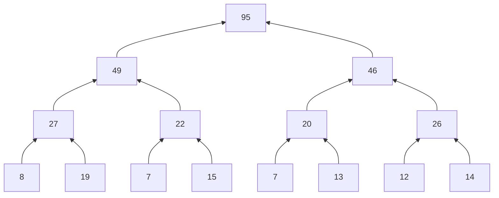

# Splitting a sum across workers

**Level:** 201 · anyone who has split a loop across threads and then had to put the pieces back together

**One line:** Give each worker its own run of the values and its own variable, and nothing needs a lock; combine the partial sums as a tree, and the same seven additions take three rounds instead of seven — but a tree regroups the additions, so a float total no longer matches the plain loop's, and a library call that chooses the grouping for you can give a different total on a different machine.

## The example

Chapter 1 of Pacheco and Malensek's [*An Introduction to Parallel Programming* ↗](https://shop.elsevier.com/books/an-introduction-to-parallel-programming/pacheco/978-0-12-804605-0) makes the case for parallel programs with a sum: 24 values, 8 cores, each core adding its own 3 values into a private `my_sum`, and then the eight partial sums combined into one. It combines them twice. First a master core receives each partial sum and adds it to its own, one at a time. Then the cores pair up and add in rounds — 0 takes 1's sum while 2 takes 3's, then 0 takes 2's while 4 takes 6's, then 0 takes 4's:



Every program below does exactly that with threads and the book's 24 values: a thread per worker for the partial sums, the serial combine on the main thread, and a thread per pair in each round of the tree. Then it repeats the split with each value plus 0.2, as floating-point numbers, where the answer on paper is 99.8.

| | A worker's partial sum comes back through | The standard library's own sum, and the float total it gave |
|---|---|---|
| Rust | `join()` on a scoped thread | `iter().sum()`: the plain loop's total |
| Go | the worker's own slot in a slice | — |
| C | the worker's own `struct` in an array of jobs | — |
| C++ | the worker's own slot in a `std::vector` | `std::accumulate`: the plain loop's total |
| Java | the worker's own slot in an array | `DoubleStream.reduce(0.0, Double::sum)`: the plain loop's total; `DoubleStream.sum()`: 99.8 |
| Python | the worker's own slot in a list | `sum()`: 99.8; `math.fsum()`: 99.8 |

## Rust

<!-- output:split_sum_rs -->
*Verified output of [`split_sum_rs.rs`](examples/split_sum_rs.rs) — regenerated by `tools/run_examples.py`, never hand-typed.*

```text
24 values, 3 to each of 8 workers
partial sums: 8 19 7 15 7 13 12 14
serial combine: 95, after 7 additions in 7 rounds
tree, round 1: 27 22 20 26
tree, round 2: 49 46
tree, round 3: 95
tree combine: 95, after 7 additions in 3 rounds

the same 24 values plus 0.2 each, as f64 (on paper, 99.8)
one loop over all 24: 99.80000000000004
partial sums, then serial: 99.79999999999998
partial sums, then tree: 99.80000000000001
iter().sum(): 99.80000000000004
```
<!-- /output -->

**No worker shares anything while it works.** Each scoped thread gets a slice of three values, adds them into a local `my_sum`, and returns it; `join()` hands the eight results back in order. There is no shared total to lose an update from, so there is no lock — the [lost update](../../02_Shared_State/the_lost_update/README.md) of chapter 02 cannot happen when nothing is shared until the work is done.

**Both combines make seven additions.** The serial combine makes them one after another, so it takes seven rounds. The tree makes four in its first round, two in its second and one in its third, and the additions within a round are independent — each reads two numbers that no other addition in that round touches — so they can run at the same time. The count of rounds is the depth of the tree, about log₂ of the number of workers: for Pacheco's thousand cores, 999 rounds against 10. What the tree saves is waiting, not work, and only if a round's additions really do run at once. Eight additions of small integers are far too little work to repay starting a thread each; the program starts them anyway, because the shape is the point.

**The three float totals differ.** A plain loop over all 24 values, the eight partial sums added one after another, and the same eight added as a tree give `99.80000000000004`, `99.79999999999998` and `99.80000000000001`. Every value was added exactly once each time; what changed is which additions happened first, and float addition is not associative — [When does order change a sum?](../../02_Shared_State/when_order_changes_a_sum/README.md) shows the same thing with three numbers. `iter().sum()` gave the plain loop's total.

<details markdown="1">
<summary><code>split_sum_rs.rs</code></summary>

<!-- source:split_sum_rs -->
*[`split_sum_rs.rs`](examples/split_sum_rs.rs) in full — pasted here by `tools/run_examples.py` from the file CI runs.*

```rust
//! Splitting a sum across workers. Each worker adds its own run of values into a
//! variable no other thread can see, and the partial sums are then combined two
//! ways: one after another, and as a tree whose rounds add pairs at the same time.
//! Then the same split, with floats.
//!
//!   rustc --edition 2024 split_sum_rs.rs -o split_sum_rs && ./split_sum_rs

use std::fmt::Display;
use std::ops::Add;
use std::thread;

const WORKERS: usize = 8; // a power of two, so every round of the tree pairs everyone up
const VALUES: [i64; 24] = [1, 4, 3, 9, 2, 8, 5, 1, 1, 6, 2, 7, 2, 5, 0, 4, 1, 8, 6, 5, 1, 2, 3, 9];

/// Give each worker an equal run of `values`. Each worker adds its run, left to
/// right, into its own `my_sum`; the thread hands the result back through `join`.
fn partial_sums<T>(values: &[T], workers: usize) -> Vec<T>
where
    T: Copy + Add<Output = T> + Send + Sync,
{
    thread::scope(|s| {
        let handles: Vec<_> = values
            .chunks(values.len() / workers)
            .map(|run| {
                s.spawn(move || {
                    let mut my_sum = run[0];
                    for &x in &run[1..] {
                        my_sum = my_sum + x;
                    }
                    my_sum
                })
            })
            .collect();
        handles.into_iter().map(|h| h.join().unwrap()).collect()
    })
}

/// The master adds every partial sum into its own, one at a time.
fn serial_combine<T: Copy + Add<Output = T>>(sums: &[T]) -> (T, usize) {
    let mut total = sums[0];
    for &s in &sums[1..] {
        total = total + s;
    }
    (total, sums.len() - 1)
}

/// Each round adds neighbouring pairs, every pair on its own thread, until one
/// value is left. Returns the total, the number of additions and of rounds.
fn tree_combine<T>(sums: &[T], show_rounds: bool) -> (T, usize, usize)
where
    T: Copy + Add<Output = T> + Send + Sync + Display,
{
    let mut level = sums.to_vec();
    let (mut additions, mut rounds) = (0, 0);
    while level.len() > 1 {
        level = thread::scope(|s| {
            let handles: Vec<_> = level
                .chunks(2)
                .map(|pair| s.spawn(move || pair[0] + pair[1]))
                .collect();
            handles.into_iter().map(|h| h.join().unwrap()).collect()
        });
        additions += level.len();
        rounds += 1;
        if show_rounds {
            println!("tree, round {rounds}: {}", joined(&level));
        }
    }
    (level[0], additions, rounds)
}

fn joined<T: Display>(xs: &[T]) -> String {
    xs.iter().map(|x| x.to_string()).collect::<Vec<_>>().join(" ")
}

fn main() {
    println!("{} values, {} to each of {WORKERS} workers", VALUES.len(), VALUES.len() / WORKERS);
    let partials = partial_sums(&VALUES, WORKERS);
    println!("partial sums: {}", joined(&partials));
    let (total, additions) = serial_combine(&partials);
    println!("serial combine: {total}, after {additions} additions in {additions} rounds");
    let (total, additions, rounds) = tree_combine(&partials, true);
    println!("tree combine: {total}, after {additions} additions in {rounds} rounds");

    let floats: Vec<f64> = VALUES.iter().map(|&v| v as f64 + 0.2).collect();
    println!();
    println!("the same {} values plus 0.2 each, as f64 (on paper, 99.8)", floats.len());
    let mut loop_total = 0.0;
    for &x in &floats {
        loop_total += x;
    }
    println!("one loop over all {}: {loop_total}", floats.len());
    let partials = partial_sums(&floats, WORKERS);
    println!("partial sums, then serial: {}", serial_combine(&partials).0);
    println!("partial sums, then tree: {}", tree_combine(&partials, false).0);
    println!("iter().sum(): {}", floats.iter().sum::<f64>());
}
```
<!-- /source -->

</details>

## Go

<!-- output:split_sum_go -->
*Verified output of [`split_sum_go.go`](examples/split_sum_go.go) — regenerated by `tools/run_examples.py`, never hand-typed.*

```text
24 values, 3 to each of 8 workers
partial sums: 8 19 7 15 7 13 12 14
serial combine: 95, after 7 additions in 7 rounds
tree, round 1: 27 22 20 26
tree, round 2: 49 46
tree, round 3: 95
tree combine: 95, after 7 additions in 3 rounds

the same 24 values plus 0.2 each, as float64 (on paper, 99.8)
one loop over all 24: 99.80000000000004
partial sums, then serial: 99.79999999999998
partial sums, then tree: 99.80000000000001
```
<!-- /output -->

Each goroutine writes its partial sum into its own element of `sums`, and each goroutine in a round of the tree into its own element of `next`. Different elements of a slice are different variables, so no two goroutines write the same variable, and `wg.Wait()` is what lets `main` read them afterwards. One generic function, over `int | float64`, does both halves. The float totals are the other languages', printed by `fmt` in the same shortest form. The Go library's [Fan-out, fan-in ↗](https://masiarek.github.io/go-learning-library/06_Patterns/fan_out_fan_in/index.html) does the same kind of split with channels instead of slots.

<details markdown="1">
<summary><code>split_sum_go.go</code></summary>

<!-- source:split_sum_go -->
*[`split_sum_go.go`](examples/split_sum_go.go) in full — pasted here by `tools/run_examples.py` from the file CI runs.*

```go
// Splitting a sum across workers. Each goroutine adds its own run of values into
// a variable no other goroutine can see, and the partial sums are then combined
// two ways: one after another, and as a tree whose rounds add pairs at the same
// time. Then the same split, with floats.
//
//	go build split_sum_go.go && ./split_sum_go
package main

import (
	"fmt"
	"strings"
	"sync"
)

const workers = 8 // a power of two, so every round of the tree pairs everyone up

var values = []int{1, 4, 3, 9, 2, 8, 5, 1, 1, 6, 2, 7, 2, 5, 0, 4, 1, 8, 6, 5, 1, 2, 3, 9}

type number interface{ int | float64 }

// partialSums gives each worker an equal run of values. Each adds its run, left
// to right, into its own mySum, and stores the result in its own slot of sums:
// no two goroutines write the same variable.
func partialSums[T number](values []T, workers int) []T {
	width := len(values) / workers
	sums := make([]T, workers)
	var wg sync.WaitGroup
	for w := range workers {
		wg.Go(func() {
			run := values[w*width : (w+1)*width]
			mySum := run[0]
			for _, x := range run[1:] {
				mySum += x
			}
			sums[w] = mySum
		})
	}
	wg.Wait()
	return sums
}

// serialCombine is the master adding every partial sum into its own, one at a time.
func serialCombine[T number](sums []T) (T, int) {
	total := sums[0]
	for _, s := range sums[1:] {
		total += s
	}
	return total, len(sums) - 1
}

// treeCombine adds neighbouring pairs, every pair in its own goroutine, round
// after round until one value is left.
func treeCombine[T number](sums []T, showRounds bool) (total T, additions, rounds int) {
	level := sums
	for len(level) > 1 {
		next := make([]T, len(level)/2)
		var wg sync.WaitGroup
		for i := range next {
			wg.Go(func() { next[i] = level[2*i] + level[2*i+1] })
		}
		wg.Wait()
		additions += len(next)
		rounds++
		level = next
		if showRounds {
			fmt.Printf("tree, round %d: %s\n", rounds, joined(level))
		}
	}
	return level[0], additions, rounds
}

func joined[T number](xs []T) string {
	parts := make([]string, len(xs))
	for i, x := range xs {
		parts[i] = fmt.Sprint(x)
	}
	return strings.Join(parts, " ")
}

func main() {
	fmt.Printf("%d values, %d to each of %d workers\n", len(values), len(values)/workers, workers)
	partials := partialSums(values, workers)
	fmt.Println("partial sums:", joined(partials))
	total, additions := serialCombine(partials)
	fmt.Printf("serial combine: %d, after %d additions in %d rounds\n", total, additions, additions)
	total, additions, rounds := treeCombine(partials, true)
	fmt.Printf("tree combine: %d, after %d additions in %d rounds\n", total, additions, rounds)

	floats := make([]float64, len(values))
	for i, v := range values {
		floats[i] = float64(v) + 0.2
	}
	fmt.Println()
	fmt.Printf("the same %d values plus 0.2 each, as float64 (on paper, 99.8)\n", len(floats))
	loopTotal := 0.0
	for _, x := range floats {
		loopTotal += x
	}
	fmt.Printf("one loop over all %d: %v\n", len(floats), loopTotal)
	floatPartials := partialSums(floats, workers)
	serialTotal, _ := serialCombine(floatPartials)
	fmt.Println("partial sums, then serial:", serialTotal)
	treeTotal, _, _ := treeCombine(floatPartials, false)
	fmt.Println("partial sums, then tree:", treeTotal)
}
```
<!-- /source -->

</details>

## C

<!-- output:split_sum_c -->
*Verified output of [`split_sum_c.c`](examples/split_sum_c.c) — regenerated by `tools/run_examples.py`, never hand-typed.*

```text
24 values, 3 to each of 8 workers
partial sums: 8 19 7 15 7 13 12 14
serial combine: 95, after 7 additions in 7 rounds
tree, round 1: 27 22 20 26
tree, round 2: 49 46
tree, round 3: 95
tree combine: 95, after 7 additions in 3 rounds

the same 24 values plus 0.2 each, as double (on paper, 99.8)
one loop over all 24: 99.80000000000004
partial sums, then serial: 99.799999999999983
partial sums, then tree: 99.800000000000011
```
<!-- /output -->

A worker's job is a `struct`: where its values start, how many, and a slot for the sum. The same thread function serves a worker, adding three values, and a pair in the tree, adding two. C has no generics, so the program has one set of functions for `long` and one for `double`.

The float totals are the same numbers as in the other five languages, spelled differently. `printf` has no conversion that prints the shortest decimal that reads back as the same `double`, so the program uses `%.17g`, which always has enough digits: `99.799999999999983` is the `double` that Rust, Go, C++, Java and Python print as `99.79999999999998`.

<details markdown="1">
<summary><code>split_sum_c.c</code></summary>

<!-- source:split_sum_c -->
*[`split_sum_c.c`](examples/split_sum_c.c) in full — pasted here by `tools/run_examples.py` from the file CI runs.*

```c
/* Splitting a sum across workers. Each thread adds its own run of values into a
 * variable no other thread can see, and the partial sums are then combined two
 * ways: one after another, and as a tree whose rounds add pairs at the same time.
 * Then the same split, with doubles.
 *
 * C has no generics, so every function comes twice: once for long, once for
 * double. Each thread's job is the same in both: add up `count` values,
 * starting at `from`.
 *
 *   cc -std=c17 -Wall -Wextra -pedantic -pthread split_sum_c.c -o split_sum_c && ./split_sum_c
 */
#define _POSIX_C_SOURCE 200809L

#include <pthread.h>
#include <stdio.h>

enum { COUNT = 24, WORKERS = 8 }; /* a power of two, so every round pairs everyone up */

static const long VALUES[COUNT] = {1, 4, 3, 9, 2, 8, 5, 1, 1, 6, 2, 7,
                                   2, 5, 0, 4, 1, 8, 6, 5, 1, 2, 3, 9};

struct long_job {
    const long *from;
    int count;
    long sum;
};

struct double_job {
    const double *from;
    int count;
    double sum;
};

static void *add_longs(void *arg) {
    struct long_job *job = arg;
    long my_sum = job->from[0];
    for (int i = 1; i < job->count; i++) {
        my_sum += job->from[i];
    }
    job->sum = my_sum;
    return NULL;
}

static void *add_doubles(void *arg) {
    struct double_job *job = arg;
    double my_sum = job->from[0];
    for (int i = 1; i < job->count; i++) {
        my_sum += job->from[i];
    }
    job->sum = my_sum;
    return NULL;
}

/* Run each of n jobs on its own thread, and wait for all of them. */
static void run_all(void *(*work)(void *), void *jobs, size_t job_size, int n) {
    pthread_t threads[COUNT];
    for (int i = 0; i < n; i++) {
        pthread_create(&threads[i], NULL, work, (char *)jobs + (size_t)i * job_size);
    }
    for (int i = 0; i < n; i++) {
        pthread_join(threads[i], NULL);
    }
}

/* Partial sums: one job per worker, each over an equal run of values. */
static void partial_longs(const long *values, long *sums) {
    struct long_job jobs[WORKERS];
    for (int w = 0; w < WORKERS; w++) {
        jobs[w] = (struct long_job){values + w * (COUNT / WORKERS), COUNT / WORKERS, 0};
    }
    run_all(add_longs, jobs, sizeof jobs[0], WORKERS);
    for (int w = 0; w < WORKERS; w++) {
        sums[w] = jobs[w].sum;
    }
}

static void partial_doubles(const double *values, double *sums) {
    struct double_job jobs[WORKERS];
    for (int w = 0; w < WORKERS; w++) {
        jobs[w] = (struct double_job){values + w * (COUNT / WORKERS), COUNT / WORKERS, 0};
    }
    run_all(add_doubles, jobs, sizeof jobs[0], WORKERS);
    for (int w = 0; w < WORKERS; w++) {
        sums[w] = jobs[w].sum;
    }
}

/* The tree: each round is one job per neighbouring pair, all at once. The
   results overwrite the front of `level`, so it shrinks by half every round. */
static long tree_longs(long *level, int *additions, int *rounds, int show_rounds) {
    *additions = *rounds = 0;
    for (int n = WORKERS; n > 1; n /= 2) {
        struct long_job jobs[WORKERS];
        for (int i = 0; i < n / 2; i++) {
            jobs[i] = (struct long_job){level + 2 * i, 2, 0};
        }
        run_all(add_longs, jobs, sizeof jobs[0], n / 2);
        for (int i = 0; i < n / 2; i++) {
            level[i] = jobs[i].sum;
        }
        *additions += n / 2;
        *rounds += 1;
        if (show_rounds) {
            printf("tree, round %d:", *rounds);
            for (int i = 0; i < n / 2; i++) {
                printf(" %ld", level[i]);
            }
            printf("\n");
        }
    }
    return level[0];
}

static double tree_doubles(double *level) {
    for (int n = WORKERS; n > 1; n /= 2) {
        struct double_job jobs[WORKERS];
        for (int i = 0; i < n / 2; i++) {
            jobs[i] = (struct double_job){level + 2 * i, 2, 0};
        }
        run_all(add_doubles, jobs, sizeof jobs[0], n / 2);
        for (int i = 0; i < n / 2; i++) {
            level[i] = jobs[i].sum;
        }
    }
    return level[0];
}

int main(void) {
    printf("%d values, %d to each of %d workers\n", COUNT, COUNT / WORKERS, WORKERS);
    long partials[WORKERS];
    partial_longs(VALUES, partials);
    printf("partial sums:");
    for (int w = 0; w < WORKERS; w++) {
        printf(" %ld", partials[w]);
    }
    printf("\n");

    long total = partials[0];
    for (int w = 1; w < WORKERS; w++) {
        total += partials[w];
    }
    printf("serial combine: %ld, after %d additions in %d rounds\n", total, WORKERS - 1, WORKERS - 1);
    int additions, rounds;
    total = tree_longs(partials, &additions, &rounds, 1);
    printf("tree combine: %ld, after %d additions in %d rounds\n", total, additions, rounds);

    double floats[COUNT];
    for (int i = 0; i < COUNT; i++) {
        floats[i] = (double)VALUES[i] + 0.2;
    }
    printf("\nthe same %d values plus 0.2 each, as double (on paper, 99.8)\n", COUNT);
    double loop_total = 0.0;
    for (int i = 0; i < COUNT; i++) {
        loop_total += floats[i];
    }
    printf("one loop over all %d: %.17g\n", COUNT, loop_total);
    double float_partials[WORKERS];
    partial_doubles(floats, float_partials);
    double serial_total = float_partials[0];
    for (int w = 1; w < WORKERS; w++) {
        serial_total += float_partials[w];
    }
    printf("partial sums, then serial: %.17g\n", serial_total);
    printf("partial sums, then tree: %.17g\n", tree_doubles(float_partials));
    return 0;
}
```
<!-- /source -->

</details>

## C++

<!-- output:split_sum_cpp -->
*Verified output of [`split_sum_cpp.cpp`](examples/split_sum_cpp.cpp) — regenerated by `tools/run_examples.py`, never hand-typed.*

```text
24 values, 3 to each of 8 workers
partial sums: 8 19 7 15 7 13 12 14
serial combine: 95, after 7 additions in 7 rounds
tree, round 1: 27 22 20 26
tree, round 2: 49 46
tree, round 3: 95
tree combine: 95, after 7 additions in 3 rounds

the same 24 values plus 0.2 each, as double (on paper, 99.8)
one loop over all 24: 99.80000000000004
partial sums, then serial: 99.79999999999998
partial sums, then tree: 99.80000000000001
std::accumulate: 99.80000000000004
```
<!-- /output -->

One function template serves `long` and `double`. Each worker is a `std::jthread` that writes its own element of `sums`, and each `std::jthread` joins when the block that holds the vector ends. `std::format("{}")` prints a `double` in its shortest round-trip form.

[`std::accumulate` ↗](https://en.cppreference.com/w/cpp/algorithm/accumulate) adds left to right and gave the plain loop's total. Its C++17 relative [`std::reduce` ↗](https://en.cppreference.com/w/cpp/algorithm/reduce) may group the additions however it likes, and cppreference notes that its behaviour is non-deterministic when the operation is not associative or not commutative — which is why the program does not print it: the two standard libraries CI builds against give different totals. [When a library chooses the grouping](#when-a-library-chooses-the-grouping) shows them.

<details markdown="1">
<summary><code>split_sum_cpp.cpp</code></summary>

<!-- source:split_sum_cpp -->
*[`split_sum_cpp.cpp`](examples/split_sum_cpp.cpp) in full — pasted here by `tools/run_examples.py` from the file CI runs.*

```cpp
// Splitting a sum across workers. Each thread adds its own run of values into a
// variable no other thread can see, and the partial sums are then combined two
// ways: one after another, and as a tree whose rounds add pairs at the same time.
// Then the same split, with doubles.
//
//   c++ -std=c++20 -O2 -Wall -Wextra -Wpedantic -pthread split_sum_cpp.cpp -o split_sum_cpp && ./split_sum_cpp

#include <cstddef>
#include <format>
#include <iostream>
#include <numeric>
#include <string>
#include <thread>
#include <tuple>
#include <utility>
#include <vector>

constexpr std::size_t workers = 8; // a power of two, so every round pairs everyone up
const std::vector<long> values{1, 4, 3, 9, 2, 8, 5, 1, 1, 6, 2, 7, 2, 5, 0, 4, 1, 8, 6, 5, 1, 2, 3, 9};

// Give each worker an equal run of values. Each adds its run, left to right, into
// its own my_sum, and stores the result in its own slot of sums.
template <typename T>
std::vector<T> partial_sums(const std::vector<T>& values, std::size_t workers) {
    std::size_t width = values.size() / workers;
    std::vector<T> sums(workers);
    {
        std::vector<std::jthread> threads;
        for (std::size_t w = 0; w < workers; ++w) {
            threads.emplace_back([&, w] {
                T my_sum = values[w * width];
                for (std::size_t i = w * width + 1; i < (w + 1) * width; ++i) {
                    my_sum += values[i];
                }
                sums[w] = my_sum;
            });
        }
    } // each std::jthread joins as it is destroyed
    return sums;
}

// The master adds every partial sum into its own, one at a time.
template <typename T>
std::pair<T, std::size_t> serial_combine(const std::vector<T>& sums) {
    T total = sums[0];
    for (std::size_t i = 1; i < sums.size(); ++i) {
        total += sums[i];
    }
    return {total, sums.size() - 1};
}

template <typename T>
std::string joined(const std::vector<T>& xs) {
    std::string out;
    for (const T& x : xs) {
        out += std::format("{}{}", out.empty() ? "" : " ", x);
    }
    return out;
}

// Each round adds neighbouring pairs, every pair on its own thread, until one
// value is left. Returns the total, the number of additions and of rounds.
template <typename T>
std::tuple<T, std::size_t, std::size_t> tree_combine(std::vector<T> level, bool show_rounds) {
    std::size_t additions = 0;
    std::size_t rounds = 0;
    while (level.size() > 1) {
        std::vector<T> next(level.size() / 2);
        {
            std::vector<std::jthread> threads;
            for (std::size_t i = 0; i < next.size(); ++i) {
                threads.emplace_back([&, i] { next[i] = level[2 * i] + level[2 * i + 1]; });
            }
        }
        additions += next.size();
        ++rounds;
        level = std::move(next);
        if (show_rounds) {
            std::cout << std::format("tree, round {}: {}\n", rounds, joined(level));
        }
    }
    return {level[0], additions, rounds};
}

int main() {
    std::cout << std::format("{} values, {} to each of {} workers\n", values.size(),
                             values.size() / workers, workers);
    auto partials = partial_sums(values, workers);
    std::cout << "partial sums: " << joined(partials) << "\n";
    auto [serial_total, serial_additions] = serial_combine(partials);
    std::cout << std::format("serial combine: {}, after {} additions in {} rounds\n", serial_total,
                             serial_additions, serial_additions);
    auto [tree_total, additions, rounds] = tree_combine(partials, true);
    std::cout << std::format("tree combine: {}, after {} additions in {} rounds\n", tree_total,
                             additions, rounds);

    std::vector<double> floats;
    for (long v : values) {
        floats.push_back(static_cast<double>(v) + 0.2);
    }
    std::cout << std::format("\nthe same {} values plus 0.2 each, as double (on paper, 99.8)\n",
                             floats.size());
    double loop_total = 0.0;
    for (double x : floats) {
        loop_total += x;
    }
    std::cout << std::format("one loop over all {}: {}\n", floats.size(), loop_total);
    auto float_partials = partial_sums(floats, workers);
    std::cout << std::format("partial sums, then serial: {}\n", serial_combine(float_partials).first);
    std::cout << std::format("partial sums, then tree: {}\n",
                             std::get<0>(tree_combine(float_partials, false)));
    std::cout << std::format("std::accumulate: {}\n",
                             std::accumulate(floats.begin(), floats.end(), 0.0));
}
```
<!-- /source -->

</details>

## Java

<!-- output:split_sum_java -->
*Verified output of [`split_sum_java.java`](examples/split_sum_java.java) — regenerated by `tools/run_examples.py`, never hand-typed.*

```text
24 values, 3 to each of 8 workers
partial sums: 8 19 7 15 7 13 12 14
serial combine: 95, after 7 additions in 7 rounds
tree, round 1: 27 22 20 26
tree, round 2: 49 46
tree, round 3: 95
tree combine: 95, after 7 additions in 3 rounds

the same 24 values plus 0.2 each, as double (on paper, 99.8)
one loop over all 24: 99.80000000000004
partial sums, then serial: 99.79999999999998
partial sums, then tree: 99.80000000000001
DoubleStream.reduce(0.0, Double::sum): 99.80000000000004
DoubleStream.sum(): 99.8
```
<!-- /output -->

Generics do not reach `long` and `double`, so the adding methods come twice. Each worker is a platform thread that writes its own element of an array; `join()` makes those writes visible to `main`.

Two stream calls give two different answers. A sequential `DoubleStream.reduce(0.0, Double::sum)` adds left to right, like the loop. [`DoubleStream.sum()` ↗](https://docs.oracle.com/en/java/javase/25/docs/api/java.base/java/util/stream/DoubleStream.html#sum()) leaves its order of additions undefined on purpose, so that it may use compensated summation to reduce the error, and here it printed `99.8`. The same page warns that its output may vary on the same input, so this line of the answer key holds only while the JDKs on both CI machines keep the same implementation. A *parallel* `reduce` splits the array however its fork-join pool decides, which is why it is not in the program either.

<details markdown="1">
<summary><code>split_sum_java.java</code></summary>

<!-- source:split_sum_java -->
*[`split_sum_java.java`](examples/split_sum_java.java) in full — pasted here by `tools/run_examples.py` from the file CI runs.*

```java
// Splitting a sum across workers. Each thread adds its own run of values into a
// variable no other thread can see, and the partial sums are then combined two
// ways: one after another, and as a tree whose rounds add pairs at the same time.
// Then the same split, with doubles.
//
// Java's generics do not cover long and double, so the methods that add come
// twice, once for each.
//
//   java split_sum_java.java      (Java 25: a compact source file, which imports java.base)

final int WORKERS = 8; // a power of two, so every round pairs everyone up
final long[] VALUES = {1, 4, 3, 9, 2, 8, 5, 1, 1, 6, 2, 7, 2, 5, 0, 4, 1, 8, 6, 5, 1, 2, 3, 9};

record Combined(String total, int additions, int rounds) {}

// Run job(0) ... job(n - 1), each on its own thread, and wait for all of them.
void runAll(int n, IntConsumer job) {
    List<Thread> threads = new ArrayList<>();
    for (int i = 0; i < n; i++) {
        int index = i;
        threads.add(Thread.ofPlatform().start(() -> job.accept(index)));
    }
    try {
        for (Thread t : threads) {
            t.join();
        }
    } catch (InterruptedException e) {
        throw new IllegalStateException(e);
    }
}

// Each worker adds its own run, left to right, into its own mySum, and stores
// the result in its own slot of sums.
long[] partialSums(long[] values, int workers) {
    int width = values.length / workers;
    long[] sums = new long[workers];
    runAll(workers, w -> {
        long mySum = values[w * width];
        for (int i = w * width + 1; i < (w + 1) * width; i++) {
            mySum += values[i];
        }
        sums[w] = mySum;
    });
    return sums;
}

double[] partialSums(double[] values, int workers) {
    int width = values.length / workers;
    double[] sums = new double[workers];
    runAll(workers, w -> {
        double mySum = values[w * width];
        for (int i = w * width + 1; i < (w + 1) * width; i++) {
            mySum += values[i];
        }
        sums[w] = mySum;
    });
    return sums;
}

// Each round adds neighbouring pairs, every pair on its own thread, until one
// value is left.
Combined treeCombine(long[] sums, boolean showRounds) {
    long[] level = sums;
    int additions = 0;
    int rounds = 0;
    while (level.length > 1) {
        long[] from = level;
        long[] next = new long[from.length / 2];
        runAll(next.length, i -> next[i] = from[2 * i] + from[2 * i + 1]);
        additions += next.length;
        rounds++;
        level = next;
        if (showRounds) {
            IO.println("tree, round " + rounds + ": " + joined(Arrays.stream(level).boxed()));
        }
    }
    return new Combined(Long.toString(level[0]), additions, rounds);
}

double treeCombine(double[] sums) {
    double[] level = sums;
    while (level.length > 1) {
        double[] from = level;
        double[] next = new double[from.length / 2];
        runAll(next.length, i -> next[i] = from[2 * i] + from[2 * i + 1]);
        level = next;
    }
    return level[0];
}

String joined(Stream<?> xs) {
    return xs.map(String::valueOf).collect(Collectors.joining(" "));
}

void main() {
    IO.println(VALUES.length + " values, " + VALUES.length / WORKERS + " to each of " + WORKERS + " workers");
    long[] partials = partialSums(VALUES, WORKERS);
    IO.println("partial sums: " + joined(Arrays.stream(partials).boxed()));
    long serialTotal = partials[0];
    for (int w = 1; w < partials.length; w++) {
        serialTotal += partials[w];
    }
    int serialAdditions = partials.length - 1;
    IO.println("serial combine: " + serialTotal + ", after " + serialAdditions + " additions in "
            + serialAdditions + " rounds");
    Combined tree = treeCombine(partials, true);
    IO.println("tree combine: " + tree.total() + ", after " + tree.additions() + " additions in "
            + tree.rounds() + " rounds");

    double[] floats = new double[VALUES.length];
    for (int i = 0; i < VALUES.length; i++) {
        floats[i] = VALUES[i] + 0.2;
    }
    IO.println();
    IO.println("the same " + floats.length + " values plus 0.2 each, as double (on paper, 99.8)");
    double loopTotal = 0.0;
    for (double x : floats) {
        loopTotal += x;
    }
    IO.println("one loop over all " + floats.length + ": " + loopTotal);
    double[] floatPartials = partialSums(floats, WORKERS);
    double floatSerial = floatPartials[0];
    for (int w = 1; w < floatPartials.length; w++) {
        floatSerial += floatPartials[w];
    }
    IO.println("partial sums, then serial: " + floatSerial);
    IO.println("partial sums, then tree: " + treeCombine(floatPartials));
    IO.println("DoubleStream.reduce(0.0, Double::sum): " + DoubleStream.of(floats).reduce(0.0, Double::sum));
    IO.println("DoubleStream.sum(): " + DoubleStream.of(floats).sum());
}
```
<!-- /source -->

</details>

## Python

<!-- output:split_sum_py -->
*Verified output of [`split_sum_py.py`](examples/split_sum_py.py) — regenerated by `tools/run_examples.py`, never hand-typed.*

```text
24 values, 3 to each of 8 workers
partial sums: 8 19 7 15 7 13 12 14
serial combine: 95, after 7 additions in 7 rounds
tree, round 1: 27 22 20 26
tree, round 2: 49 46
tree, round 3: 95
tree combine: 95, after 7 additions in 3 rounds

the same 24 values plus 0.2 each, as float (on paper, 99.8)
one loop over all 24: 99.80000000000004
partial sums, then serial: 99.79999999999998
partial sums, then tree: 99.80000000000001
sum(): 99.8
math.fsum(): 99.8
```
<!-- /output -->

The threads write their own slots of a list. Under the global interpreter lock they take turns rather than running at once, which changes how long the program takes and nothing it prints: the grouping of the additions is fixed by the code, not by the scheduler.

Python's own [`sum()` ↗](https://docs.python.org/3/library/functions.html#sum) printed `99.8`. Its documentation says that in Python 3.12 the summation of floats switched to an algorithm giving "higher accuracy and better commutativity on most builds"; both CI machines run 3.12 or later. [`math.fsum()` ↗](https://docs.python.org/3/library/math.html#math.fsum) tracks the exact sum and rounds once at the end, so no grouping can change its result.

<details markdown="1">
<summary><code>split_sum_py.py</code></summary>

<!-- source:split_sum_py -->
*[`split_sum_py.py`](examples/split_sum_py.py) in full — pasted here by `tools/run_examples.py` from the file CI runs.*

```python
"""Splitting a sum across workers. Each thread adds its own run of values into a
variable no other thread can see, and the partial sums are then combined two
ways: one after another, and as a tree whose rounds add pairs at the same time.
Then the same split, with floats.

With the global interpreter lock, these threads take turns rather than running
at once; the grouping of the additions, which is what this program prints, is
the same either way.

    python3 split_sum_py.py
"""

import math
import threading

WORKERS = 8  # a power of two, so every round of the tree pairs everyone up
VALUES = [1, 4, 3, 9, 2, 8, 5, 1, 1, 6, 2, 7, 2, 5, 0, 4, 1, 8, 6, 5, 1, 2, 3, 9]


def run_all(n, job):
    """Run job(0) ... job(n - 1), each on its own thread, and wait for all of them."""
    threads = [threading.Thread(target=job, args=(i,)) for i in range(n)]
    for t in threads:
        t.start()
    for t in threads:
        t.join()


def partial_sums(values, workers):
    """Each worker adds its own run, left to right, into its own my_sum, and
    stores the result in its own slot of sums."""
    width = len(values) // workers
    sums = [None] * workers

    def worker(w):
        run = values[w * width : (w + 1) * width]
        my_sum = run[0]
        for x in run[1:]:
            my_sum += x
        sums[w] = my_sum

    run_all(workers, worker)
    return sums


def serial_combine(sums):
    """The master adds every partial sum into its own, one at a time."""
    total = sums[0]
    for s in sums[1:]:
        total += s
    return total, len(sums) - 1


def tree_combine(sums, show_rounds):
    """Each round adds neighbouring pairs, every pair on its own thread, until
    one value is left. Returns the total, the additions and the rounds."""
    level, additions, rounds = sums, 0, 0
    while len(level) > 1:
        current, following = level, [None] * (len(level) // 2)

        def add_pair(i):
            following[i] = current[2 * i] + current[2 * i + 1]

        run_all(len(following), add_pair)
        additions += len(following)
        rounds += 1
        level = following
        if show_rounds:
            print(f"tree, round {rounds}:", *level)
    return level[0], additions, rounds


print(f"{len(VALUES)} values, {len(VALUES) // WORKERS} to each of {WORKERS} workers")
partials = partial_sums(VALUES, WORKERS)
print("partial sums:", *partials)
total, additions = serial_combine(partials)
print(f"serial combine: {total}, after {additions} additions in {additions} rounds")
total, additions, rounds = tree_combine(partials, show_rounds=True)
print(f"tree combine: {total}, after {additions} additions in {rounds} rounds")

floats = [v + 0.2 for v in VALUES]
print()
print(f"the same {len(floats)} values plus 0.2 each, as float (on paper, 99.8)")
loop_total = 0.0
for x in floats:
    loop_total += x
print(f"one loop over all {len(floats)}: {loop_total}")
float_partials = partial_sums(floats, WORKERS)
print("partial sums, then serial:", serial_combine(float_partials)[0])
print("partial sums, then tree:", tree_combine(float_partials, show_rounds=False)[0])
print("sum():", sum(floats))
print("math.fsum():", math.fsum(floats))
```
<!-- /source -->

</details>

## When a library chooses the grouping

A parallel `reduce` is the tree of this lesson with the grouping chosen for you — by the standard library, or by how many threads a pool has. With integers the choice cannot show. With floats it can, and it can differ between machines, so no answer key here can hold it. [`demo/who_groups_the_sum.sh`](demo/who_groups_the_sum.sh) runs two such calls on the lesson's float values:

```text title="Real runs — Apple clang 21.0.0 on this Mac; GCC 14.4.0 in Docker gcc:14; OpenJDK 25.0.4.1; x86-64 Mac with 12 hardware threads, macOS 26; 2026-09-14"
the 24 values plus 0.2 each; one loop gives 99.80000000000004

std::reduce(floats.begin(), floats.end(), 0.0):
  Apple clang version 21.0.0 with libc++ 99.80000000000004
  GCC 14.4.0 with libstdc++              99.79999999999998

DoubleStream.of(floats).parallel().reduce(0.0, Double::sum), openjdk 25.0.4.1:
  common pool parallelism 1              99.8
  common pool parallelism 2              99.80000000000001
  common pool parallelism 3              99.8
  common pool parallelism 4              99.8
  common pool parallelism 8              99.8
```

`std::reduce` without an execution policy still runs on one thread, and the two standard libraries still group differently: libc++ adds left to right, and libstdc++ gives a different total. Java's parallel stream gave one total or another depending only on the size of the common pool. [`Stream.reduce` ↗](https://docs.oracle.com/en/java/javase/25/docs/api/java.base/java/util/stream/Stream.html#reduce(T,java.util.function.BinaryOperator)) requires an associative accumulator for exactly this reason, and adding doubles is not one.

To run it: `bash demo/who_groups_the_sum.sh` from the lesson folder, with Docker running.

## What to do

- **Give each worker its own accumulator** and share nothing until the combine. Then there is nothing to lock and no update to lose.
- **Combine as a tree when each combine step is expensive** — a message between machines, a large merge. The work is the same; the rounds drop from p−1 to about log₂ p, provided each round's steps really run at the same time.
- **Split and regroup only operations that are associative.** Integer addition is. Float addition is not, so a parallel float sum is a slightly different number from the serial one, and possibly a different number on a different machine.
- **When a float total must not depend on the split,** add integers (cents, counts) instead, or use a sum that does not depend on grouping, such as `math.fsum`; and never compare two float totals from different groupings with `==`.

## See also

- [When does order change a sum?](../../02_Shared_State/when_order_changes_a_sum/README.md) — the same non-associativity with three floats and one thread.
- [Is `total += n` safe on two threads?](../../02_Shared_State/the_lost_update/README.md) — what happens when the workers share the total instead.
- The Rust library's [Letting the compiler reorder a float sum ↗](https://masiarek.github.io/rust-learning-library/19_Numbers/letting_the_compiler_reorder/index.html) — the optimizer's version of this regrouping, and why it must be given permission.
- [Books: general and cross-language](../../10_Resources/books_general/README.md) — Pacheco and Malensek, with the rest of the chapters.
- Concepts: [Data parallelism](../../11_Concepts/parallelism/data_parallelism/README.md) · [Map-reduce](../../11_Concepts/parallelism/map_reduce/README.md) · [Parallel algorithms](../../11_Concepts/parallelism/parallel_algorithms/README.md) · [MPI](../../11_Concepts/parallelism/mpi/README.md)
