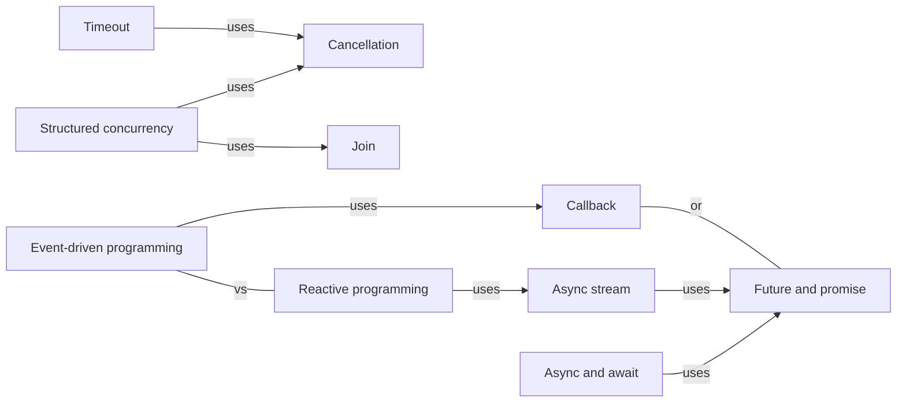

# Async

Not waiting: callbacks, futures and promises, async and await, and what cancelling, timing out and blocking mean once a task can pause.

[All categories](../README.md) · [How they connect](../schema/README.md)

- [Event-driven programming](event_driven_programming/README.md) — A program built as handlers that run when events arrive — a click, a message, a ready socket — instead of as one flow from top to bottom.
- [Callback](callback/README.md) — A function handed to an operation to be called when the operation finishes — the oldest way to write asynchronous code, and the source of deeply nested callback code.
- [Future and promise](future_and_promise/README.md) — A placeholder for a result that is not ready yet: the future is the side that waits for the value, the promise the side that supplies it.
- [Async and await](async_await/README.md) — Syntax that lets asynchronous code read like sequential code: an async function returns a future, and await pauses the caller until that future resolves, without blocking the thread.
- [Async functions as state machines](async_state_machine/README.md) — A compiler turns an async function into a state machine whose states are its suspension points, storing the local variables that live across each await.
- [Structured concurrency](structured_concurrency/README.md) — Concurrent tasks are started inside a scope that does not end until all of them have, so no task outlives the code that started it and every error reaches that code.
- [Cancellation](cancellation/README.md) — Asking a running task to stop early and release what it holds; in most languages the task has to cooperate by noticing the request.
- [Timeout](timeout/README.md) — Giving up on an operation after a time limit — which, in concurrent code, means cancelling or abandoning whatever was still running on its behalf.
- [Join](join/README.md) — Waiting for a thread or task to finish, usually receiving its result or its failure through a handle.
- [Function coloring](function_coloring/README.md) — An async function can call a sync one, but not the other way round without help, so async-ness spreads up the call graph and splits libraries into two colors.
- [Async stream](async_stream/README.md) — An asynchronous iterator: a sequence whose items arrive over time, each one awaited in turn.
- [Pinning](pinning/README.md) — Rust's guarantee that a value will not move in memory, needed because an async state machine may hold pointers into itself.
- [Blocking the event loop](blocking_the_event_loop/README.md) — A task that computes for a long time, or makes a blocking call, on the runtime's thread stops every other task on that thread until it is done.
- [Reactive programming](reactive_programming/README.md) — Describing a program as streams of values over time and the values derived from them, with changes propagating through automatically.
- [Timers and tickers](timers/README.md) — A runtime facility that fires once after a delay, or repeatedly at an interval, and delivers it as a callback, a value on a channel, or something to await.

## Inside this category

<!-- Generated above this line by tools/build_concepts.py from TOML data — edit the data, not the page. Hand-written notes go below it and are kept. -->
