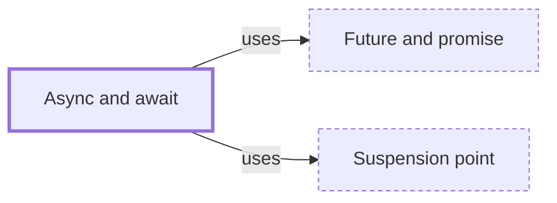

# Async and await

**Category:** [Async](../README.md) · **Status:** stub · **Lessons:** [chapter 06, Async](../../../06_Async/README.md)

**One line:** Syntax that lets asynchronous code read like sequential code: an async function returns a future, and await pauses the caller until that future resolves, without blocking the thread.

Also called: async/await, async function, coroutines (C++20).

## How it connects

- **Is built on:** [Future and promise](../future_and_promise/README.md), [Suspension point](../../scheduling/suspension_point/README.md)
- **See also:** [Async functions as state machines](../async_state_machine/README.md), [Asynchrony](../../foundations/asynchrony/README.md), [Coroutine](../../units_of_execution/coroutine/README.md), [Durable execution](../../distributed/durable_execution/README.md), [Function coloring](../function_coloring/README.md), [Future and promise](../future_and_promise/README.md), [Suspension point](../../scheduling/suspension_point/README.md)

## In each language

| | |
|---|---|
| Rust | `async fn` and `.await`; an async function does no work until its future is polled ([reference ↗](https://doc.rust-lang.org/reference/items/functions.html#async-functions)), and while most languages with async bundle a runtime, Rust does not ([Book ↗](https://doc.rust-lang.org/book/ch17-01-futures-and-syntax.html)) |
| Go | neither: code blocks in ordinary calls, and when a goroutine blocks the runtime moves the others to a runnable thread ([FAQ ↗](https://go.dev/doc/faq#goroutines)) |
| C++ | C++20 [coroutines ↗](https://en.cppreference.com/w/cpp/language/coroutines) (`co_await`, `co_yield`, `co_return`) are stackless; C++20 ships handles and traits but no task type, which the [support library ↗](https://en.cppreference.com/w/cpp/coroutine) adds as `std::execution::task` in C++26 |
| Java | no async/await: [JEP 444 ↗](https://openjdk.org/jeps/444) delivered virtual threads in JDK 21 and rejected async/await because it would split the world between APIs for threads and APIs for coroutines; [`CompletableFuture` ↗](https://docs.oracle.com/en/java/javase/25/docs/api/java.base/java/util/concurrent/CompletableFuture.html) chains actions on completion |
| Python | [`async def` and `await` ↗](https://docs.python.org/3/reference/compound_stmts.html#coroutine-function-definition) on [asyncio's event loop ↗](https://docs.python.org/3/library/asyncio-eventloop.html); simply calling a coroutine does not schedule it ([docs ↗](https://docs.python.org/3/library/asyncio-task.html#coroutines)) |
| C# | an `async` method returns a [`Task` ↗](https://learn.microsoft.com/en-us/dotnet/csharp/asynchronous-programming/) that is already running: only tasks made with a `Task` constructor start cold ([TAP ↗](https://learn.microsoft.com/en-us/dotnet/standard/asynchronous-programming-patterns/task-based-asynchronous-pattern-tap)); the compiler turns the method into a state machine |
| JavaScript | an [`async function` ↗](https://developer.mozilla.org/en-US/docs/Web/JavaScript/Reference/Statements/async_function) runs synchronously up to its first `await`, so its work starts on the call; [`await` ↗](https://developer.mozilla.org/en-US/docs/Web/JavaScript/Reference/Operators/await) is allowed only in async functions and at the top level of a module |
| Kotlin | `suspend` functions, called with no `await` keyword and only from other suspending functions ([basics ↗](https://kotlinlang.org/docs/coroutines-basics.html)); [`async` ↗](https://kotlinlang.org/docs/composing-suspending-functions.html) returns a `Deferred` to await, and starts lazily only if asked to |
| Swift | `async` functions with `await` marking each possible suspension point, plus `async let` and task groups ([Swift book ↗](https://docs.swift.org/swift-book/documentation/the-swift-programming-language/concurrency/)) |

## Where to read more

- **In this library:** [Is total += n safe on two threads?](../../../02_Shared_State/the_lost_update/README.md)
- **In this library:** [What happens at an await?](../../../06_Async/async_and_await/README.md)
- **In this library:** [Where does a callback keep its state?](../../../06_Async/a_callback_and_its_state/README.md)
- **In this library:** [Why can't a normal function call an async one?](../../../06_Async/function_coloring/README.md)
- **In a sibling library:** [Rust: `async fn` and `.await` ↗](https://masiarek.github.io/rust-learning-library/35_Async/async_fn_and_await/index.html)
- **In the books:** [*Asynchronous Programming in Rust*](../../../10_Resources/books_rust/README.md#samson_asynchronous_programming_in_rust), Carl Fredrik Samson — ch. 7, 'Coroutines and async/await'
- **In the books:** [*Pro Asynchronous Programming with .NET*](../../../10_Resources/books_csharp_dotnet/README.md#blewett_clymer_pro_asynchronous_programming_dotnet), Richard Blewett, Andrew Clymer — ch. 7, 'async and await'
- **In the books:** [*asyncio Recipes*](../../../10_Resources/books_python/README.md#tahrioui_asyncio_recipes), Mohamed Mustapha Tahrioui — ch. 3, 'Working with Coroutines and Async/Await'
- **In the books:** [*Kotlin Coroutines by Tutorials*](../../../10_Resources/books_other/README.md#babic_srivastava_kotlin_coroutines_by_tutorials), Filip Babić, Nishant Srivastava — ch. 5, 'Async/Await'
- **In the books:** [*Async JavaScript*](../../../10_Resources/books_javascript/README.md#burnham_async_javascript), Trevor Burnham — ch. 1, 'Understanding JavaScript Events' → 'Types of Async Functions'
- **In the books:** [*Combine: Asynchronous Programming with Swift*](../../../10_Resources/books_swift/README.md#kodeco_combine_asynchronous_programming_swift), Shai Mishali, Florent Pillet, Marin Todorov, Scott Gardner — ch. 2, 'Publishers & Subscribers' → 'Bridging Combine publishers to async/await'
- **Notes:** [Topics - async - how to teach async rust ↗](https://docs.google.com/document/u/0/d/1r-1z2MoDfVtR0gaz7ZypLhOzfmZrlme1BJs_Y6vx1IQ/edit)
- **Notes:** [async - rust - concurrency - main - idx ↗](https://docs.google.com/document/u/0/d/1V8gave_8PBAPOj3SgO91rktMc3u-3FLIExFu_0HNJsw/edit)
- **Notes:** [Asynchronous Programming in Rust (notes) ↗](https://docs.google.com/document/u/0/d/15kighMDIDhny4QjmTyiEjVUeBe_GqTMb23rVH3rNWAQ/edit)
- **Notes:** [book rust asynchronous programming ↗](https://docs.google.com/document/u/0/d/10K6F_oPLDwp9oMmeOjA_yEJlZJyrUzGvXD9MLePpDd8/edit)
- **Notes:** [Error handling in async functions ↗](https://docs.google.com/document/d/18z0CoZUSqptiWohFcLyKKOph22f5DgpxiQO791phWEc/edit?tab=t.0)
- **Notes:** [asynchronous python ↗](https://docs.google.com/document/u/0/d/1tkAkfrrVTZY30QMNLV211PXKcQooMhDHBL1lF_27_ic/edit)
- **Notes:** [async kata - python ↗](https://docs.google.com/document/d/1og40CcSWMRJCs2H98L8VGFoi12eX-DYNtFBAl_BQrFQ/edit?tab=t.0)
- **Notes:** [async - concurrent - C# - main ↗](https://docs.google.com/document/d/1RA-b0Ib0k0Vly1mMsvENHLwJ4cHG_mrhEFY7LKDxI-g/edit?tab=t.0)
- **Notes:** [async method - c# ↗](https://docs.google.com/document/d/1oJ7jSmz8DkWkGE_8nP9KxsUgGk_xpM2IygCWLrV0FJo/edit?tab=t.0)
- **Notes:** [async - dart programming - main ↗](https://docs.google.com/document/d/1k7sgra_fO8kFhNIN7QRN2dgC7z0KMo1sXboan8WG4O8/edit?tab=t.0)
- **Reference:** [Wikipedia: Async/await ↗](https://en.wikipedia.org/wiki/Async/await)

<!-- Generated above this line by tools/build_concepts.py from TOML data — edit the data, not the page. Hand-written notes go below it and are kept. -->
