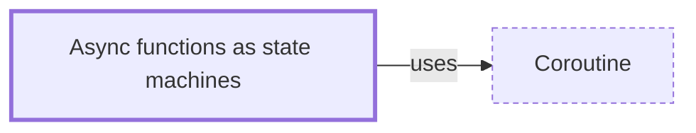

# Async functions as state machines

**Category:** [Async](../README.md) · **Status:** stub · **Lessons:** [chapter 06, Async](../../../06_Async/README.md)

**One line:** A compiler turns an async function into a state machine whose states are its suspension points, storing the local variables that live across each await.

## How it connects

- **Is built on:** [Coroutine](../../units_of_execution/coroutine/README.md)
- **See also:** [Async and await](../async_await/README.md), [Pinning](../pinning/README.md)

## In each language

| | |
|---|---|
| Rust | the compiler turns async code into an invisible state machine that a runtime drives ([Book ↗](https://doc.rust-lang.org/book/ch17-01-futures-and-syntax.html)) |
| C++ | a [coroutine ↗](https://en.cppreference.com/w/cpp/language/coroutines) keeps its promise, parameters, suspension point and locals in a coroutine state, allocated dynamically unless the allocation is optimized out |
| C# | the compiler generates a state machine for each async method, implementing [`IAsyncStateMachine` ↗](https://learn.microsoft.com/en-us/dotnet/api/system.runtime.compilerservices.iasyncstatemachine) |
| Kotlin | a suspended computation is resumed through a [`Continuation` ↗](https://kotlinlang.org/api/core/kotlin-stdlib/kotlin.coroutines/-continuation/), which represents the rest of the work after a suspension point |

## Where to read more

- **In this library:** [What happens at an await?](../../../06_Async/async_and_await/README.md)
- **In this library:** [Where does a callback keep its state?](../../../06_Async/a_callback_and_its_state/README.md)
- **In a sibling library:** [Rust: `async fn` and `.await` ↗](https://masiarek.github.io/rust-learning-library/35_Async/async_fn_and_await/index.html)
- **In the books:** [*Asynchronous Programming in Rust*](../../../10_Resources/books_rust/README.md#samson_asynchronous_programming_in_rust), Carl Fredrik Samson — ch. 7, 'Coroutines and async/await' → 'Introduction to stackless coroutines'
- **In the books:** [*asyncio Recipes*](../../../10_Resources/books_python/README.md#tahrioui_asyncio_recipes), Mohamed Mustapha Tahrioui — ch. 4, 'Working with Async Generators' → 'Writing a State Machine with an Async Generator'
- **In the books:** [*Async Rust*](../../../10_Resources/books_rust/README.md#flitton_morton_async_rust), Maxwell Flitton, Caroline Morton — ch. 9, 'Design Patterns' → 'The State Machine Pattern'
- **In the books:** [*Erlang Programming*](../../../10_Resources/books_elixir_erlang/README.md#cesarini_thompson_erlang_programming), Francesco Cesarini, Simon Thompson — ch. 5, 'Process Design Patterns' → 'Finite State Machines'
- **Notes:** [async functions - state machines - rust ↗](https://docs.google.com/document/d/1mQYBLftNU6A4mo4hA5gsJVMOfvWY79dNFSagAlZETVU/edit?tab=t.0)

<!-- Generated above this line by tools/build_concepts.py from TOML data — edit the data, not the page. Hand-written notes go below it and are kept. -->
