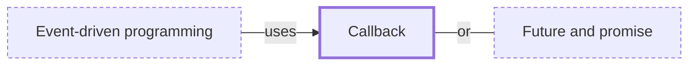

# Callback

**Category:** [Async](../README.md) · **Status:** stub · **Lessons:** [chapter 06, Async](../../../06_Async/README.md)

**One line:** A function handed to an operation to be called when the operation finishes — the oldest way to write asynchronous code, and the source of deeply nested callback code.

Also called: completion handler, callback hell.

## How it connects

- **Is used by:** [Event-driven programming](../event_driven_programming/README.md)
- **An alternative to:** [Future and promise](../future_and_promise/README.md)
- **See also:** [Asynchrony](../../foundations/asynchrony/README.md), [Event loop](../../scheduling/event_loop/README.md)

## In each language

| | |
|---|---|
| C | a function pointer; POSIX [AIO ↗](https://man7.org/linux/man-pages/man7/aio.7.html) can report a finished operation by starting a thread (`SIGEV_THREAD`) |
| Java | [`CompletableFuture` ↗](https://docs.oracle.com/en/java/javase/25/docs/api/java.base/java/util/concurrent/CompletableFuture.html) takes callbacks such as `thenApply` and `thenAccept` |
| Python | [`Future.add_done_callback` ↗](https://docs.python.org/3/library/asyncio-future.html#asyncio.Future.add_done_callback) and [`loop.call_soon` ↗](https://docs.python.org/3/library/asyncio-eventloop.html#asyncio.loop.call_soon); asyncio futures exist to bridge callback-based code with async/await |
| C# | the [Asynchronous Programming Model ↗](https://learn.microsoft.com/en-us/dotnet/standard/asynchronous-programming-patterns/asynchronous-programming-model-apm): `BeginOperationName` takes an `AsyncCallback` that is called when the operation completes |
| JavaScript | a [callback function ↗](https://developer.mozilla.org/en-US/docs/Glossary/Callback_function), passed into another function and invoked inside it |
| Swift | completion handlers, which the [Swift book ↗](https://docs.swift.org/swift-book/documentation/the-swift-programming-language/concurrency/) shows piling up as nested closures before it introduces `async` and `await` |

## Where to read more

- **In this library:** [What is a future before it has a value?](../../../06_Async/a_future_is_a_value_not_yet_there/README.md)
- **In this library:** [Where does a callback keep its state?](../../../06_Async/a_callback_and_its_state/README.md)
- **In the books:** [*Asynchronous Programming in Rust*](../../../10_Resources/books_rust/README.md#samson_asynchronous_programming_in_rust), Carl Fredrik Samson — ch. 2, 'How Programming Languages Model Asynchronous Program Flow' → 'Callback based approaches'
- **In the books:** [*asyncio Recipes*](../../../10_Resources/books_python/README.md#tahrioui_asyncio_recipes), Mohamed Mustapha Tahrioui — ch. 2, 'Working with Event Loops' → 'Scheduling Callbacks on a Loop'
- **In the books:** [*JavaScript Concurrency*](../../../10_Resources/books_javascript/README.md#boduch_javascript_concurrency), Adam Boduch — ch. 3, 'Synchronizing with Promises' → 'Building callback chains'
- **In the books:** [*Combine: Asynchronous Programming with Swift*](../../../10_Resources/books_swift/README.md#kodeco_combine_asynchronous_programming_swift), Shai Mishali, Florent Pillet, Marin Todorov, Scott Gardner — ch. 8, 'In Practice: Project "Collage Neue"' → 'Wrapping a callback function as a future'
- **In the books:** [*Kotlin Coroutines by Tutorials*](../../../10_Resources/books_other/README.md#babic_srivastava_kotlin_coroutines_by_tutorials), Filip Babić, Nishant Srivastava — ch. 1, 'What Is Asynchronous Programming' → 'Handling work completion using callbacks'
- **In the books:** [*Grokking Concurrency*](../../../10_Resources/books_general/README.md#bobrov_grokking_concurrency), Kirill Bobrov — ch. 11, 'Event-based concurrency' → 'Callbacks'
- **Notes:** [Callback-Based - Asynchronous Programming ↗](https://docs.google.com/document/d/1zFZ8NF6R3-81b46gVYpKPc-woMDFy-wo2wie158ODs8/edit?tab=t.0)
- **Reference:** [Wikipedia: Callback (computer programming) ↗](https://en.wikipedia.org/wiki/Callback_(computer_programming))

<!-- Generated above this line by tools/build_concepts.py from TOML data — edit the data, not the page. Hand-written notes go below it and are kept. -->
