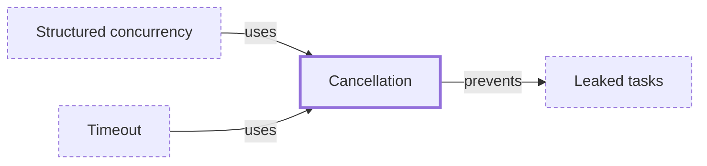

# Cancellation

**Category:** [Async](../README.md) · **Status:** stub · **Lessons:** chapter 06, Async *(planned)*

**One line:** Asking a running task to stop early and release what it holds; in most languages the task has to cooperate by noticing the request.

Also called: cancellation token, context cancellation, stop token.

## How it connects

- **Is used by:** [Structured concurrency](../structured_concurrency/README.md), [Timeout](../timeout/README.md)
- **Helps prevent:** [Leaked tasks](../../hazards/task_leak/README.md)
- **See also:** [Select](../../communication/select/README.md), [Timeout](../timeout/README.md)

## In each language

| | |
|---|---|
| Rust | a future is cancelled by dropping it; tokio's [`select!` ↗](https://docs.rs/tokio/latest/tokio/macro.select.html) cancels the branches that lose that way, which is why its docs discuss cancellation safety |
| Go | a [`context` ↗](https://pkg.go.dev/context#WithCancel): calling `cancel` closes the context's `Done` channel, and with it those of the contexts derived from it; each goroutine has to watch `Done` |
| C | [`pthread_cancel` ↗](https://pubs.opengroup.org/onlinepubs/9799919799/functions/pthread_cancel.html) asks; the target thread's cancelability state and type decide when it takes effect |
| C++ | [`std::stop_token` ↗](https://en.cppreference.com/w/cpp/thread/stop_token) (C++20) tells a thread whether a stop has been requested; a [`std::jthread` ↗](https://en.cppreference.com/w/cpp/thread/jthread) can be stopped this way |
| Java | [`Thread.interrupt` ↗](https://docs.oracle.com/en/java/javase/25/docs/api/java.base/java/lang/Thread.html), which a blocked `sleep`, `wait` or `join` answers with `InterruptedException`; [`Future.cancel` ↗](https://docs.oracle.com/en/java/javase/25/docs/api/java.base/java/util/concurrent/Future.html) |
| Python | [`Task.cancel` ↗](https://docs.python.org/3/library/asyncio-task.html#asyncio.Task.cancel) raises `CancelledError` inside the task at its next opportunity |
| C# | a [`CancellationToken` ↗](https://learn.microsoft.com/en-us/dotnet/standard/threading/cancellation-in-managed-threads), a cooperative model: each listener must notice the request and respond to it |
| JavaScript | an [`AbortController` ↗](https://developer.mozilla.org/en-US/docs/Web/API/AbortController) and its `AbortSignal` |
| Kotlin | [cooperative ↗](https://kotlinlang.org/docs/coroutines-cancellation.html): a coroutine reacts to cancellation only when it suspends or checks for it explicitly |
| Swift | cooperative: a task checks with `Task.checkCancellation()` or `Task.isCancelled` ([Swift book ↗](https://docs.swift.org/swift-book/documentation/the-swift-programming-language/concurrency/)) |
| Erlang and Elixir | [`Process.exit/2` ↗](https://hexdocs.pm/elixir/Process.html#exit/2) sends an exit signal; a process that traps exits receives it as a message instead |
| Haskell | [`killThread` ↗](https://hackage.haskell.org/package/base/docs/Control-Concurrent.html#v:killThread) raises the `ThreadKilled` exception in the target thread |

## Where to read more

- **In a sibling library:** [Go: One `cancel` reaches every goroutine ↗](https://masiarek.github.io/go-learning-library/05_Context/cancel_reaches_every_goroutine/index.html)
- **In a sibling library:** [Go: Cancel with a cause ↗](https://masiarek.github.io/go-learning-library/05_Context/cancel_with_a_cause/index.html)
- **In a sibling library:** [Go: The first error cancels the rest ↗](https://masiarek.github.io/go-learning-library/06_Patterns/first_error_cancels_the_rest/index.html)
- **In a sibling library:** [Rust: Cancellation ↗](https://masiarek.github.io/rust-learning-library/35_Async/building_minidb/cancellation/index.html)
- **In the books:** [*Pro TBB*](../../../10_Resources/books_cpp/README.md#voss_pro_tbb), Michael Voss, Rafael Asenjo, James Reinders — ch. 15, 'Cancellation and Exception Handling'
- **In the books:** [*Java Concurrency in Practice*](../../../10_Resources/books_java/README.md#goetz_java_concurrency_in_practice), Brian Goetz, Tim Peierls, Joshua Bloch, Joseph Bowbeer, David Holmes, Doug Lea — ch. 7, 'Cancellation and Shutdown'
- **In the books:** [*Parallel and Concurrent Programming in Haskell*](../../../10_Resources/books_haskell/README.md#marlow_parallel_and_concurrent_programming_in_haskell), Simon Marlow — ch. 9, 'Cancellation and Timeouts'
- **In the books:** [*Concurrency in Go*](../../../10_Resources/books_go/README.md#cox_buday_concurrency_in_go), Katherine Cox-Buday — ch. 5, 'Concurrency at Scale' → 'Timeouts and Cancellation'
- **In the books:** [*Pthreads Programming*](../../../10_Resources/books_c/README.md#nichols_pthreads_programming), Bradford Nichols, Dick Buttlar, Jacqueline Proulx Farrell — ch. 4, 'Managing Pthreads' → 'Cancellation'
- **In the books:** [*Concurrency in C# Cookbook*](../../../10_Resources/books_csharp_dotnet/README.md#cleary_concurrency_in_csharp_cookbook), Stephen Cleary — ch. 3, 'Asynchronous Streams' → 'Asynchronous Streams and Cancellation'

<!-- Generated above this line by tools/build_concepts.py from TOML data — edit the data, not the page. Hand-written notes go below it and are kept. -->
