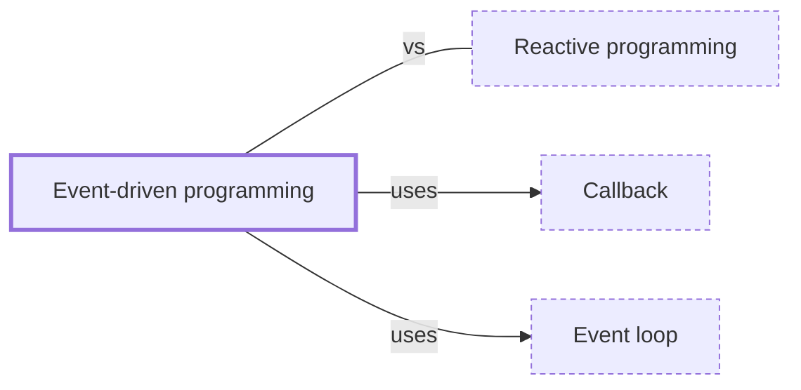

# Event-driven programming

**Category:** [Async](../README.md) · **Status:** stub · **Lessons:** chapter 06, Async *(planned)*

**One line:** A program built as handlers that run when events arrive — a click, a message, a ready socket — instead of as one flow from top to bottom.

Also called: event-driven architecture.

## How it connects

- **Is built on:** [Callback](../callback/README.md), [Event loop](../../scheduling/event_loop/README.md)
- **Often confused with:** [Reactive programming](../reactive_programming/README.md)

## In each language

| | |
|---|---|
| Go | no event loop in user code: a goroutine makes an ordinary blocking call, and the runtime moves the other goroutines to a runnable thread ([FAQ ↗](https://go.dev/doc/faq#goroutines)) |
| Python | the [asyncio event loop ↗](https://docs.python.org/3/library/asyncio-eventloop.html) runs asynchronous tasks and callbacks, network I/O and subprocesses |
| C# | [events ↗](https://learn.microsoft.com/en-us/dotnet/standard/events/), built on the delegate model and declared with the `event` keyword |
| JavaScript | the host's event loop takes jobs from a job queue ([execution model ↗](https://developer.mozilla.org/en-US/docs/Web/JavaScript/Reference/Execution_model)); handlers are attached with [`addEventListener` ↗](https://developer.mozilla.org/en-US/docs/Web/API/EventTarget/addEventListener), or with Node's [`EventEmitter` ↗](https://nodejs.org/api/events.html) |
| The operating system | [epoll ↗](https://man7.org/linux/man-pages/man7/epoll.7.html) reports which of many file descriptors can do I/O, edge- or level-triggered |

## Where to read more

- **In the books:** [*Grokking Concurrency*](../../../10_Resources/books_general/README.md#bobrov_grokking_concurrency), Kirill Bobrov — ch. 11, 'Event-based concurrency'
- **In the books:** [*JavaScript Concurrency*](../../../10_Resources/books_javascript/README.md#boduch_javascript_concurrency), Adam Boduch — ch. 8, 'Evented IO with NodeJS'
- **In the books:** [*Asynchronous Programming*](../../../10_Resources/books_general/README.md#edet_asynchronous_programming), Theophilus Edet — ch. 5, 'Real-time Applications and Event-driven Architectures'
- **In the books:** [*C++ Reactive Programming*](../../../10_Resources/books_cpp/README.md#pai_abraham_cpp_reactive_programming), Praseed Pai, Peter Abraham — ch. 1, 'Reactive Programming Model – Overview and History' → 'Event-driven programming model'
- **In the books:** [*Async JavaScript*](../../../10_Resources/books_javascript/README.md#burnham_async_javascript), Trevor Burnham — ch. 2, 'Distributing Events' → 'Evented Models'
- **In the books:** [*Designing Distributed Systems*](../../../10_Resources/books_general/README.md#burns_designing_distributed_systems), Brendan Burns — ch. 8, 'Functions and Event-Driven Processing'
- **Reference:** [Wikipedia: Event-driven programming ↗](https://en.wikipedia.org/wiki/Event-driven_programming)

<!-- Generated above this line by tools/build_concepts.py from TOML data — edit the data, not the page. Hand-written notes go below it and are kept. -->
