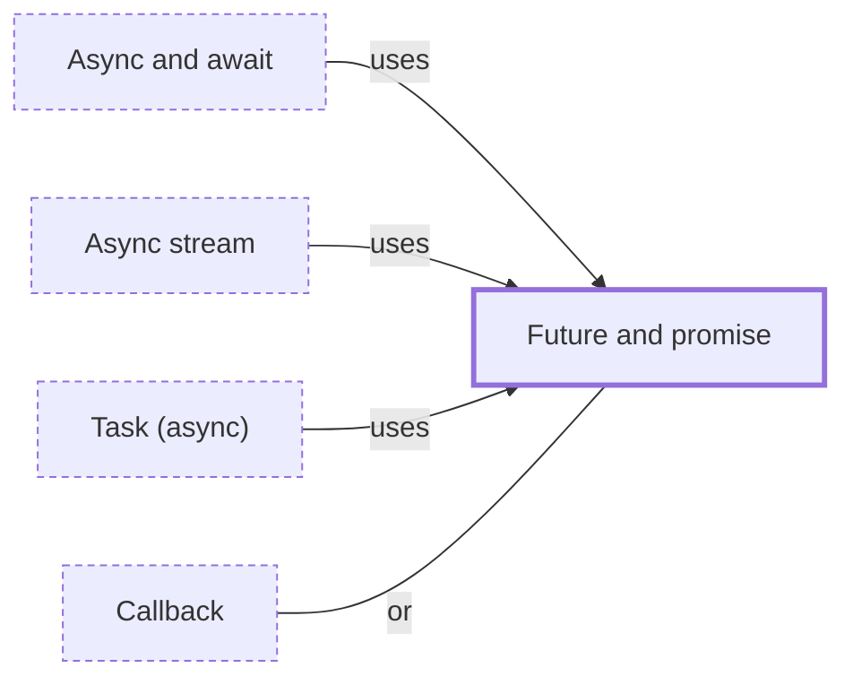

# Future and promise

**Category:** [Async](../README.md) · **Status:** stub · **Lessons:** [chapter 06, Async](../../../06_Async/README.md)

**One line:** A placeholder for a result that is not ready yet: the future is the side that waits for the value, the promise the side that supplies it.

Also called: future, promise, deferred, Task.

## How it connects

- **Is used by:** [Async and await](../async_await/README.md), [Async stream](../async_stream/README.md), [Task (async)](../../units_of_execution/async_task/README.md)
- **An alternative to:** [Callback](../callback/README.md)
- **See also:** [Async and await](../async_await/README.md), [Asynchrony](../../foundations/asynchrony/README.md), [Concurrency primitives](../../foundations/concurrency_primitives/README.md), [Join](../join/README.md), [Polling](../../scheduling/polling/README.md)

## In each language

| | |
|---|---|
| Rust | [`Future` ↗](https://doc.rust-lang.org/std/future/trait.Future.html), a trait with a `poll` method; an async function's future does no work until polled ([reference ↗](https://doc.rust-lang.org/reference/items/functions.html#async-functions)); a thread's result comes back from [`JoinHandle::join` ↗](https://doc.rust-lang.org/std/thread/struct.JoinHandle.html#method.join) |
| Go | none: a [`go` statement ↗](https://go.dev/ref/spec#Go_statements) discards the function's return values, so a result has to be sent back on a channel |
| C++ | [`std::future` ↗](https://en.cppreference.com/w/cpp/thread/future) and [`std::promise` ↗](https://en.cppreference.com/w/cpp/thread/promise) (C++11); [`std::async` ↗](https://en.cppreference.com/w/cpp/thread/async) returns a future |
| Java | [`Future` ↗](https://docs.oracle.com/en/java/javase/25/docs/api/java.base/java/util/concurrent/Future.html); a [`CompletableFuture` ↗](https://docs.oracle.com/en/java/javase/25/docs/api/java.base/java/util/concurrent/CompletableFuture.html) can also be completed explicitly, so it is the promise side too |
| Python | [`concurrent.futures.Future` ↗](https://docs.python.org/3/library/concurrent.futures.html#concurrent.futures.Future) from executors; [`asyncio.Future` ↗](https://docs.python.org/3/library/asyncio-future.html#asyncio.Future) on the event loop, which is not thread-safe |
| C# | [`Task<TResult>` ↗](https://learn.microsoft.com/en-us/dotnet/api/system.threading.tasks.task-1) is the future and [`TaskCompletionSource<TResult>` ↗](https://learn.microsoft.com/en-us/dotnet/api/system.threading.tasks.taskcompletionsource-1) the producer side |
| JavaScript | [`Promise` ↗](https://developer.mozilla.org/en-US/docs/Web/JavaScript/Reference/Global_Objects/Promise); the executor passed to its [constructor ↗](https://developer.mozilla.org/en-US/docs/Web/JavaScript/Reference/Global_Objects/Promise/Promise) runs synchronously and receives the resolve and reject functions |
| Kotlin | [`Deferred` ↗](https://kotlinlang.org/api/kotlinx.coroutines/kotlinx-coroutines-core/kotlinx.coroutines/-deferred/), returned by `async`: a light-weight non-blocking future that is also a `Job`, so it can be cancelled |
| Swift | a [`Task` ↗](https://docs.swift.org/swift-book/documentation/the-swift-programming-language/concurrency/) handle, whose result is read with `await handle.value` |
| Erlang and Elixir | [`Task.async` and `Task.await` ↗](https://hexdocs.pm/elixir/Task.html): a task is a process meant to execute one particular action |

## Where to read more

- **In this library:** [Getting a result back](../../../01_Threads/getting_a_result_back/README.md)
- **In this library:** [What is a future before it has a value?](../../../06_Async/a_future_is_a_value_not_yet_there/README.md)
- **In this library:** [What happens to the work when an await times out?](../../../06_Async/a_timeout_on_an_await/README.md)
- **In a sibling library:** [Go: A goroutine has no handle ↗](https://masiarek.github.io/go-learning-library/01_Goroutines/a_goroutine_has_no_handle/index.html)
- **In a sibling library:** [Rust: What a future is ↗](https://masiarek.github.io/rust-learning-library/35_Async/what_a_future_is/index.html)
- **In the books:** [*Learning Concurrent Programming in Scala*](../../../10_Resources/books_scala_jvm_functional/README.md#prokopec_learning_concurrent_programming_in_scala), Aleksandar Prokopec — ch. 4, 'Asynchronous Programming with Futures and Promises'
- **In the books:** [*Parallel Programming with Python*](../../../10_Resources/books_python/README.md#palach_parallel_programming_with_python), Jan Palach — ch. 4, 'Using the threading and concurrent.futures Modules'
- **In the books:** [*JavaScript Concurrency*](../../../10_Resources/books_javascript/README.md#boduch_javascript_concurrency), Adam Boduch — ch. 3, 'Synchronizing with Promises'
- **In the books:** [*The Art of Multiprocessor Programming*](../../../10_Resources/books_general/README.md#herlihy_shavit_art_of_multiprocessor_programming), Maurice Herlihy, Nir Shavit — ch. 16, 'Futures, Scheduling, and Work Distribution'
- **In the books:** [*Asynchronous Programming in Rust*](../../../10_Resources/books_rust/README.md#samson_asynchronous_programming_in_rust), Carl Fredrik Samson — ch. 2, 'How Programming Languages Model Asynchronous Program Flow' → 'Coroutines: promises and futures'
- **In the books:** [*C++ Concurrency in Action*](../../../10_Resources/books_cpp/README.md#williams_cpp_concurrency_in_action), Anthony Williams — ch. 4, 'Synchronizing concurrent operations' → 'Waiting for one-off events with futures'
- **Notes:** [future - promise - delay - deferred - general ↗](https://docs.google.com/document/d/1iqZZ4hXscxlN9ZjMpeangJ8CyWVVw3pFiJDCpYy4FHQ/edit?tab=t.0)
- **Notes:** [futures - rust - main ↗](https://docs.google.com/document/u/0/d/1OuH409o_MQsV3yRAMxznNr8EV4FRYUJ0-7M3hvq9tQw/edit)
- **Notes:** [Futures rust - code snippets ↗](https://docs.google.com/document/u/0/d/1UDGnkC1IwtqRUA15TzE5qSOpCWTQ0NRV7NhSak62BoY/edit)
- **Notes:** [resolving - fulfilling, binding a future - general ↗](https://docs.google.com/document/d/1PokViozEx7OcfZ6pSVA2J98H5U-_6yJsNkHsBE9N-hg/edit?tab=t.0)
- **Notes:** [asynchronous results - general ↗](https://docs.google.com/document/d/19HPYv4knrGuaCoHxcL0WDHOlmkHBLvZpQ94V1ugVrkU/edit?tab=t.0)
- **Notes:** [promises - general ↗](https://docs.google.com/document/d/1OSuXt27KNUd9Jd5rUoDpH_-nOA0yiKBMPhJRgm8MO_Q/edit?tab=t.0)
- **Reference:** [Wikipedia: Futures and promises ↗](https://en.wikipedia.org/wiki/Futures_and_promises)

<!-- Generated above this line by tools/build_concepts.py from TOML data — edit the data, not the page. Hand-written notes go below it and are kept. -->
