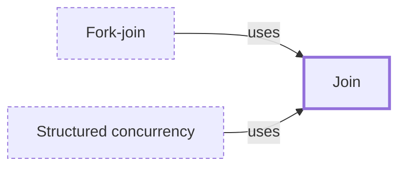

# Join

**Category:** [Async](../README.md) · **Status:** stub · **Lessons:** [chapter 01, Threads](../../../01_Threads/README.md)

**One line:** Waiting for a thread or task to finish, usually receiving its result or its failure through a handle.

Also called: join handle, JoinHandle, WaitGroup, await.

## How it connects

- **Is used by:** [Fork-join](../../parallelism/fork_join/README.md), [Structured concurrency](../structured_concurrency/README.md)
- **See also:** [Daemon and detached threads](../../units_of_execution/daemon_thread/README.md), [Future and promise](../future_and_promise/README.md), [Scoped thread](../../units_of_execution/scoped_thread/README.md)

## In each language

| | |
|---|---|
| Rust | [`JoinHandle::join` ↗](https://doc.rust-lang.org/std/thread/struct.JoinHandle.html#method.join) returns the thread's result, or `Err` if the thread panicked |
| Go | no handle to join: count goroutines with a [`sync.WaitGroup` ↗](https://pkg.go.dev/sync#WaitGroup), which also has a `Go` method, or receive their results on a channel |
| C | [`pthread_join` ↗](https://pubs.opengroup.org/onlinepubs/9799919799/functions/pthread_join.html) suspends the caller until the target thread terminates |
| C++ | [`std::thread::join` ↗](https://en.cppreference.com/w/cpp/thread/thread/join); destroying a thread that is still joinable calls `std::terminate` ([destructor ↗](https://en.cppreference.com/w/cpp/thread/thread/~thread)), which a [`std::jthread` ↗](https://en.cppreference.com/w/cpp/thread/jthread) avoids by joining |
| Java | [`Thread.join` ↗](https://docs.oracle.com/en/java/javase/25/docs/api/java.base/java/lang/Thread.html), or `get` on a [`Future` ↗](https://docs.oracle.com/en/java/javase/25/docs/api/java.base/java/util/concurrent/Future.html) |
| Python | [`Thread.join` ↗](https://docs.python.org/3/library/threading.html#threading.Thread.join) |
| C# | [`Thread.Join` ↗](https://learn.microsoft.com/en-us/dotnet/api/system.threading.thread.join); for tasks, `await` or [`Task.WhenAll` ↗](https://learn.microsoft.com/en-us/dotnet/api/system.threading.tasks.task.whenall) |
| JavaScript | [`Promise.all` ↗](https://developer.mozilla.org/en-US/docs/Web/JavaScript/Reference/Global_Objects/Promise/all), which rejects as soon as any input promise rejects |
| Kotlin | [`Job.join` ↗](https://kotlinlang.org/api/kotlinx.coroutines/kotlinx-coroutines-core/kotlinx.coroutines/-job/join.html) suspends until the job is complete, for any reason |
| Swift | `await` a task's `value` ([Swift book ↗](https://docs.swift.org/swift-book/documentation/the-swift-programming-language/concurrency/)) |
| Erlang and Elixir | [`Task.await` ↗](https://hexdocs.pm/elixir/Task.html) |
| The operating system | [`waitpid` ↗](https://pubs.opengroup.org/onlinepubs/9799919799/functions/waitpid.html) for a child process |

## Where to read more

- **In this library:** [Who waits when main returns?](../../../01_Threads/who_waits_when_main_returns/README.md)
- **In this library:** [Getting a result back](../../../01_Threads/getting_a_result_back/README.md)
- **In this library:** [Can a thread borrow a local variable?](../../../01_Threads/lending_a_local_to_a_thread/README.md)
- **In a sibling library:** [Rust: Spawning a thread ↗](https://masiarek.github.io/rust-learning-library/09_Advanced/spawning_a_thread/index.html)
- **In a sibling library:** [Go: A goroutine has no handle ↗](https://masiarek.github.io/go-learning-library/01_Goroutines/a_goroutine_has_no_handle/index.html)
- **In a sibling library:** [Go: `main` does not wait ↗](https://masiarek.github.io/go-learning-library/01_Goroutines/main_does_not_wait/index.html)
- **In a sibling library:** [Go: A WaitGroup counts goroutines ↗](https://masiarek.github.io/go-learning-library/04_Sync/a_waitgroup_counts_goroutines/index.html)
- **In the books:** [*Learn Concurrent Programming with Go*](../../../10_Resources/books_go/README.md#cutajar_learn_concurrent_programming_with_go), James Cutajar — ch. 6, 'Synchronizing with waitgroups and barriers'
- **In the books:** [*Async Rust*](../../../10_Resources/books_rust/README.md#flitton_morton_async_rust), Maxwell Flitton, Caroline Morton — ch. 3, 'Building Our Own Async Queues' → 'Creating Our Own Join Macro'
- **In the books:** [*Concurrency with Modern C++*](../../../10_Resources/books_cpp/README.md#grimm_concurrency_with_modern_cpp), Rainer Grimm — ch. 6, 'The Future: C++20/23' → 'A Cooperatively Interruptible Joining Thread'
- **In the books:** [*Pro Asynchronous Programming with .NET*](../../../10_Resources/books_csharp_dotnet/README.md#blewett_clymer_pro_asynchronous_programming_dotnet), Richard Blewett, Andrew Clymer — ch. 4, 'Basic Thread Safety' → 'CountdownEvent: Simplifying Fork and Join'
- **In the books:** [*Effective Concurrency in Go*](../../../10_Resources/books_go/README.md#serdar_effective_concurrency_in_go), Burak Serdar — ch. 2, 'Go Concurrency Primitives' → 'Wait groups'
- **In the books:** [*The Linux Programming Interface*](../../../10_Resources/books_c/README.md#kerrisk_linux_programming_interface), Michael Kerrisk — ch. 29, 'Threads: Introduction' → 'Joining with a Terminated Thread'

<!-- Generated above this line by tools/build_concepts.py from TOML data — edit the data, not the page. Hand-written notes go below it and are kept. -->
