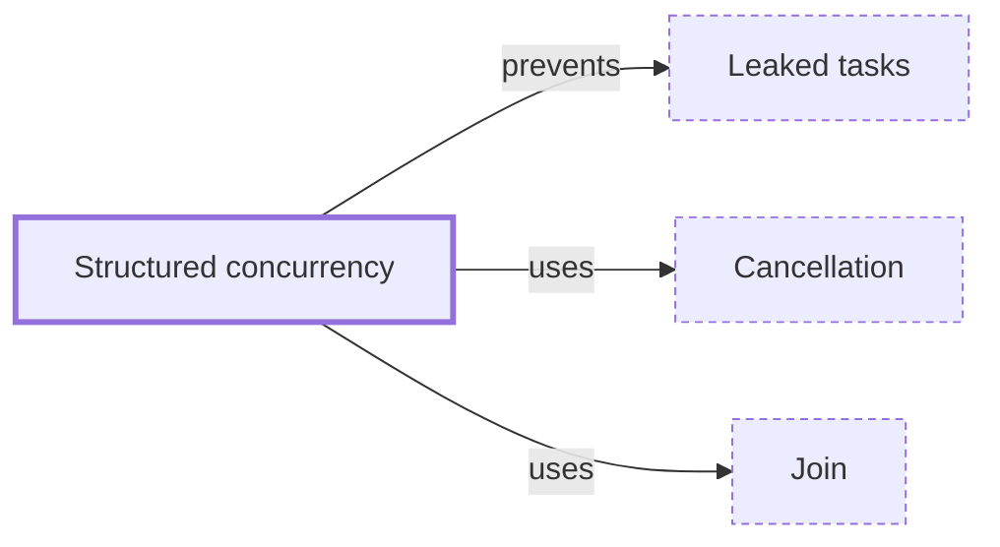

# Structured concurrency

**Category:** [Async](../README.md) · **Status:** stub · **Lessons:** chapter 06, Async *(planned)*

**One line:** Concurrent tasks are started inside a scope that does not end until all of them have, so no task outlives the code that started it and every error reaches that code.

Also called: nursery, task group.

## How it connects

- **Is built on:** [Cancellation](../cancellation/README.md), [Join](../join/README.md)
- **Helps prevent:** [Leaked tasks](../../hazards/task_leak/README.md)
- **See also:** [Scoped thread](../../units_of_execution/scoped_thread/README.md), [Supervision](../../communication/supervision/README.md)

## In each language

| | |
|---|---|
| Rust | [`thread::scope` ↗](https://doc.rust-lang.org/std/thread/fn.scope.html): every thread spawned in the scope is joined before it returns, which is why scoped threads may borrow local data |
| Go | not in std; [`errgroup` ↗](https://pkg.go.dev/golang.org/x/sync/errgroup) waits for a group of goroutines and cancels their context the first time one returns an error |
| C++ | no scope construct; a [`std::jthread` ↗](https://en.cppreference.com/w/cpp/thread/jthread) (C++20) joins on destruction, where a still-joinable [`std::thread` ↗](https://en.cppreference.com/w/cpp/thread/thread/~thread) calls `std::terminate` |
| Java | [`StructuredTaskScope` ↗](https://docs.oracle.com/en/java/javase/25/docs/api/java.base/java/util/concurrent/StructuredTaskScope.html), a preview API in JDK 25 ([JEP 505 ↗](https://openjdk.org/jeps/505), fifth preview) and again in JDK 26 ([JEP 525 ↗](https://openjdk.org/jeps/525), sixth preview) |
| Python | [`asyncio.TaskGroup` ↗](https://docs.python.org/3/library/asyncio-task.html#asyncio.TaskGroup), added in 3.11 |
| Kotlin | the default: coroutines start inside a `CoroutineScope`, and [`coroutineScope` ↗](https://kotlinlang.org/api/kotlinx.coroutines/kotlinx-coroutines-core/kotlinx.coroutines/coroutine-scope.html) returns only when its block and all coroutines launched in it have completed |
| Swift | task groups and `async let` create child tasks; the [Swift book ↗](https://docs.swift.org/swift-book/documentation/the-swift-programming-language/concurrency/) calls that explicit parent-child relationship structured concurrency |
| Elsewhere | Trio's [nurseries ↗](https://trio.readthedocs.io/en/stable/reference-core.html#tasks-let-you-do-multiple-things-at-once), in Python |

## Where to read more

- **In this library:** [Who waits when main returns?](../../../01_Threads/who_waits_when_main_returns/README.md)
- **In this library:** [Can a thread borrow a local variable?](../../../01_Threads/lending_a_local_to_a_thread/README.md)
- **In a sibling library:** [Go: The first error cancels the rest ↗](https://masiarek.github.io/go-learning-library/06_Patterns/first_error_cancels_the_rest/index.html)
- **In the books:** [*Kotlin Coroutines by Tutorials*](../../../10_Resources/books_other/README.md#babic_srivastava_kotlin_coroutines_by_tutorials), Filip Babić, Nishant Srivastava — ch. 6, 'Coroutine Context'
- **In the books:** [*Rust Atomics and Locks*](../../../10_Resources/books_rust/README.md#bos_rust_atomics_and_locks), Mara Bos — ch. 1, 'Basics of Rust Concurrency' → 'Scoped Threads'
- **Reference:** [Wikipedia: Structured concurrency ↗](https://en.wikipedia.org/wiki/Structured_concurrency)

<!-- Generated above this line by tools/build_concepts.py from TOML data — edit the data, not the page. Hand-written notes go below it and are kept. -->
