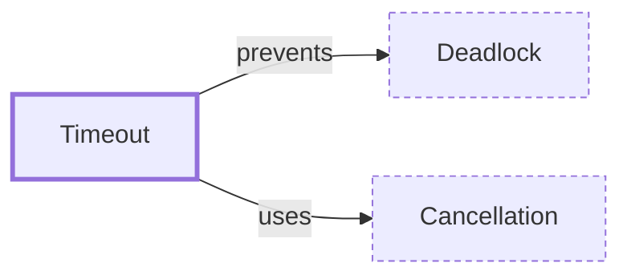

# Timeout

**Category:** [Async](../README.md) · **Status:** stub · **Lessons:** [chapter 06, Async](../../../06_Async/README.md)

**One line:** Giving up on an operation after a time limit — which, in concurrent code, means cancelling or abandoning whatever was still running on its behalf.

Also called: deadline.

## How it connects

- **Is built on:** [Cancellation](../cancellation/README.md)
- **Helps prevent:** [Deadlock](../../hazards/deadlock/README.md)
- **See also:** [Cancellation](../cancellation/README.md), [Partial failure](../../distributed/partial_failure/README.md), [Select](../../communication/select/README.md), [Timers and tickers](../timers/README.md)

## In each language

| | |
|---|---|
| Rust | [`Receiver::recv_timeout` ↗](https://doc.rust-lang.org/std/sync/mpsc/struct.Receiver.html#method.recv_timeout) on a channel; tokio's [`time::timeout` ↗](https://docs.rs/tokio/latest/tokio/time/fn.timeout.html) requires a future to complete before a duration has elapsed |
| Go | [`context.WithTimeout` ↗](https://pkg.go.dev/context#WithTimeout) for a whole call tree; [`time.After` ↗](https://pkg.go.dev/time#After) as one case of a `select` |
| C | [`pthread_cond_timedwait` ↗](https://pubs.opengroup.org/onlinepubs/9799919799/functions/pthread_cond_timedwait.html), which takes an absolute time |
| C++ | [`std::future::wait_for` ↗](https://en.cppreference.com/w/cpp/thread/future/wait_for), which returns `future_status::timeout` |
| Java | [`Future.get` ↗](https://docs.oracle.com/en/java/javase/25/docs/api/java.base/java/util/concurrent/Future.html) with a timeout throws `TimeoutException`; [`CompletableFuture.orTimeout` ↗](https://docs.oracle.com/en/java/javase/25/docs/api/java.base/java/util/concurrent/CompletableFuture.html) |
| Python | [`asyncio.timeout` ↗](https://docs.python.org/3/library/asyncio-task.html#asyncio.timeout) cancels the task and turns the `CancelledError` into a `TimeoutError`; [`asyncio.wait_for` ↗](https://docs.python.org/3/library/asyncio-task.html#asyncio.wait_for) |
| C# | [`CancellationTokenSource.CancelAfter` ↗](https://learn.microsoft.com/en-us/dotnet/api/system.threading.cancellationtokensource.cancelafter), and [`Task.WaitAsync` ↗](https://learn.microsoft.com/en-us/dotnet/api/system.threading.tasks.task.waitasync) with a `TimeSpan` |
| JavaScript | [`AbortSignal.timeout()` ↗](https://developer.mozilla.org/en-US/docs/Web/API/AbortSignal/timeout_static) returns a signal that aborts with a `TimeoutError` |
| Kotlin | [`withTimeout` ↗](https://kotlinlang.org/api/kotlinx.coroutines/kotlinx-coroutines-core/kotlinx.coroutines/with-timeout.html) cancels its block with a `TimeoutCancellationException`; `withTimeoutOrNull` is the variant the [guide ↗](https://kotlinlang.org/docs/coroutines-cancellation.html) uses |
| Erlang and Elixir | an `after` clause on `receive`, in [Erlang ↗](https://www.erlang.org/doc/system/expressions.html) and [Elixir ↗](https://hexdocs.pm/elixir/processes.html) |
| Haskell | [`System.Timeout.timeout` ↗](https://hackage.haskell.org/package/base/docs/System-Timeout.html) |

## Where to read more

- **In this library:** [What does a wait return when the time runs out?](../../../04_Waiting_For_Each_Other/waiting_with_a_timeout/README.md)
- **In this library:** [How is a running task told to stop, and does it?](../../../06_Async/cancelling_an_async_task/README.md)
- **In this library:** [What happens to the work when an await times out?](../../../06_Async/a_timeout_on_an_await/README.md)
- **In this library:** [How does a test wait an hour in a millisecond?](../../../09_Testing_and_Tools/virtual_time_in_tests/README.md)
- **In a sibling library:** [Go: A timeout is a channel ↗](https://masiarek.github.io/go-learning-library/03_Select/a_timeout_is_a_channel/index.html)
- **In a sibling library:** [Go: A deadline is a cancel with a clock ↗](https://masiarek.github.io/go-learning-library/05_Context/a_deadline_is_a_cancel_with_a_clock/index.html)
- **In a sibling library:** [Rust: Cancellation ↗](https://masiarek.github.io/rust-learning-library/35_Async/building_minidb/cancellation/index.html)
- **In the books:** [*Parallel and Concurrent Programming in Haskell*](../../../10_Resources/books_haskell/README.md#marlow_parallel_and_concurrent_programming_in_haskell), Simon Marlow — ch. 9, 'Cancellation and Timeouts'
- **In the books:** [*Concurrency in Go*](../../../10_Resources/books_go/README.md#cox_buday_concurrency_in_go), Katherine Cox-Buday — ch. 5, 'Concurrency at Scale' → 'Timeouts and Cancellation'
- **In the books:** [*C++ Concurrency in Action*](../../../10_Resources/books_cpp/README.md#williams_cpp_concurrency_in_action), Anthony Williams — ch. 4, 'Synchronizing concurrent operations' → 'Waiting with a time limit'
- **In the books:** [*Concurrency in C# Cookbook*](../../../10_Resources/books_csharp_dotnet/README.md#cleary_concurrency_in_csharp_cookbook), Stephen Cleary — ch. 6, 'System.Reactive Basics' → 'Timeouts'
- **In the books:** [*Python Concurrency with asyncio*](../../../10_Resources/books_python/README.md#fowler_python_concurrency_with_asyncio), Matthew Fowler — ch. 2, 'asyncio basics' → 'Canceling tasks and setting timeouts'
- **In the books:** [*Combine: Asynchronous Programming with Swift*](../../../10_Resources/books_swift/README.md#kodeco_combine_asynchronous_programming_swift), Shai Mishali, Florent Pillet, Marin Todorov, Scott Gardner — ch. 6, 'Time Manipulation Operators' → 'Timing out'

<!-- Generated above this line by tools/build_concepts.py from TOML data — edit the data, not the page. Hand-written notes go below it and are kept. -->
