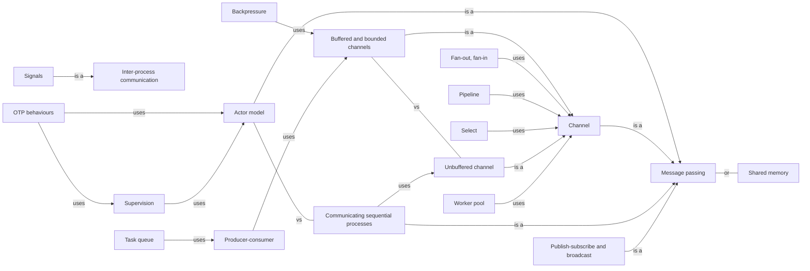

# Communication

Tasks that hand data to each other instead of sharing it — channels, queues, actors, processes — and the patterns built from them.

[All categories](../README.md) · [How they connect](../schema/README.md)

- [Message passing](message_passing/README.md) — Tasks share nothing and interact only by sending each other values, so that each value has one owner at a time.
    - [Channel](channel/README.md) — A typed conduit between tasks: one side sends values, the other receives them, in order.
        - [Unbuffered channel](unbuffered_channel/README.md) — A channel with no buffer: a send waits until a receiver takes the value, so every message is also a meeting of the two tasks.
        - [Buffered and bounded channels](bounded_channel/README.md) — A channel with a fixed-size buffer: sends succeed until it is full and then wait, which is how a slow receiver pushes back on a fast sender; an unbounded channel never waits and never pushes back.
    - [Publish-subscribe and broadcast](publish_subscribe/README.md) — A sender publishes to a topic and every subscriber gets its own copy, without the sender knowing who the subscribers are.
    - [Communicating sequential processes](csp/README.md) — Tony Hoare's model of independent processes that interact only through synchronous channels — the idea behind Go's goroutines and channels.
    - [Actor model](actor_model/README.md) — Actors are isolated units with a mailbox: each handles one message at a time, and can send messages, create actors and change its own state.
- [Shared memory](shared_memory/README.md) — Tasks read and write the same memory directly and coordinate with locks or atomics — the fastest way to share data, and the easiest to get wrong.
- [Select](select/README.md) — Waiting on several channel operations or futures at once, and continuing with whichever becomes ready first.
- [Backpressure](backpressure/README.md) — Letting a slow consumer slow its producers down — by making sends wait or fail — instead of letting unprocessed work pile up without limit.
- [Producer-consumer](producer_consumer/README.md) — One or more tasks make work items and one or more take them from a shared queue, each side running at its own speed.
- [Pipeline](pipeline/README.md) — A chain of stages, each a task that reads from the previous stage's channel and writes to the next one's.
- [Fan-out, fan-in](fan_out_fan_in/README.md) — Spreading the items of one channel across several workers, then merging their results back into one channel.
- [Worker pool](worker_pool/README.md) — A fixed number of workers take jobs from one shared queue, which bounds how much work runs at once.
- [Supervision](supervision/README.md) — Letting a failed actor or task crash and having a supervisor restart it, instead of defending against every error inside it — the approach of Erlang and OTP.
- [Inter-process communication](ipc/README.md) — The ways separate processes exchange data: pipes, sockets, shared-memory segments, signals and message queues.
    - [Signals](signals/README.md) — Asynchronous notifications the operating system delivers to a process — an interrupt from the keyboard, a closed pipe, a child that exited — and which, in a threaded program, one thread has to be chosen to receive.
- [Task queue](task_queue/README.md) — A queue of jobs that workers take and run — within one program, or across processes and machines with a broker in between.
- [Dataflow programming](dataflow/README.md) — A program as a graph of blocks through which data flows, each block running when its inputs are ready — so the graph, not the programmer, decides what runs in parallel.
- [OTP behaviours](otp_behaviours/README.md) — Erlang/OTP's reusable process patterns — a generic server, a supervisor, an application — where the library owns the concurrency and your module supplies the callbacks.

## Inside this category

<!-- Generated above this line by tools/build_concepts.py from TOML data — edit the data, not the page. Hand-written notes go below it and are kept. -->
