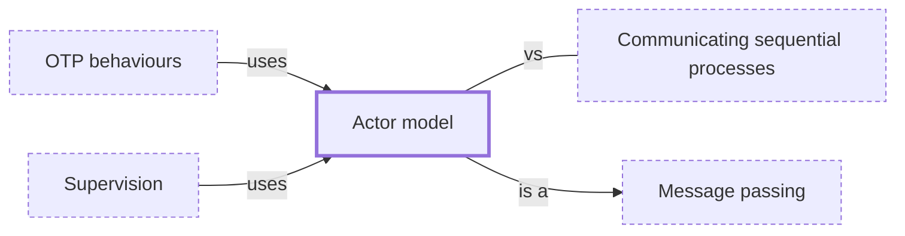

# Actor model

**Category:** [Communication](../README.md) · **Status:** stub · **Lessons:** [chapter 05, Message passing](../../../05_Message_Passing/README.md)

**One line:** Actors are isolated units with a mailbox: each handles one message at a time, and can send messages, create actors and change its own state.

Also called: actors, mailbox.

## How it connects

- **Is a kind of:** [Message passing](../message_passing/README.md)
- **Is used by:** [OTP behaviours](../otp_behaviours/README.md), [Supervision](../supervision/README.md)
- **Often confused with:** [Communicating sequential processes](../csp/README.md)
- **See also:** [Concurrency models](../../foundations/concurrency_models/README.md)

## In each language

| | |
|---|---|
| C# | [Orleans ↗](https://learn.microsoft.com/en-us/dotnet/orleans/overview), whose virtual actors are called grains |
| Kotlin | the channel-based [`actor` ↗](https://kotlinlang.org/api/kotlinx.coroutines/kotlinx-coroutines-core/kotlinx.coroutines.channels/actor.html) builder is marked `@ObsoleteCoroutinesApi` |
| Swift | an [`actor` ↗](https://docs.swift.org/swift-book/documentation/the-swift-programming-language/concurrency/) is a reference type that lets only one task at a time access its mutable state |
| Erlang and Elixir | processes are the actors, each with a mailbox it reads with `receive` ([Elixir ↗](https://hexdocs.pm/elixir/processes.html)); a [`GenServer` ↗](https://hexdocs.pm/elixir/GenServer.html) is a process that keeps state and serves calls |
| Elsewhere | [Akka ↗](https://doc.akka.io/libraries/akka-core/current/typed/actors.html): an actor processes one message at a time, so its state needs no locks |

## Where to read more

- **In this library:** [What if only one thread is allowed to touch the data?](../../../05_Message_Passing/one_owner_receives_the_numbers/README.md)
- **In a sibling library:** [Rust: Who owns the state ↗](https://masiarek.github.io/rust-learning-library/35_Async/building_minidb/who_owns_the_state/index.html)
- **In the books:** [*Async Rust*](../../../10_Resources/books_rust/README.md#flitton_morton_async_rust), Maxwell Flitton, Caroline Morton — ch. 8, 'The Actor Model'
- **In the books:** [*Learning Concurrent Programming in Scala*](../../../10_Resources/books_scala_jvm_functional/README.md#prokopec_learning_concurrent_programming_in_scala), Aleksandar Prokopec — ch. 8, 'Actors'
- **In the books:** [*Kotlin Coroutines by Tutorials*](../../../10_Resources/books_other/README.md#babic_srivastava_kotlin_coroutines_by_tutorials), Filip Babić, Nishant Srivastava — ch. 13, 'Producer & Actors'
- **In the books:** [*Seven Concurrency Models in Seven Weeks*](../../../10_Resources/books_general/README.md#butcher_seven_concurrency_models), Paul Butcher — ch. 5, 'Actors'
- **In the books:** [*Programming Concurrency on the JVM*](../../../10_Resources/books_java/README.md#subramaniam_programming_concurrency_on_the_jvm), Venkat Subramaniam — ch. 8, 'Favoring Isolated Mutability' → 'Isolating Mutability Using Actors'
- **In the books:** [*The Little Elixir & OTP Guidebook*](../../../10_Resources/books_elixir_erlang/README.md#tan_little_elixir_otp_guidebook), Benjamin Tan Wei Hao — ch. 3, 'Processes 101' → 'Actor concurrency model'
- **Notes:** [actors model ↗](https://docs.google.com/document/d/16H7fnXaNoPx-hEHHK6mY2ugHl1HXBljXvnYrIV-pNIc/edit?tab=t.0)
- **Reference:** [Wikipedia: Actor model ↗](https://en.wikipedia.org/wiki/Actor_model)

<!-- Generated above this line by tools/build_concepts.py from TOML data — edit the data, not the page. Hand-written notes go below it and are kept. -->
