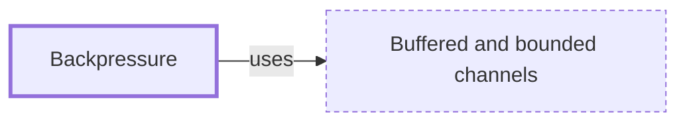

# Backpressure

**Category:** [Communication](../README.md) · **Status:** stub · **Lessons:** chapter 05, Message passing *(planned)*

**One line:** Letting a slow consumer slow its producers down — by making sends wait or fail — instead of letting unprocessed work pile up without limit.

Also called: flow control.

## How it connects

- **Is built on:** [Buffered and bounded channels](../bounded_channel/README.md)

## In each language

| | |
|---|---|
| Rust | a bounded [`sync_channel` ↗](https://doc.rust-lang.org/std/sync/mpsc/fn.sync_channel.html): `send` blocks until the buffer has room |
| Go | a buffered channel: a send proceeds without blocking only while the buffer is not full ([spec ↗](https://go.dev/ref/spec#Channel_types)) |
| Java | [`Flow` ↗](https://docs.oracle.com/en/java/javase/25/docs/api/java.base/java/util/concurrent/Flow.html), the reactive-streams interfaces: a subscriber asks for items with `request(n)`, a simple form of flow control |
| Python | [`StreamWriter.drain` ↗](https://docs.python.org/3/library/asyncio-stream.html#asyncio.StreamWriter.drain): once the write buffer reaches the high watermark, it blocks until the buffer drains to the low watermark |
| C# | [`BoundedChannelFullMode.Wait` ↗](https://learn.microsoft.com/en-us/dotnet/core/extensions/channels), the default for a bounded channel: `WriteAsync` waits for space |
| JavaScript | [streams ↗](https://developer.mozilla.org/en-US/docs/Web/API/Streams_API/Concepts#backpressure) compare their queue with a high water mark and report `desiredSize`; in Node, `write()` returns `false` until a `'drain'` event ([guide ↗](https://nodejs.org/en/learn/modules/backpressuring-in-streams)) |
| Kotlin | [`BufferOverflow.SUSPEND` ↗](https://kotlinlang.org/api/kotlinx.coroutines/kotlinx-coroutines-core/kotlinx.coroutines.channels/-buffer-overflow/): the sender suspends while the buffer is full |
| The operating system | a full [pipe ↗](https://man7.org/linux/man-pages/man7/pipe.7.html) blocks the writing process until enough has been read to make room |

## Where to read more

- **In a sibling library:** [Go: A buffered channel is a bounded queue ↗](https://masiarek.github.io/go-learning-library/02_Channels/a_buffered_channel_is_a_bounded_queue/index.html)
- **In the books:** [*Combine: Asynchronous Programming with Swift*](../../../10_Resources/books_swift/README.md#kodeco_combine_asynchronous_programming_swift), Shai Mishali, Florent Pillet, Marin Todorov, Scott Gardner — ch. 18, 'Custom Publishers & Handling Backpressure'
- **In the books:** [*Concurrency in Go*](../../../10_Resources/books_go/README.md#cox_buday_concurrency_in_go), Katherine Cox-Buday — ch. 5, 'Concurrency at Scale' → 'Rate Limiting'
- **In the books:** [*Effective Concurrency in Go*](../../../10_Resources/books_go/README.md#serdar_effective_concurrency_in_go), Burak Serdar — ch. 4, 'Some Well-Known Concurrency Problems' → 'Rate limiting'

<!-- Generated above this line by tools/build_concepts.py from TOML data — edit the data, not the page. Hand-written notes go below it and are kept. -->
