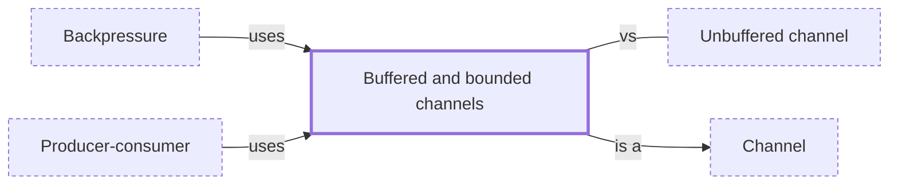

# Buffered and bounded channels

**Category:** [Communication](../README.md) · **Status:** stub · **Lessons:** [chapter 05, Message passing](../../../05_Message_Passing/README.md)

**One line:** A channel with a fixed-size buffer: sends succeed until it is full and then wait, which is how a slow receiver pushes back on a fast sender; an unbounded channel never waits and never pushes back.

Also called: buffered channel, bounded queue, unbounded channel, asynchronous channel.

## How it connects

- **Is a kind of:** [Channel](../channel/README.md)
- **Is used by:** [Backpressure](../backpressure/README.md), [Producer-consumer](../producer_consumer/README.md)
- **Often confused with:** [Unbuffered channel](../unbuffered_channel/README.md)
- **See also:** [Semaphore](../../synchronization/semaphore/README.md)

## In each language

| | |
|---|---|
| Rust | [`sync_channel(n)` ↗](https://doc.rust-lang.org/std/sync/mpsc/fn.sync_channel.html) blocks senders when full, while [`channel()` ↗](https://doc.rust-lang.org/std/sync/mpsc/fn.channel.html) has an infinite buffer and never blocks the sender; tokio's [`mpsc` ↗](https://docs.rs/tokio/latest/tokio/sync/mpsc/index.html) offers both for async tasks |
| Go | [`make(chan T, n)` ↗](https://go.dev/ref/spec#Channel_types): a send proceeds without blocking while the buffer is not full |
| Java | [`ArrayBlockingQueue` ↗](https://docs.oracle.com/en/java/javase/25/docs/api/java.base/java/util/concurrent/ArrayBlockingQueue.html), a classic bounded buffer; [`LinkedBlockingQueue` ↗](https://docs.oracle.com/en/java/javase/25/docs/api/java.base/java/util/concurrent/LinkedBlockingQueue.html) is optionally bounded |
| Python | [`queue.Queue(maxsize)` ↗](https://docs.python.org/3/library/queue.html#queue.Queue) and [`asyncio.Queue(maxsize)` ↗](https://docs.python.org/3/library/asyncio-queue.html#asyncio.Queue); a `maxsize` of zero or less means infinite |
| C# | [`Channel.CreateBounded` ↗](https://learn.microsoft.com/en-us/dotnet/core/extensions/channels) or `CreateUnbounded`; a [`BoundedChannelFullMode` ↗](https://learn.microsoft.com/en-us/dotnet/api/system.threading.channels.boundedchannelfullmode) says whether a full channel waits, or drops the newest, the oldest or the item being written |
| Kotlin | a capacity passed to [`Channel` ↗](https://kotlinlang.org/api/kotlinx.coroutines/kotlinx-coroutines-core/kotlinx.coroutines.channels/-channel/), or `Channel.UNLIMITED`; [`BufferOverflow` ↗](https://kotlinlang.org/api/kotlinx.coroutines/kotlinx-coroutines-core/kotlinx.coroutines.channels/-buffer-overflow/) chooses between suspending the sender and dropping a value |
| The operating system | a [pipe ↗](https://man7.org/linux/man-pages/man7/pipe.7.html) has a limited capacity, 16 pages by default on Linux: a write to a full pipe blocks, or fails if the pipe is non-blocking |

## Where to read more

- **In this library:** [What does a semaphore count?](../../../04_Waiting_For_Each_Other/a_semaphore_counts_permits/README.md)
- **In this library:** [How does a producer wait for room and a consumer wait for an item?](../../../04_Waiting_For_Each_Other/the_bounded_buffer/README.md)
- **In this library:** [Does a send return before anyone receives?](../../../05_Message_Passing/an_unbuffered_send_waits/README.md)
- **In this library:** [What stops a fast producer from filling memory?](../../../05_Message_Passing/a_bounded_queue_pushes_back/README.md)
- **In this library:** [How do two processes talk through a pipe?](../../../08_Processes/a_pipe_between_processes/README.md)
- **In a sibling library:** [Go: A buffered channel is a bounded queue ↗](https://masiarek.github.io/go-learning-library/02_Channels/a_buffered_channel_is_a_bounded_queue/index.html)
- **In the books:** [*Async Rust*](../../../10_Resources/books_rust/README.md#flitton_morton_async_rust), Maxwell Flitton, Caroline Morton — ch. 11, 'Testing' → 'Testing Channel Capacity'
- **In the books:** [*Parallel and Concurrent Programming in Haskell*](../../../10_Resources/books_haskell/README.md#marlow_parallel_and_concurrent_programming_in_haskell), Simon Marlow — ch. 7, 'Basic Concurrency: Threads and MVars' → 'MVar as a Building Block: Unbounded Channels'
- **In the books:** [*The Art of Multiprocessor Programming*](../../../10_Resources/books_general/README.md#herlihy_shavit_art_of_multiprocessor_programming), Maurice Herlihy, Nir Shavit — ch. 10, 'Concurrent Queues and the ABA Problem' → 'A Bounded Partial Queue'
- **In the books:** [*Go Systems Programming*](../../../10_Resources/books_go/README.md#tsoukalos_go_systems_programming), Mihalis Tsoukalos — ch. 10, 'Goroutines — Advanced Features' → 'Buffered channels'

<!-- Generated above this line by tools/build_concepts.py from TOML data — edit the data, not the page. Hand-written notes go below it and are kept. -->
