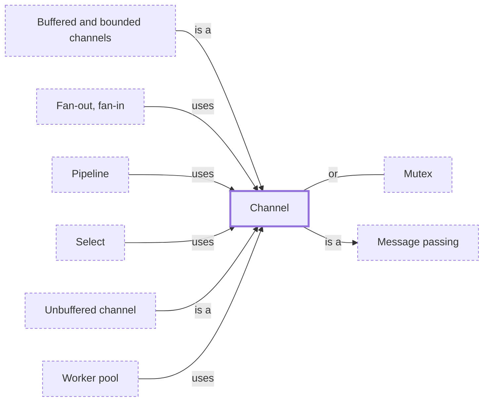

# Channel

**Category:** [Communication](../README.md) · **Status:** stub · **Lessons:** chapter 05, Message passing *(planned)*

**One line:** A typed conduit between tasks: one side sends values, the other receives them, in order.

Also called: queue, mpsc.

## How it connects

- **Is a kind of:** [Message passing](../message_passing/README.md)
- **Kinds:** [Buffered and bounded channels](../bounded_channel/README.md), [Unbuffered channel](../unbuffered_channel/README.md)
- **Is used by:** [Fan-out, fan-in](../fan_out_fan_in/README.md), [Pipeline](../pipeline/README.md), [Select](../select/README.md), [Worker pool](../worker_pool/README.md)
- **An alternative to:** [Mutex](../../synchronization/mutex/README.md)
- **See also:** [Concurrency primitives](../../foundations/concurrency_primitives/README.md), [Goroutine](../../units_of_execution/goroutine/README.md)

## In each language

| | |
|---|---|
| Rust | [`mpsc::channel` ↗](https://doc.rust-lang.org/std/sync/mpsc/fn.channel.html) or the bounded [`sync_channel` ↗](https://doc.rust-lang.org/std/sync/mpsc/fn.sync_channel.html); there is no `close`: operations fail once the other half has hung up by being dropped ([module docs ↗](https://doc.rust-lang.org/std/sync/mpsc/index.html)) |
| Go | a [`chan T` ↗](https://go.dev/ref/spec#Channel_types) made with `make` and closed explicitly with [`close` ↗](https://go.dev/ref/spec#Close); a nil channel is never ready |
| Java | [`BlockingQueue` ↗](https://docs.oracle.com/en/java/javase/25/docs/api/java.base/java/util/concurrent/BlockingQueue.html) with `put` and `take`; it has no close or shutdown operation, so producers signal the end with a poison object |
| Python | [`queue.Queue` ↗](https://docs.python.org/3/library/queue.html#queue.Queue) for threads and [`asyncio.Queue` ↗](https://docs.python.org/3/library/asyncio-queue.html#asyncio.Queue), which is not thread-safe, for coroutines |
| C# | [`Channel<T>` ↗](https://learn.microsoft.com/en-us/dotnet/core/extensions/channels), split into a `ChannelWriter` and a `ChannelReader`; `writer.Complete()` ends it |
| Kotlin | [`Channel` ↗](https://kotlinlang.org/docs/channels.html): `send` and `receive` suspend rather than block, and unlike a queue a channel can be closed |
| Erlang and Elixir | no channel objects: a message is sent to a process and stored in its [mailbox ↗](https://hexdocs.pm/elixir/processes.html) |
| Haskell | [`Chan` ↗](https://hackage.haskell.org/package/base/docs/Control-Concurrent-Chan.html), unbounded |
| Elsewhere | Clojure's [core.async ↗](https://clojure.github.io/core.async/) channels, made with `chan` |

## Where to read more

- **In this library:** [Getting a result back](../../../01_Threads/getting_a_result_back/README.md)
- **In this library:** [Keeping every update](../../../02_Shared_State/keeping_every_update/README.md)
- **In a sibling library:** [Rust: Channels ↗](https://masiarek.github.io/rust-learning-library/09_Advanced/channels/index.html)
- **In a sibling library:** [Go: An unbuffered send waits for a receiver ↗](https://masiarek.github.io/go-learning-library/02_Channels/an_unbuffered_send_waits_for_a_receiver/index.html)
- **In a sibling library:** [Go: Closing a channel ends a range ↗](https://masiarek.github.io/go-learning-library/02_Channels/closing_a_channel_ends_a_range/index.html)
- **In the books:** [*Rust Atomics and Locks*](../../../10_Resources/books_rust/README.md#bos_rust_atomics_and_locks), Mara Bos — ch. 5, 'Building Our Own Channels'
- **In the books:** [*Kotlin Coroutines by Tutorials*](../../../10_Resources/books_other/README.md#babic_srivastava_kotlin_coroutines_by_tutorials), Filip Babić, Nishant Srivastava — ch. 11, 'Channels'
- **In the books:** [*Concurrency in Go*](../../../10_Resources/books_go/README.md#cox_buday_concurrency_in_go), Katherine Cox-Buday — ch. 3, 'Go’s Concurrency Building Blocks' → 'Channels'
- **In the books:** [*Multi-Threaded Programming in C++*](../../../10_Resources/books_cpp/README.md#walmsley_multithreaded_programming_in_cpp), Mark Walmsley — ch. 10, 'Distributed Computing' → 'The CHANNEL Class'
- **In the books:** [*Parallel and Concurrent Programming in Haskell*](../../../10_Resources/books_haskell/README.md#marlow_parallel_and_concurrent_programming_in_haskell), Simon Marlow — ch. 7, 'Basic Concurrency: Threads and MVars' → 'MVar as a Simple Channel: A Logging Service'
- **In the books:** [*Seven Concurrency Models in Seven Weeks*](../../../10_Resources/books_general/README.md#butcher_seven_concurrency_models), Paul Butcher — ch. 6, 'Communicating Sequential Processes' → 'Day 1: Channels and Go Blocks'
- **Notes:** [channel ↗](https://docs.google.com/document/u/0/d/1ZlGpxYxS0Dp1KLNzUDe2YSbVAU-l3GPFgX9y4cPIS9o/edit)
- **Notes:** [Channels - rust ↗](https://docs.google.com/document/d/1CQBXxKYGBJZMInRx6Ahve8Gzp4C4r0mSL9wngjorf9M/edit?tab=t.0)
- **Notes:** [async-compatible nonblocking channels ↗](https://docs.google.com/document/u/0/d/1xU0J0ZvRMFv9MlCsy4cR_Jt-k4O3UKZnjDPrbJnewo0/edit)
- **Notes:** [crossbeam ↗](https://docs.google.com/document/d/1MsXBn3QXmFkV6KuBtv9AUhocfxctyXbfp0TI534Mf6c/edit?tab=t.0)
- **Reference:** [Wikipedia: Channel (programming) ↗](https://en.wikipedia.org/wiki/Channel_(programming))

<!-- Generated above this line by tools/build_concepts.py from TOML data — edit the data, not the page. Hand-written notes go below it and are kept. -->
