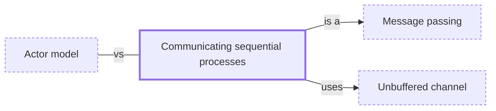

# Communicating sequential processes

**Category:** [Communication](../README.md) · **Status:** stub · **Lessons:** chapter 05, Message passing *(planned)*

**One line:** Tony Hoare's model of independent processes that interact only through synchronous channels — the idea behind Go's goroutines and channels.

Also called: CSP.

## How it connects

- **Is a kind of:** [Message passing](../message_passing/README.md)
- **Is built on:** [Unbuffered channel](../unbuffered_channel/README.md)
- **Often confused with:** [Actor model](../actor_model/README.md)
- **See also:** [Concurrency models](../../foundations/concurrency_models/README.md), [Goroutine](../../units_of_execution/goroutine/README.md)

## In each language

| | |
|---|---|
| Go | goroutines and channels; the [Go FAQ ↗](https://go.dev/doc/faq#csp) explains why Go built its concurrency on the ideas of CSP |
| Java | [`SynchronousQueue` ↗](https://docs.oracle.com/en/java/javase/25/docs/api/java.base/java/util/concurrent/SynchronousQueue.html), whose docs compare it to the rendezvous channels of CSP and Ada |
| Elsewhere | Clojure's [core.async ↗](https://clojure.github.io/core.async/), with channels and `go` blocks |

## Where to read more

- **In the books:** [*Concurrency in Go*](../../../10_Resources/books_go/README.md#cox_buday_concurrency_in_go), Katherine Cox-Buday — ch. 2, 'Modeling Your Code: Communicating Sequential Processes'
- **In the books:** [*Seven Concurrency Models in Seven Weeks*](../../../10_Resources/books_general/README.md#butcher_seven_concurrency_models), Paul Butcher — ch. 6, 'Communicating Sequential Processes'
- **In the books:** [*Python Parallel Programming Cookbook*](../../../10_Resources/books_python/README.md#zaccone_python_parallel_programming_cookbook), Giancarlo Zaccone — ch. 5, 'Distributed Python' → 'Communicating sequential processes with PyCSP'
- **In the books:** [*Learn Concurrent Programming with Go*](../../../10_Resources/books_go/README.md#cutajar_learn_concurrent_programming_with_go), James Cutajar — ch. 9, 'Programming with channels' → 'Communicating sequential processes'
- **In the books:** [*The Go Programming Language Phrasebook*](../../../10_Resources/books_go/README.md#chisnall_go_phrasebook), David Chisnall — ch. 10, 'Concurrency Design Patterns' → 'Share Memory by Communicating'
- **Notes:** [Communicating Sequential Processes (CSP) ↗](https://docs.google.com/document/d/1OhlXnA1d1kutRCYhOdN5kLwy9Kfl3ggvl1PB_ixvIuM/edit?tab=t.0)
- **Reference:** [Wikipedia: Communicating sequential processes ↗](https://en.wikipedia.org/wiki/Communicating_sequential_processes)

<!-- Generated above this line by tools/build_concepts.py from TOML data — edit the data, not the page. Hand-written notes go below it and are kept. -->
