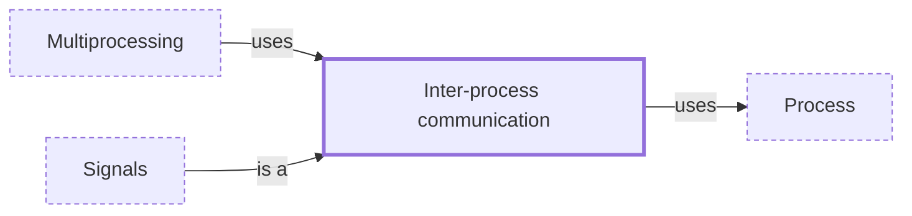

# Inter-process communication

**Category:** [Communication](../README.md) · **Status:** stub · **Lessons:** [chapter 08, Processes](../../../08_Processes/README.md)

**One line:** The ways separate processes exchange data: pipes, sockets, shared-memory segments, signals and message queues.

Also called: IPC, pipes, signals.

## How it connects

- **Kinds:** [Signals](../signals/README.md)
- **Is built on:** [Process](../../units_of_execution/process/README.md)
- **Is used by:** [Multiprocessing](../../parallelism/multiprocessing/README.md)
- **See also:** [Child process](../../units_of_execution/subprocess/README.md), [Message passing](../message_passing/README.md), [Process](../../units_of_execution/process/README.md)

## In each language

| | |
|---|---|
| Rust | [`Stdio::piped` ↗](https://doc.rust-lang.org/std/process/struct.Stdio.html#method.piped) connects a child process by a pipe; [`UnixStream` ↗](https://doc.rust-lang.org/std/os/unix/net/struct.UnixStream.html) on Unix |
| Go | [`Cmd.StdoutPipe` ↗](https://pkg.go.dev/os/exec#Cmd.StdoutPipe) for a child's output, [`os.Pipe` ↗](https://pkg.go.dev/os#Pipe) for a raw pipe |
| C | POSIX [`pipe` ↗](https://pubs.opengroup.org/onlinepubs/9799919799/functions/pipe.html), [`mkfifo` ↗](https://pubs.opengroup.org/onlinepubs/9799919799/functions/mkfifo.html), [`socketpair` ↗](https://pubs.opengroup.org/onlinepubs/9799919799/functions/socketpair.html), [`shm_open` ↗](https://pubs.opengroup.org/onlinepubs/9799919799/functions/shm_open.html) and [`mq_open` ↗](https://pubs.opengroup.org/onlinepubs/9799919799/functions/mq_open.html) |
| Java | [`ProcessBuilder` ↗](https://docs.oracle.com/en/java/javase/25/docs/api/java.base/java/lang/ProcessBuilder.html) for child processes; [`UnixDomainSocketAddress` ↗](https://docs.oracle.com/en/java/javase/25/docs/api/java.base/java/net/UnixDomainSocketAddress.html) (Java 16) for local sockets |
| Python | [`subprocess` ↗](https://docs.python.org/3/library/subprocess.html) for child processes; [`multiprocessing` ↗](https://docs.python.org/3/library/multiprocessing.html#pipes-and-queues) pipes and queues between Python processes |
| C# | [`System.IO.Pipes` ↗](https://learn.microsoft.com/en-us/dotnet/api/system.io.pipes), anonymous and named pipes |
| JavaScript | Node's [`child_process` ↗](https://nodejs.org/api/child_process.html) sets up pipes for the child's stdin, stdout and stderr by default |
| Erlang and Elixir | [ports ↗](https://www.erlang.org/doc/system/ports.html), the basic mechanism for communicating with the external world; Elixir's [`Port` ↗](https://hexdocs.pm/elixir/Port.html) |
| The operating system | [pipes ↗](https://man7.org/linux/man-pages/man7/pipe.7.html), [UNIX domain sockets ↗](https://man7.org/linux/man-pages/man7/unix.7.html), [POSIX shared memory ↗](https://man7.org/linux/man-pages/man7/shm_overview.7.html), [message queues ↗](https://man7.org/linux/man-pages/man7/mq_overview.7.html) and [signals ↗](https://man7.org/linux/man-pages/man7/signal.7.html) |

## Where to read more

- **In this library:** [How do two processes talk through a pipe?](../../../08_Processes/a_pipe_between_processes/README.md)
- **In this library:** [Which thread gets the signal?](../../../08_Processes/a_signal_arrives_on_some_thread/README.md)
- **In this library:** [When are processes the better workers?](../../../08_Processes/multiprocessing_instead_of_threads/README.md)
- **In this library:** [Can two processes share a variable after all?](../../../08_Processes/shared_memory_between_processes/README.md)
- **In a sibling library:** [Linux: head closes the pipe early ↗](https://masiarek.github.io/linux-learning-library/01_Pipelines/head_closes_the_pipe_early/index.html)
- **In the books:** [*Grokking Concurrency*](../../../10_Resources/books_general/README.md#bobrov_grokking_concurrency), Kirill Bobrov — ch. 5, 'Interprocess communication'
- **In the books:** [*Parallel Programming with Python*](../../../10_Resources/books_python/README.md#palach_parallel_programming_with_python), Jan Palach — ch. 6, 'Utilizing Parallel Python' → 'Understanding interprocess communication'
- **In the books:** [*Distributed Graph Algorithms for Computer Networks*](../../../10_Resources/books_other/README.md#erciyes_distributed_graph_algorithms), K. Erciyes — ch. 18, 'ASSIST: A Simulator to Develop Distributed Algorithms' → 'Interprocess Communication'
- **In the books:** [*Advanced Programming in the UNIX Environment*](../../../10_Resources/books_c/README.md#stevens_rago_apue), W. Richard Stevens, Stephen A. Rago — ch. 15, 'Interprocess Communication'
- **In the books:** [*Operating System Concepts*](../../../10_Resources/books_c/README.md#silberschatz_operating_system_concepts), Abraham Silberschatz, Peter Baer Galvin, Greg Gagne — ch. 3, 'Processes' → 'Interprocess Communication'
- **In the books:** [*High Performance Python*](../../../10_Resources/books_python/README.md#gorelick_ozsvald_high_performance_python), Micha Gorelick, Ian Ozsvald — ch. 9, 'The multiprocessing Module' → 'Verifying Primes Using Interprocess Communication'
- **Reference:** [Wikipedia: Inter-process communication ↗](https://en.wikipedia.org/wiki/Inter-process_communication)

<!-- Generated above this line by tools/build_concepts.py from TOML data — edit the data, not the page. Hand-written notes go below it and are kept. -->
