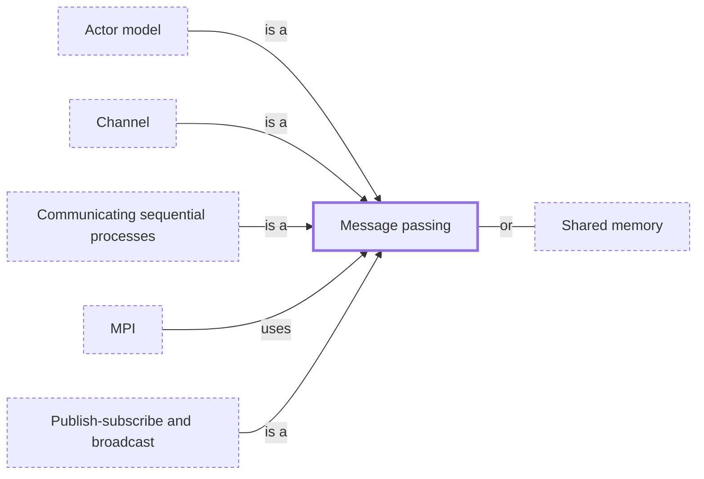

# Message passing

**Category:** [Communication](../README.md) · **Status:** stub · **Lessons:** chapter 05, Message passing *(planned)*

**One line:** Tasks share nothing and interact only by sending each other values, so that each value has one owner at a time.

## How it connects

- **Kinds:** [Actor model](../actor_model/README.md), [Channel](../channel/README.md), [Communicating sequential processes](../csp/README.md), [Publish-subscribe and broadcast](../publish_subscribe/README.md)
- **Is used by:** [MPI](../../parallelism/mpi/README.md)
- **An alternative to:** [Shared memory](../shared_memory/README.md)
- **See also:** [Inter-process communication](../ipc/README.md), [Thread confinement](../../safety_in_languages/thread_confinement/README.md)

## In each language

| | |
|---|---|
| Rust | channels from [`std::sync::mpsc` ↗](https://doc.rust-lang.org/std/sync/mpsc/index.html), multi-producer and single-consumer: `Sender`s can be cloned, the `Receiver` cannot |
| Go | goroutines and [channels ↗](https://go.dev/ref/spec#Channel_types); [Effective Go ↗](https://go.dev/doc/effective_go#sharing) puts it as share memory by communicating, instead of communicating by sharing memory |
| Java | no channel type: threads hand objects over through a [`BlockingQueue` ↗](https://docs.oracle.com/en/java/javase/25/docs/api/java.base/java/util/concurrent/BlockingQueue.html), designed primarily for producer-consumer queues |
| Python | [`queue.Queue` ↗](https://docs.python.org/3/library/queue.html#queue.Queue) between threads; between processes, [`multiprocessing` ↗](https://docs.python.org/3/library/multiprocessing.html#pipes-and-queues) pipes and queues, whose queues serialize every object put into them |
| C# | [`System.Threading.Channels` ↗](https://learn.microsoft.com/en-us/dotnet/core/extensions/channels), for passing data between producers and consumers asynchronously |
| JavaScript | a worker gets data through [`postMessage` ↗](https://developer.mozilla.org/en-US/docs/Web/API/Worker/postMessage), which copies it with the structured clone algorithm or transfers it |
| Kotlin | [`Channel` ↗](https://kotlinlang.org/docs/channels.html), conceptually a `BlockingQueue` whose `send` and `receive` suspend instead of blocking |
| Erlang and Elixir | the whole model: a process sends to another with `!` (Erlang) or `send/2` (Elixir), the message waits in the receiver's mailbox, and `receive` picks messages out by pattern ([Erlang ↗](https://www.erlang.org/doc/system/conc_prog.html), [Elixir ↗](https://hexdocs.pm/elixir/processes.html)) |
| Haskell | [`Chan` ↗](https://hackage.haskell.org/package/base/docs/Control-Concurrent-Chan.html), an unbounded channel; an [`MVar` ↗](https://hackage.haskell.org/package/base/docs/Control-Concurrent-MVar.html) can also act as a channel, with `takeMVar` and `putMVar` as receive and send |
| The operating system | [POSIX message queues ↗](https://man7.org/linux/man-pages/man7/mq_overview.7.html) let processes exchange data as messages, delivered highest priority first |

## Where to read more

- **In the books:** [*Learn Concurrent Programming with Go*](../../../10_Resources/books_go/README.md#cutajar_learn_concurrent_programming_with_go), James Cutajar — ch. 7, 'Communication using message passing'
- **In the books:** [*Modern Multithreading*](../../../10_Resources/books_general/README.md#carver_tai_modern_multithreading), Richard H. Carver, Kuo-Chung Tai — ch. 5, 'Message Passing'
- **In the books:** [*Concurrent Programming on Windows*](../../../10_Resources/books_csharp_dotnet/README.md#duffy_concurrent_programming_on_windows), Joe Duffy — ch. 13, 'Data and Task Parallelism' → 'Message-Based Parallelism'
- **In the books:** [*Multithreaded JavaScript*](../../../10_Resources/books_javascript/README.md#hunter_english_multithreaded_javascript), Thomas Hunter II, Bryan English — ch. 2, 'Browsers' → 'Message Passing Abstractions'
- **In the books:** [*Distributed Graph Algorithms for Computer Networks*](../../../10_Resources/books_other/README.md#erciyes_distributed_graph_algorithms), K. Erciyes — ch. 3, 'The Computational Model' → 'Message Passing'
- **In the books:** [*The Rust Programming Language*](../../../10_Resources/books_rust/README.md#klabnik_nichols_rust_programming_language), Steve Klabnik, Carol Nichols — ch. 16, 'Fearless Concurrency' → 'Using Message Passing to Transfer Data Between Threads'
- **Notes:** [Broker - sender - receiver - in general ↗](https://docs.google.com/document/d/1F1NMuTJYTemiALyBsQn6NMQ8ZN9mJvPyUUdCZ0x22e0/edit)
- **Reference:** [Wikipedia: Message passing ↗](https://en.wikipedia.org/wiki/Message_passing)

<!-- Generated above this line by tools/build_concepts.py from TOML data — edit the data, not the page. Hand-written notes go below it and are kept. -->
