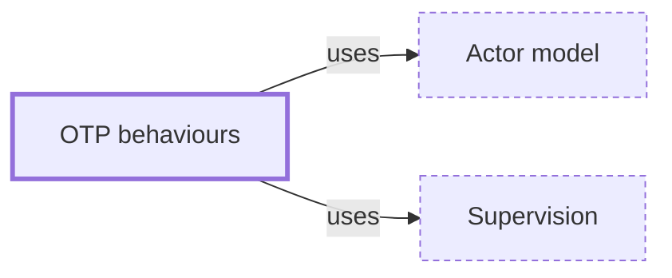

# OTP behaviours

**Category:** [Communication](../README.md) · **Status:** stub · **Lessons:** chapter 05, Message passing *(planned)*

**One line:** Erlang/OTP's reusable process patterns — a generic server, a supervisor, an application — where the library owns the concurrency and your module supplies the callbacks.

Also called: gen_server, GenServer, OTP.

## How it connects

- **Is built on:** [Actor model](../actor_model/README.md), [Supervision](../supervision/README.md)

## In each language

| | |
|---|---|
| Erlang and Elixir | [`gen_server` ↗](https://www.erlang.org/doc/apps/stdlib/gen_server.html) in Erlang and [`GenServer` ↗](https://hexdocs.pm/elixir/GenServer.html) in Elixir |

## Where to read more

- **In the books:** [*Erlang Programming*](../../../10_Resources/books_elixir_erlang/README.md#cesarini_thompson_erlang_programming), Francesco Cesarini, Simon Thompson — ch. 12, 'OTP Behaviors'
- **In the books:** [*Programming Elixir ≥ 1.6*](../../../10_Resources/books_elixir_erlang/README.md#thomas_programming_elixir), Dave Thomas — ch. 17, 'OTP: Servers'
- **In the books:** [*Programming Erlang*](../../../10_Resources/books_elixir_erlang/README.md#armstrong_programming_erlang), Joe Armstrong — ch. 22, 'Introducing OTP'
- **In the books:** [*Erlang and OTP in Action*](../../../10_Resources/books_elixir_erlang/README.md#logan_erlang_and_otp_in_action), Martin Logan, Eric Merritt, Richard Carlsson — ch. 1, 'The foundations of Erlang/OTP'
- **In the books:** [*Introducing Elixir*](../../../10_Resources/books_elixir_erlang/README.md#st_laurent_introducing_elixir), Simon St. Laurent, J. David Eisenberg — ch. 12, 'Getting Started with OTP'
- **Reference:** [Erlang/OTP: Design Principles ↗](https://www.erlang.org/doc/system/design_principles.html)

<!-- Generated above this line by tools/build_concepts.py from TOML data — edit the data, not the page. Hand-written notes go below it and are kept. -->
