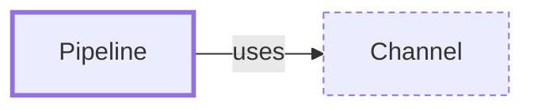

# Pipeline

**Category:** [Communication](../README.md) · **Status:** stub · **Lessons:** [chapter 05, Message passing](../../../05_Message_Passing/README.md)

**One line:** A chain of stages, each a task that reads from the previous stage's channel and writes to the next one's.

Also called: pipes and filters.

## How it connects

- **Is built on:** [Channel](../channel/README.md)
- **See also:** [Dataflow programming](../dataflow/README.md), [Fan-out, fan-in](../fan_out_fan_in/README.md)

## In each language

| | |
|---|---|
| Rust | threads joined by [`mpsc` ↗](https://doc.rust-lang.org/std/sync/mpsc/index.html) channels; a stage's receives fail once the stage before it has hung up by dropping its sender |
| Go | goroutines joined by channels, each stage receiving from upstream and sending downstream; the Go blog's [pipelines post ↗](https://go.dev/blog/pipelines) notes there is no formal definition of one in Go |
| C# | [TPL Dataflow ↗](https://learn.microsoft.com/en-us/dotnet/standard/parallel-programming/dataflow-task-parallel-library), in-process message passing for dataflow and pipelining tasks |
| JavaScript | [`ReadableStream.pipeThrough` ↗](https://developer.mozilla.org/en-US/docs/Web/API/ReadableStream/pipeThrough) chains transform streams |
| Kotlin | a [pipeline ↗](https://kotlinlang.org/docs/channels.html#pipelines): one coroutine produces a stream of values and others consume, process and pass it on |
| The operating system | the shell pipeline: processes connected by [pipes ↗](https://man7.org/linux/man-pages/man7/pipe.7.html) |

## Where to read more

- **In this library:** [How do three stages run at once on one stream of values?](../../../05_Message_Passing/a_pipeline_of_stages/README.md)
- **In this library:** [How does one stream split across workers and merge back?](../../../05_Message_Passing/fan_out_fan_in/README.md)
- **In a sibling library:** [Go: A pipeline of stages ↗](https://masiarek.github.io/go-learning-library/06_Patterns/a_pipeline_of_stages/index.html)
- **In a sibling library:** [Rust: Channels ↗](https://masiarek.github.io/rust-learning-library/09_Advanced/channels/index.html)
- **In the books:** [*Effective Concurrency in Go*](../../../10_Resources/books_go/README.md#serdar_effective_concurrency_in_go), Burak Serdar — ch. 5, 'Worker Pools and Pipelines'
- **In the books:** [*Programming with POSIX Threads*](../../../10_Resources/books_c/README.md#butenhof_programming_with_posix_threads), David R. Butenhof — ch. 4, 'A Few Ways to Use Threads' → 'Pipeline'
- **In the books:** [*Pro TBB*](../../../10_Resources/books_cpp/README.md#voss_pro_tbb), Michael Voss, Rafael Asenjo, James Reinders — ch. 2, 'Generic Parallel Algorithms' → 'Cook Until Done: parallel_do and parallel_pipeline'
- **In the books:** [*Parallel and Concurrent Programming in Haskell*](../../../10_Resources/books_haskell/README.md#marlow_parallel_and_concurrent_programming_in_haskell), Simon Marlow — ch. 4, 'Dataflow Parallelism: The Par Monad' → 'Pipeline Parallelism'
- **In the books:** [*Parallel Programming and Concurrency with C# 10 and .NET 6*](../../../10_Resources/books_csharp_dotnet/README.md#ashcraft_parallel_programming_concurrency_csharp10), Alvin Ashcraft — ch. 7, 'Task Parallel Library (TPL) and Dataflow' → 'Creating a data pipeline with multiple blocks'
- **In the books:** [*Parallel Programming with Python*](../../../10_Resources/books_python/README.md#palach_parallel_programming_with_python), Jan Palach — ch. 2, 'Designing Parallel Algorithms' → 'Decomposing tasks with pipeline'
- **Reference:** [Wikipedia: Pipeline (software) ↗](https://en.wikipedia.org/wiki/Pipeline_(software))

<!-- Generated above this line by tools/build_concepts.py from TOML data — edit the data, not the page. Hand-written notes go below it and are kept. -->
