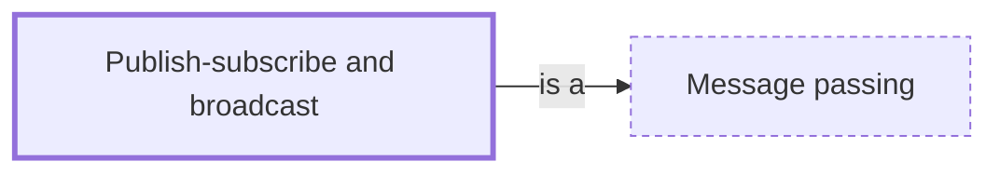

# Publish-subscribe and broadcast

**Category:** [Communication](../README.md) · **Status:** stub · **Lessons:** [chapter 05, Message passing](../../../05_Message_Passing/README.md)

**One line:** A sender publishes to a topic and every subscriber gets its own copy, without the sender knowing who the subscribers are.

Also called: pub/sub, broadcast channel, message broker.

## How it connects

- **Is a kind of:** [Message passing](../message_passing/README.md)
- **See also:** [Reactive programming](../../async/reactive_programming/README.md), [Task queue](../task_queue/README.md)

## In each language

| | |
|---|---|
| Rust | not in std; tokio's [`broadcast` ↗](https://docs.rs/tokio/latest/tokio/sync/broadcast/index.html) is a multi-producer, multi-consumer queue in which every receiver sees each value |
| Java | [`SubmissionPublisher` ↗](https://docs.oracle.com/en/java/javase/25/docs/api/java.base/java/util/concurrent/SubmissionPublisher.html), a `Flow.Publisher` that issues each item to all current subscribers, each with its own buffer |
| C# | [`IObservable<T>` ↗](https://learn.microsoft.com/en-us/dotnet/api/system.iobservable-1), a provider for push-based notification in the observer design pattern |
| JavaScript | [`BroadcastChannel` ↗](https://developer.mozilla.org/en-US/docs/Web/API/BroadcastChannel) delivers to every listener of the same origin except the sender; Node's [`EventEmitter` ↗](https://nodejs.org/api/events.html) calls every listener attached to an event, synchronously |
| Kotlin | [`SharedFlow` ↗](https://kotlinlang.org/api/kotlinx.coroutines/kotlinx-coroutines-core/kotlinx.coroutines.flow/-shared-flow/), a hot flow that shares emitted values among all its collectors |
| Swift | Combine's [publishers and subscribers ↗](https://developer.apple.com/documentation/combine) |
| Erlang and Elixir | Erlang's [`pg` ↗](https://www.erlang.org/doc/apps/kernel/pg.html), distributed named process groups whose members a sender looks up with `get_members`; Elixir's [`Registry` ↗](https://hexdocs.pm/elixir/Registry.html) can serve as a local PubSub |
| Elsewhere | [Redis Pub/Sub ↗](https://redis.io/docs/latest/develop/pubsub/) has at-most-once delivery: a message is delivered once if at all |

## Where to read more

- **In this library:** [How does one event reach every subscriber?](../../../05_Message_Passing/publish_and_subscribe/README.md)
- **In the books:** [*Async JavaScript*](../../../10_Resources/books_javascript/README.md#burnham_async_javascript), Trevor Burnham — ch. 2, 'Distributing Events'
- **In the books:** [*Combine: Asynchronous Programming with Swift*](../../../10_Resources/books_swift/README.md#kodeco_combine_asynchronous_programming_swift), Shai Mishali, Florent Pillet, Marin Todorov, Scott Gardner — ch. 2, 'Publishers & Subscribers'
- **In the books:** [*Kotlin Coroutines by Tutorials*](../../../10_Resources/books_other/README.md#babic_srivastava_kotlin_coroutines_by_tutorials), Filip Babić, Nishant Srivastava — ch. 12, 'Broadcast Channels'
- **In the books:** [*Async Rust*](../../../10_Resources/books_rust/README.md#flitton_morton_async_rust), Maxwell Flitton, Caroline Morton — ch. 6, 'Reactive Programming' → 'Enabling Broadcasting with an Event Bus'
- **In the books:** [*C++ Reactive Programming*](../../../10_Resources/books_cpp/README.md#pai_abraham_cpp_reactive_programming), Praseed Pai, Peter Abraham — ch. 11, 'Design Patterns and Idioms for C++ Rx Programming' → 'The Event bus pattern'
- **In the books:** [*Python Parallel Programming Cookbook*](../../../10_Resources/books_python/README.md#zaccone_python_parallel_programming_cookbook), Giancarlo Zaccone — ch. 3, 'Process-based Parallelism' → 'Collective communication using broadcast'
- **Notes:** [Broker - Asynchronous - in general ↗](https://docs.google.com/document/u/0/d/1F1NMuTJYTemiALyBsQn6NMQ8ZN9mJvPyUUdCZ0x22e0/edit)
- **Reference:** [Wikipedia: Publish–subscribe pattern ↗](https://en.wikipedia.org/wiki/Publish%E2%80%93subscribe_pattern)

<!-- Generated above this line by tools/build_concepts.py from TOML data — edit the data, not the page. Hand-written notes go below it and are kept. -->
