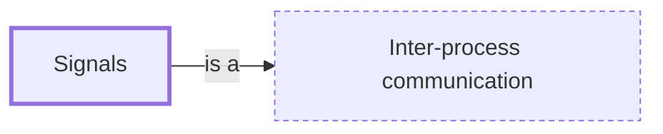

# Signals

**Category:** [Communication](../README.md) · **Status:** stub · **Lessons:** chapter 08, Processes *(planned)*

**One line:** Asynchronous notifications the operating system delivers to a process — an interrupt from the keyboard, a closed pipe, a child that exited — and which, in a threaded program, one thread has to be chosen to receive.

Also called: Unix signals, SIGINT, SIGPIPE, signal handler.

## How it connects

- **Is a kind of:** [Inter-process communication](../ipc/README.md)

## In each language

| | |
|---|---|
| Go | [`os/signal` ↗](https://pkg.go.dev/os/signal) delivers signals as values on a channel |
| C | [`sigaction` ↗](https://pubs.opengroup.org/onlinepubs/9799919799/functions/sigaction.html) installs a handler; [`pthread_sigmask` ↗](https://pubs.opengroup.org/onlinepubs/9799919799/functions/pthread_sigmask.html) chooses which threads may receive one |
| Python | [`signal` ↗](https://docs.python.org/3/library/signal.html): handlers always run in the main thread of the main interpreter |

## Where to read more

- **In a sibling library:** [Linux: head closes the pipe early ↗](https://masiarek.github.io/linux-learning-library/01_Pipelines/head_closes_the_pipe_early/index.html)
- **In the books:** [*Pthreads Programming*](../../../10_Resources/books_c/README.md#nichols_pthreads_programming), Bradford Nichols, Dick Buttlar, Jacqueline Proulx Farrell — ch. 5, 'Pthreads and UNIX' → 'Threads and Signals'
- **In the books:** [*Programming with POSIX Threads*](../../../10_Resources/books_c/README.md#butenhof_programming_with_posix_threads), David R. Butenhof — ch. 6, 'POSIX Adjusts to Threads' → 'Signals'
- **In the books:** [*The Linux Programming Interface*](../../../10_Resources/books_c/README.md#kerrisk_linux_programming_interface), Michael Kerrisk — ch. 33, 'Threads: Further Details' → 'Threads and Signals'
- **In the books:** [*Advanced Programming in the UNIX Environment*](../../../10_Resources/books_c/README.md#stevens_rago_apue), W. Richard Stevens, Stephen A. Rago — ch. 12, 'Thread Control' → 'Threads and Signals'
- **In the books:** [*asyncio Recipes*](../../../10_Resources/books_python/README.md#tahrioui_asyncio_recipes), Mohamed Mustapha Tahrioui — ch. 2, 'Working with Event Loops' → 'Adding a Loop Signal Handler'
- **Reference:** [Linux man page: signal(7) ↗](https://man7.org/linux/man-pages/man7/signal.7.html)

<!-- Generated above this line by tools/build_concepts.py from TOML data — edit the data, not the page. Hand-written notes go below it and are kept. -->
