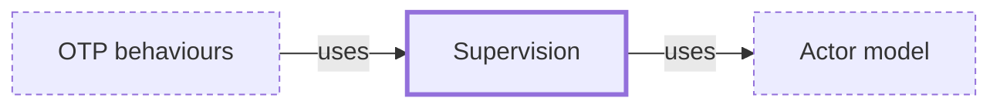

# Supervision

**Category:** [Communication](../README.md) · **Status:** stub · **Lessons:** chapter 05, Message passing *(planned)*

**One line:** Letting a failed actor or task crash and having a supervisor restart it, instead of defending against every error inside it — the approach of Erlang and OTP.

Also called: supervision tree, let it crash.

## How it connects

- **Is built on:** [Actor model](../actor_model/README.md)
- **Is used by:** [OTP behaviours](../otp_behaviours/README.md)
- **See also:** [Structured concurrency](../../async/structured_concurrency/README.md)

## In each language

| | |
|---|---|
| Kotlin | [`SupervisorJob` and `supervisorScope` ↗](https://kotlinlang.org/docs/exception-handling.html#supervision): a failing child does not cancel the supervisor or its other children |
| Erlang and Elixir | OTP's [`supervisor` ↗](https://www.erlang.org/doc/apps/stdlib/supervisor.html) keeps its children alive by restarting them, with strategies such as `one_for_one`; Elixir's [`Supervisor` ↗](https://hexdocs.pm/elixir/Supervisor.html) |
| The operating system | systemd's [`Restart=` ↗](https://man7.org/linux/man-pages/man5/systemd.service.5.html), for example `on-failure`, restarts a service automatically |
| Elsewhere | [Akka ↗](https://doc.akka.io/libraries/akka-core/current/typed/fault-tolerance.html): a typed actor that throws is stopped unless a supervision strategy, such as restart, says otherwise |

## Where to read more

- **In the books:** [*The Little Elixir & OTP Guidebook*](../../../10_Resources/books_elixir_erlang/README.md#tan_little_elixir_otp_guidebook), Benjamin Tan Wei Hao — ch. 5, 'Concurrent error-handling and fault tolerance with links, monitors, and processes'
- **In the books:** [*Concurrency in Go*](../../../10_Resources/books_go/README.md#cox_buday_concurrency_in_go), Katherine Cox-Buday — ch. 5, 'Concurrency at Scale' → 'Healing Unhealthy Goroutines'
- **In the books:** [*Async Rust*](../../../10_Resources/books_rust/README.md#flitton_morton_async_rust), Maxwell Flitton, Caroline Morton — ch. 8, 'The Actor Model' → 'Creating Actor Supervision'
- **In the books:** [*Learning Concurrent Programming in Scala*](../../../10_Resources/books_scala_jvm_functional/README.md#prokopec_learning_concurrent_programming_in_scala), Aleksandar Prokopec — ch. 8, 'Actors' → 'Actor supervision'
- **In the books:** [*Effective Concurrency in Go*](../../../10_Resources/books_go/README.md#serdar_effective_concurrency_in_go), Burak Serdar — ch. 10, 'Troubleshooting Concurrency Issues' → 'Detecting failures and healing'
- **In the books:** [*Erlang and OTP in Action*](../../../10_Resources/books_elixir_erlang/README.md#logan_erlang_and_otp_in_action), Martin Logan, Eric Merritt, Richard Carlsson — ch. 1, 'The foundations of Erlang/OTP' → '– Erlang’s fault tolerance infrastructure'

<!-- Generated above this line by tools/build_concepts.py from TOML data — edit the data, not the page. Hand-written notes go below it and are kept. -->
