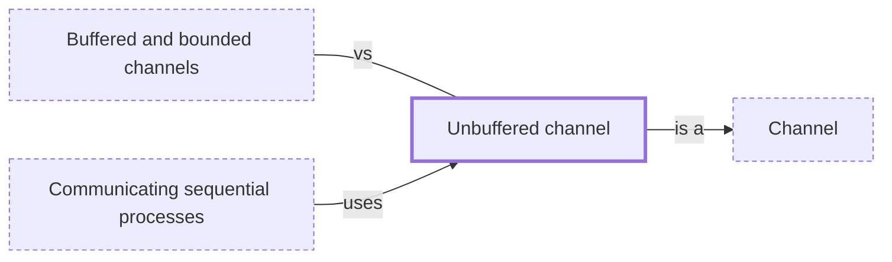

# Unbuffered channel

**Category:** [Communication](../README.md) · **Status:** stub · **Lessons:** [chapter 05, Message passing](../../../05_Message_Passing/README.md)

**One line:** A channel with no buffer: a send waits until a receiver takes the value, so every message is also a meeting of the two tasks.

Also called: synchronous channel, rendezvous channel, synchronized channel.

## How it connects

- **Is a kind of:** [Channel](../channel/README.md)
- **Is used by:** [Communicating sequential processes](../csp/README.md)
- **Often confused with:** [Buffered and bounded channels](../bounded_channel/README.md)

## In each language

| | |
|---|---|
| Rust | [`sync_channel(0)` ↗](https://doc.rust-lang.org/std/sync/mpsc/fn.sync_channel.html), a rendezvous channel: each send does not return until a receive is paired with it |
| Go | [`make(chan T)` ↗](https://go.dev/ref/spec#Channel_types): with the capacity zero or absent, communication succeeds only when sender and receiver are both ready |
| Java | [`SynchronousQueue` ↗](https://docs.oracle.com/en/java/javase/25/docs/api/java.base/java/util/concurrent/SynchronousQueue.html): every insert waits for a remove, the queue has no capacity at all, and its docs compare it to the rendezvous channels of CSP |
| Python | no rendezvous queue: `maxsize=0` makes a [`queue.Queue` ↗](https://docs.python.org/3/library/queue.html#queue.Queue) infinite, not unbuffered |
| Kotlin | [`Channel.RENDEZVOUS` ↗](https://kotlinlang.org/api/kotlinx.coroutines/kotlinx-coroutines-core/kotlinx.coroutines.channels/-channel/) (capacity 0): no buffer, so `send` suspends until a `receive` arrives, and vice versa |
| Erlang and Elixir | none: [signals between processes are asynchronous ↗](https://www.erlang.org/doc/system/ref_man_processes.html); a synchronous request is built on top, as [`GenServer.call` ↗](https://hexdocs.pm/elixir/GenServer.html) does by waiting for the reply |

## Where to read more

- **In this library:** [Does a send return before anyone receives?](../../../05_Message_Passing/an_unbuffered_send_waits/README.md)
- **In a sibling library:** [Go: An unbuffered send waits for a receiver ↗](https://masiarek.github.io/go-learning-library/02_Channels/an_unbuffered_send_waits_for_a_receiver/index.html)
- **In the books:** [*Pro Asynchronous Programming with .NET*](../../../10_Resources/books_csharp_dotnet/README.md#blewett_clymer_pro_asynchronous_programming_dotnet), Richard Blewett, Andrew Clymer — ch. 4, 'Basic Thread Safety' → 'Barrier: Rendezvous-Based Synchronization'
- **In the books:** [*The Little Book of Semaphores*](../../../10_Resources/books_general/README.md#downey_little_book_of_semaphores), Allen B. Downey — ch. 3, 'Basic synchronization patterns' → 'Rendezvous'
- **In the books:** [*Modern Multithreading*](../../../10_Resources/books_general/README.md#carver_tai_modern_multithreading), Richard H. Carver, Kuo-Chung Tai — ch. 5, 'Message Passing' → 'Rendezvous'
- **Notes:** [synchronized channels - general ↗](https://docs.google.com/document/u/0/d/1CKoMXDBi8dCU-4ExIDJhjAnIuNn3lE2TacsKim8Tnp8/edit)

<!-- Generated above this line by tools/build_concepts.py from TOML data — edit the data, not the page. Hand-written notes go below it and are kept. -->
