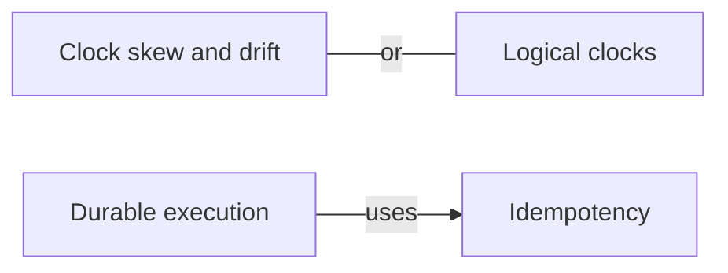

# Distributed systems

When the tasks are on different machines: partial failure, no shared clock, and the protocols that reach agreement anyway.

[All categories](../README.md) · [How they connect](../schema/README.md)

- [Distributed computing](distributed_computing/README.md) — Tasks on separate machines that communicate over a network: their events are only partially ordered, and one part can fail while the rest keeps running.
- [Partial failure](partial_failure/README.md) — In a distributed system one component can fail while the others continue, and a caller often cannot tell a slow peer from a dead one.
- [Clock skew and drift](clock_skew/README.md) — Skew is how far apart two machines' clocks are at one moment, drift how fast they move apart — the reason timestamps from different machines cannot reliably order events.
- [Logical clocks](logical_clocks/README.md) — Counters that order events by cause instead of by wall-clock time: a Lamport clock gives every event a consistent order, a vector clock can also tell that two events were concurrent.
- [Consensus](consensus/README.md) — Getting a group of machines to agree on one value, or one log of commands, even though some of them fail — the problem Paxos and Raft solve.
- [Idempotency](idempotency/README.md) — An operation that has the same effect whether it runs once or several times, which is what makes retrying after a timeout safe.
- [Consistency models](consistency_models/README.md) — The promise a distributed store makes about what a reader will see — from strong consistency, where every read sees the latest write, to eventual consistency, where replicas agree only in the end.
- [Multi-version concurrency control](mvcc/README.md) — Keeping several versions of each record so that readers see a consistent snapshot while writers add new versions, instead of readers and writers locking each other out.
- [Remote procedure call](rpc/README.md) — Calling a function that runs on another machine as though it were local — convenient until the network fails in a way no local call can.
- [Durable execution](durable_execution/README.md) — Recording a long-running workflow's progress — checkpoints, an event log — so that after a crash it resumes where it stopped instead of starting over.

## Inside this category

<!-- Generated above this line by tools/build_concepts.py from TOML data — edit the data, not the page. Hand-written notes go below it and are kept. -->
