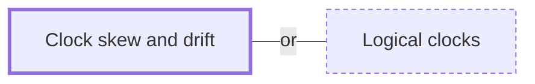

# Clock skew and drift

**Category:** [Distributed systems](../README.md) · **Status:** stub

**One line:** Skew is how far apart two machines' clocks are at one moment, drift how fast they move apart — the reason timestamps from different machines cannot reliably order events.

Also called: clock drift, clock synchronization, NTP, PTP, TrueTime.

## How it connects

- **An alternative to:** [Logical clocks](../logical_clocks/README.md)

## In each language

| | |
|---|---|
| Rust | [`Instant` ↗](https://doc.rust-lang.org/std/time/struct.Instant.html) is monotonic; [`SystemTime` ↗](https://doc.rust-lang.org/std/time/struct.SystemTime.html) is not, and is the one for communicating with other processes |
| Go | `time.Now` returns both a wall-clock and a [monotonic clock reading ↗](https://pkg.go.dev/time#hdr-Monotonic_Clocks), and the monotonic reading has no meaning outside the current process |
| C++ | [`std::chrono::steady_clock` ↗](https://en.cppreference.com/w/cpp/chrono/steady_clock) is monotonic: its time points cannot decrease as physical time moves forward |
| Java | [`System.nanoTime` ↗](https://docs.oracle.com/en/java/javase/25/docs/api/java.base/java/lang/System.html) measures elapsed time only and is not related to wall-clock time |
| Python | [`time.monotonic` ↗](https://docs.python.org/3/library/time.html#time.monotonic) cannot go backwards and is not affected by system clock updates |
| Erlang and Elixir | the runtime keeps Erlang monotonic time apart from system time, with [time warp modes ↗](https://www.erlang.org/doc/apps/erts/time_correction.html) for when system time changes |
| The operating system | [`CLOCK_REALTIME` ↗](https://man7.org/linux/man-pages/man2/clock_gettime.2.html) jumps when the system time is changed; `CLOCK_MONOTONIC` cannot be set |

## Where to read more

- **In the books:** [*Concurrent Programming on Windows*](../../../10_Resources/books_csharp_dotnet/README.md#duffy_concurrent_programming_on_windows), Joe Duffy — ch. 2, 'Synchronization and Time'
- **In the books:** [*Distributed Computing*](../../../10_Resources/books_general/README.md#kshemkalyani_singhal_distributed_computing), Ajay D. Kshemkalyani, Mukesh Singhal — ch. 3, 'Logical Time' → 'Physical Clock Synchronization: NTP'
- **In the books:** [*Modern Multithreading*](../../../10_Resources/books_general/README.md#carver_tai_modern_multithreading), Richard H. Carver, Kuo-Chung Tai — ch. 6, 'Message Passing in Distributed Programs' → 'Timestamps and Event Ordering'
- **In the books:** [*Designing Data-Intensive Applications*](../../../10_Resources/books_general/README.md#kleppmann_designing_data_intensive_applications), Martin Kleppmann — ch. 8, 'The Trouble with Distributed Systems' → 'Unreliable Clocks'
- **Notes:** [clock skew ↗](https://docs.google.com/document/d/1zGFVxtILOswbzW7HHeVlpz_jYTwpRhxU0SMwGN_ezyU/edit?tab=t.0)
- **Notes:** [Clock Drift ↗](https://docs.google.com/document/d/1-Z0UrnnJd8EBkz023U_z3-rkvrry1Vhj-Vz_8r8-WvQ/edit?tab=t.0)
- **Notes:** [clock synchronization - time synchronization ↗](https://docs.google.com/document/d/1UMPn_Kg5eyxiaMxqMZjcIvZSxxWJdUPl-YbUoB-aerg/edit?tab=t.0)
- **Notes:** [distributed clock ↗](https://docs.google.com/document/d/1gxlrcp4H_a-lTSQZAwnykrDML-7_4u-xscRskRXelEs/edit?tab=t.0)
- **Notes:** [distributed time ↗](https://docs.google.com/document/d/1Tq6KM3vicOkHALOxu3omJmQ7dSaKG4gyaXDeZ5B_Zz8/edit?tab=t.0)
- **Notes:** [Spanner: TrueTime and external consistency ↗](https://docs.google.com/document/d/1yRF-H2Fdtd_kVDGeRFUwhJkHiRPMD35XLo774HtAWq0/edit?tab=t.0)
- **Reference:** [Wikipedia: Clock skew ↗](https://en.wikipedia.org/wiki/Clock_skew)
- **Reference:** [Wikipedia: Clock drift ↗](https://en.wikipedia.org/wiki/Clock_drift)

<!-- Generated above this line by tools/build_concepts.py from TOML data — edit the data, not the page. Hand-written notes go below it and are kept. -->
