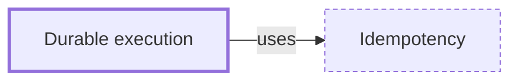

# Durable execution

**Category:** [Distributed systems](../README.md) · **Status:** stub

**One line:** Recording a long-running workflow's progress — checkpoints, an event log — so that after a crash it resumes where it stopped instead of starting over.

Also called: distributed async await, checkpointing, workflow engine, resume semantics.

## How it connects

- **Is built on:** [Idempotency](../idempotency/README.md)
- **See also:** [Async and await](../../async/async_await/README.md), [Partial failure](../partial_failure/README.md)

## In each language

| | |
|---|---|
| C# | [Azure Durable Functions ↗](https://learn.microsoft.com/en-us/azure/azure-functions/durable/durable-functions-overview): orchestrator functions whose runtime manages state, checkpoints, retries and recovery |
| Elsewhere | [Temporal ↗](https://docs.temporal.io/temporal): a Workflow Execution keeps its state and progress through crashes by recording an Event History |

## Where to read more

- **Reference:** [Dominik Tornow: Distributed Async Await (NDC talk) ↗](https://www.youtube.com/watch?v=lfSIunYUsSg)

<!-- Generated above this line by tools/build_concepts.py from TOML data — edit the data, not the page. Hand-written notes go below it and are kept. -->
