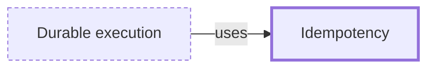

# Idempotency

**Category:** [Distributed systems](../README.md) · **Status:** stub

**One line:** An operation that has the same effect whether it runs once or several times, which is what makes retrying after a timeout safe.

Also called: idempotent.

## How it connects

- **Is used by:** [Durable execution](../durable_execution/README.md)
- **See also:** [Partial failure](../partial_failure/README.md)

## In each language

| | |
|---|---|
| Elsewhere | HTTP: the safe methods, `PUT` and `DELETE` are [idempotent ↗](https://developer.mozilla.org/en-US/docs/Glossary/Idempotent), `POST` and `PATCH` are not guaranteed to be; APIs such as [Stripe's ↗](https://docs.stripe.com/api/idempotent_requests) take an idempotency key so that a retried request is safe |

## Where to read more

- **In this library:** [When does order change a sum?](../../../02_Shared_State/when_order_changes_a_sum/README.md)
- **In the books:** [*Concurrency in Go*](../../../10_Resources/books_go/README.md#cox_buday_concurrency_in_go), Katherine Cox-Buday — ch. 5, 'Concurrency at Scale' → 'Replicated Requests'
- **In the books:** [*Async Rust*](../../../10_Resources/books_rust/README.md#flitton_morton_async_rust), Maxwell Flitton, Caroline Morton — ch. 9, 'Design Patterns' → 'The Retry Pattern'
- **In the books:** [*Distributed Systems with Node.js*](../../../10_Resources/books_javascript/README.md#hunter_distributed_systems_with_nodejs), Thomas Hunter II — ch. 8, 'Resilience' → 'Idempotency and Messaging Resilience'
- **Notes:** [idempotency ↗](https://docs.google.com/document/d/1OfjLgcuxGCb2pILxDXmXtGLS2Z1klWu9o0Hb4oNInaA/edit?tab=t.0)
- **Reference:** [Wikipedia: Idempotence (computer science meaning) ↗](https://en.wikipedia.org/wiki/Idempotence#Computer_science_meaning)

<!-- Generated above this line by tools/build_concepts.py from TOML data — edit the data, not the page. Hand-written notes go below it and are kept. -->
