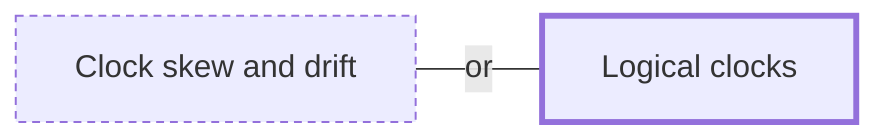

# Logical clocks

**Category:** [Distributed systems](../README.md) · **Status:** stub

**One line:** Counters that order events by cause instead of by wall-clock time: a Lamport clock gives every event a consistent order, a vector clock can also tell that two events were concurrent.

Also called: Lamport clock, vector clock, timestamp ordering.

## How it connects

- **An alternative to:** [Clock skew and drift](../clock_skew/README.md)

## In each language

| | |
|---|---|
| Elsewhere | CockroachDB's [transaction layer ↗](https://www.cockroachlabs.com/docs/stable/architecture/transaction-layer) uses hybrid-logical clocks: a physical component close to local wall time plus a logical component |

## Where to read more

- **Notes:** [timestamp ordering (TO) ↗](https://docs.google.com/document/d/1dDJvs6_9ftPoVXBft41Jfy7oFHZ27qVenrCg3kebWG4/edit?tab=t.0)
- **Notes:** [assign timestamps to transactions ↗](https://docs.google.com/document/d/1paaXi-x1J1nN2CMAulpOdFhwhMoxHon9GdyjVVKtfAo/edit?tab=t.0)
- **Reference:** [Wikipedia: Lamport timestamp ↗](https://en.wikipedia.org/wiki/Lamport_timestamp)
- **Reference:** [Wikipedia: Vector clock ↗](https://en.wikipedia.org/wiki/Vector_clock)

<!-- Generated above this line by tools/build_concepts.py from TOML data — edit the data, not the page. Hand-written notes go below it and are kept. -->
