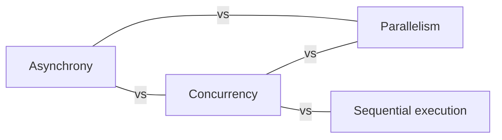

# Foundations

What the words mean before any language gets involved: several tasks over the same period of time, several computations at the same instant, and not waiting for an answer.

[All categories](../README.md) · [How they connect](../schema/README.md)

- [Concurrency](concurrency/README.md) — Structuring a program as tasks whose lifetimes overlap, so that all of them make progress over the same period of time — interleaved on one core, or at the same instant on several.
- [Parallelism](parallelism/README.md) — Running several computations at the same instant on separate processing units so the whole finishes sooner; it needs more than one core, and concurrency does not.
- [Asynchrony](asynchrony/README.md) — Starting an operation and carrying on with other work instead of waiting for it; the result arrives later, through a callback, a future, or an await.
- [Sequential execution](sequential_execution/README.md) — Steps run one after another in a fixed order, each finishing before the next starts: a single total order of events, and the baseline every concurrent program is measured against.
- [Blocking and non-blocking calls](blocking_and_nonblocking/README.md) — A blocking call does not return until its work is done, holding the caller's thread the whole time; a non-blocking call returns at once and reports that the work is not ready yet or will finish later.
- [I/O-bound and CPU-bound work](io_bound_and_cpu_bound/README.md) — Work that spends its time waiting for disks and networks gains from concurrency even on one core; work that spends its time computing gains only from parallelism.
- [Interleaving](interleaving/README.md) — One of the many orders in which the steps of concurrent tasks can actually run; a concurrent program is correct only if it is correct under every one of them.
- [Nondeterminism](nondeterminism/README.md) — The same program with the same input gives different results on different runs, because the scheduler chose a different interleaving.
- [Multitasking](multitasking/README.md) — An operating system or runtime running several tasks over the same period by switching between them — by force (preemptive) or when a task gives way (cooperative).
- [Speedup and Amdahl's law](speedup_and_amdahls_law/README.md) — How much faster more processors make a program is capped by the part that must still run sequentially: if a tenth of the work is serial, no number of cores gives more than ten times the speed.
- [Granularity](granularity/README.md) — How big the pieces of work handed to separate tasks are: too coarse leaves cores idle, too fine spends more on coordinating the pieces than on the work in them.
- [Oversubscription](oversubscription/README.md) — More busy threads than there are cores, so the machine spends its time switching between them instead of running them.
- [Concurrency models](concurrency_models/README.md) — The families of answers to how tasks share work and coordinate: threads and locks, communicating processes, actors, async tasks on an event loop, data parallelism, transactional memory.
- [Concurrency primitives](concurrency_primitives/README.md) — The building blocks a language or library provides for concurrent code, in four groups: synchronization (mutex, semaphore, condition variable), communication (channels, futures), task management (threads, tasks, pools) and atomics.

## Inside this category

<!-- Generated above this line by tools/build_concepts.py from TOML data — edit the data, not the page. Hand-written notes go below it and are kept. -->
