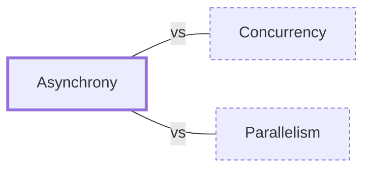

# Asynchrony

**Category:** [Foundations](../README.md) · **Status:** stub · **Lessons:** chapter 06, Async *(planned)*

**One line:** Starting an operation and carrying on with other work instead of waiting for it; the result arrives later, through a callback, a future, or an await.

Also called: asynchronous programming, async.

## How it connects

- **Often confused with:** [Concurrency](../concurrency/README.md), [Parallelism](../parallelism/README.md)
- **See also:** [Async and await](../../async/async_await/README.md), [Blocking and non-blocking calls](../blocking_and_nonblocking/README.md), [Callback](../../async/callback/README.md), [Future and promise](../../async/future_and_promise/README.md)

## In each language

| | |
|---|---|
| Rust | An [`async` ↗](https://doc.rust-lang.org/std/keyword.async.html) function returns a [`Future` ↗](https://doc.rust-lang.org/std/future/trait.Future.html), which does nothing until something polls it |
| Go | No `async` or `await`: code is written blocking, and when a goroutine blocks, the runtime [moves the others to another thread ↗](https://go.dev/doc/faq#goroutines) |
| C | POSIX [`aio_read` ↗](https://pubs.opengroup.org/onlinepubs/9799919799/functions/aio_read.html) and its relatives |
| C++ | [`std::async` ↗](https://en.cppreference.com/w/cpp/thread/async) returns a `std::future`; C++20 [coroutines ↗](https://en.cppreference.com/w/cpp/language/coroutines) add `co_await` |
| Java | [`CompletableFuture` ↗](https://docs.oracle.com/en/java/javase/25/docs/api/java.base/java/util/concurrent/CompletableFuture.html) chains stages that run when a result arrives |
| Python | [`asyncio` ↗](https://docs.python.org/3/library/asyncio.html) with `async def` and `await` |
| C# | [`async` and `await` ↗](https://learn.microsoft.com/en-us/dotnet/csharp/asynchronous-programming/) over `Task` and `Task<T>` |
| JavaScript | [Promises ↗](https://developer.mozilla.org/en-US/docs/Web/JavaScript/Reference/Global_Objects/Promise) and [`async` functions ↗](https://developer.mozilla.org/en-US/docs/Web/JavaScript/Reference/Statements/async_function) |
| Kotlin | Calls to [`suspend` functions ↗](https://kotlinlang.org/docs/composing-suspending-functions.html) run sequentially by default; the library function [`async` ↗](https://kotlinlang.org/api/kotlinx.coroutines/kotlinx-coroutines-core/kotlinx.coroutines/async.html) starts one concurrently and returns a `Deferred` |
| Swift | [`async` functions and `await` ↗](https://docs.swift.org/swift-book/documentation/the-swift-programming-language/concurrency/) |
| Erlang and Elixir | [`Task.async` ↗](https://hexdocs.pm/elixir/Task.html#async/1) and `Task.await`: a process and a message underneath |
| Haskell | [`async` and `wait` ↗](https://hackage.haskell.org/package/async/docs/Control-Concurrent-Async.html) from the `async` package run an `IO` action in a separate thread and collect its result |
| The operating system | [`io_uring` ↗](https://man7.org/linux/man-pages/man7/io_uring.7.html) on Linux, with a submission queue and a completion queue; the [POSIX AIO ↗](https://man7.org/linux/man-pages/man7/aio.7.html) interface |

## Where to read more

- **In the books:** [*Async Rust*](../../../10_Resources/books_rust/README.md#flitton_morton_async_rust), Maxwell Flitton, Caroline Morton — ch. 1, 'Introduction to Async'
- **In the books:** [*Learning Concurrent Programming in Scala*](../../../10_Resources/books_scala_jvm_functional/README.md#prokopec_learning_concurrent_programming_in_scala), Aleksandar Prokopec — ch. 4, 'Asynchronous Programming with Futures and Promises'
- **In the books:** [*Concurrent Programming on Windows*](../../../10_Resources/books_csharp_dotnet/README.md#duffy_concurrent_programming_on_windows), Joe Duffy — ch. 8, 'Asynchronous Programming Models'
- **In the books:** [*Using Asyncio in Python*](../../../10_Resources/books_python/README.md#hattingh_using_asyncio_in_python), Caleb Hattingh — ch. 1, 'Introducing Asyncio'
- **In the books:** [*Kotlin Coroutines by Tutorials*](../../../10_Resources/books_other/README.md#babic_srivastava_kotlin_coroutines_by_tutorials), Filip Babić, Nishant Srivastava — ch. 1, 'What Is Asynchronous Programming'
- **In the books:** [*Asynchronous Programming*](../../../10_Resources/books_general/README.md#edet_asynchronous_programming), Theophilus Edet — ch. 1, 'Introduction to Asynchronous Programming'
- **Notes:** [Asynchrony ↗](https://docs.google.com/document/d/1iQlbAm1n6UG6OgFnd-ECDn570GHXVRsqVAce9hrtfCE/edit?tab=t.0)
- **Notes:** [Asynchronous - general ↗](https://docs.google.com/document/d/1517jQRMuMl7Cf_E4zSvQvcOezzB65W53BrHD5BbadH0/edit?tab=t.0)
- **Notes:** [async - general - asynchronous programming ↗](https://docs.google.com/document/d/1P9HhzF0eb_Zo4EGP_4V7ESXQd4VoBBypnxHN4jOXHNA/edit?tab=t.0)
- **Notes:** [What is Async Programming and why would you do it ↗](https://docs.google.com/document/d/1W3Jd69czmRZj2Rc8e5kfWZlnuGK_CPCLEMugE5zFN5A/edit?tab=t.0)
- **Notes:** [synchronous vs asynchronous - general ↗](https://docs.google.com/document/d/1higzhaQYEb1GjKD2LzfNmbJa8n3Zb8TU0hT4Vt-tY3M/edit?tab=t.0)
- **Notes:** [why async ↗](https://docs.google.com/document/u/0/d/14WnFVjc_4uIx_qvYCcuxbd0I1dswxPmDizEGOllAv-4/edit)
- **Reference:** [Wikipedia: Asynchrony (computer programming) ↗](https://en.wikipedia.org/wiki/Asynchrony_(computer_programming))
- **Reference:** [Asynchronous Programming in Rust: what is async programming ↗](https://rust-lang.github.io/async-book/)

<!-- Generated above this line by tools/build_concepts.py from TOML data — edit the data, not the page. Hand-written notes go below it and are kept. -->
