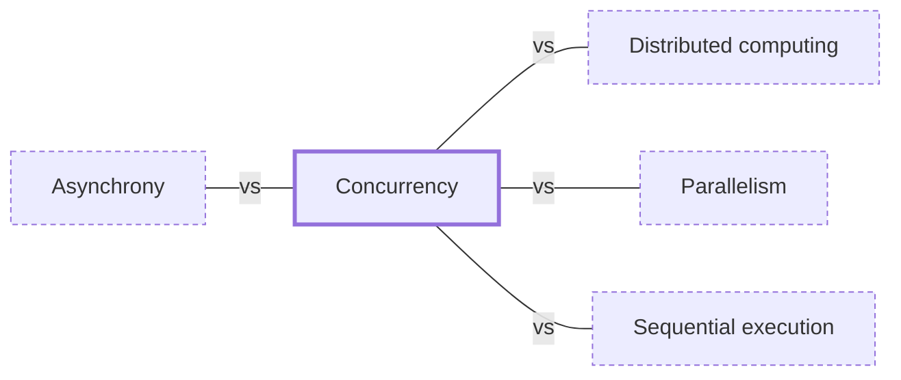

# Concurrency

**Category:** [Foundations](../README.md) · **Status:** stub · **Lessons:** [chapter 01, Threads](../../../01_Threads/README.md)

**One line:** Structuring a program as tasks whose lifetimes overlap, so that all of them make progress over the same period of time — interleaved on one core, or at the same instant on several.

Also called: concurrent programming, concurrent computing.

## How it connects

- **Often confused with:** [Asynchrony](../asynchrony/README.md), [Distributed computing](../../distributed/distributed_computing/README.md), [Parallelism](../parallelism/README.md), [Sequential execution](../sequential_execution/README.md)
- **See also:** [Concurrency models](../concurrency_models/README.md), [Interleaving](../interleaving/README.md), [Multitasking](../multitasking/README.md)

## In each language

| | |
|---|---|
| Rust | The book's [Fearless Concurrency ↗](https://doc.rust-lang.org/book/ch16-00-concurrency.html) chapter: threads, message passing and shared state, with ownership and type checking turning many concurrency errors into compile-time errors |
| Go | In the language: the [`go` statement ↗](https://go.dev/ref/spec#Go_statements) starts a goroutine, and [channels ↗](https://go.dev/ref/spec#Channel_types) and [`select` ↗](https://go.dev/ref/spec#Select_statements) connect goroutines |
| C | C11's [`<threads.h>` ↗](https://en.cppreference.com/w/c/thread) is optional (a compiler may define `__STDC_NO_THREADS__`); POSIX threads start with [`pthread_create` ↗](https://pubs.opengroup.org/onlinepubs/9799919799/functions/pthread_create.html) |
| C++ | The [concurrency support library ↗](https://en.cppreference.com/w/cpp/thread) since C++11: threads, mutexes, condition variables and futures, with `std::jthread` added in C++20 |
| Java | [`Thread` ↗](https://docs.oracle.com/en/java/javase/25/docs/api/java.base/java/lang/Thread.html) since 1.0, and the executors, locks and concurrent collections of [`java.util.concurrent` ↗](https://docs.oracle.com/en/java/javase/25/docs/api/java.base/java/util/concurrent/package-summary.html) |
| Python | The library's [Concurrent Execution ↗](https://docs.python.org/3/library/concurrency.html) chapter (`threading`, `multiprocessing`, `concurrent.futures`), and [`asyncio` ↗](https://docs.python.org/3/library/asyncio.html) for `async`/`await` code |
| C# | [Task-based asynchronous programming ↗](https://learn.microsoft.com/en-us/dotnet/standard/parallel-programming/task-based-asynchronous-programming) with `Task`, over [managed threads ↗](https://learn.microsoft.com/en-us/dotnet/standard/threading/managed-threading-basics) |
| JavaScript | Each agent, analogous to a thread, runs an [event loop ↗](https://developer.mozilla.org/en-US/docs/Web/JavaScript/Reference/Execution_model): concurrency comes from promises and `async` functions, parallelism from [workers ↗](https://developer.mozilla.org/en-US/docs/Web/API/Web_Workers_API) |
| Kotlin | [Coroutines ↗](https://kotlinlang.org/docs/coroutines-overview.html): the language has `suspend`, and `async`, `launch` and the rest come from the `kotlinx.coroutines` library |
| Swift | In the language: [`async`/`await`, tasks and actors ↗](https://docs.swift.org/swift-book/documentation/the-swift-programming-language/concurrency/) |
| Erlang and Elixir | Lightweight [processes ↗](https://www.erlang.org/doc/system/ref_man_processes.html), fast to create and terminate, that communicate by sending messages |
| Haskell | [`forkIO` ↗](https://hackage.haskell.org/package/base/docs/Control-Concurrent.html#v:forkIO) threads scheduled by the GHC runtime, communicating through `MVar`s |

## Where to read more

- **In this library:** [Who waits when main returns?](../../../01_Threads/who_waits_when_main_returns/README.md)
- **In the books:** [*Concurrency in Go*](../../../10_Resources/books_go/README.md#cox_buday_concurrency_in_go), Katherine Cox-Buday — ch. 1, 'An Introduction to Concurrency'
- **In the books:** [*C++ Concurrency in Action*](../../../10_Resources/books_cpp/README.md#williams_cpp_concurrency_in_action), Anthony Williams — ch. 1, 'Hello, world of concurrency in C++!'
- **In the books:** [*Programming Concurrency on the JVM*](../../../10_Resources/books_java/README.md#subramaniam_programming_concurrency_on_the_jvm), Venkat Subramaniam — ch. 1, 'The Power and Perils of Concurrency'
- **In the books:** [*Concurrency in C# Cookbook*](../../../10_Resources/books_csharp_dotnet/README.md#cleary_concurrency_in_csharp_cookbook), Stephen Cleary — ch. 1, 'Concurrency: An Overview'
- **In the books:** [*Grokking Concurrency*](../../../10_Resources/books_general/README.md#bobrov_grokking_concurrency), Kirill Bobrov — ch. 1, 'Introducing concurrency'
- **In the books:** [*Learning Concurrent Programming in Scala*](../../../10_Resources/books_scala_jvm_functional/README.md#prokopec_learning_concurrent_programming_in_scala), Aleksandar Prokopec — ch. 1, 'Introduction' → 'Concurrent programming'
- **Notes:** [Concurrency - concurrent operations ↗](https://docs.google.com/document/u/0/d/1lPhK8MVCged6d1Px-_N5G4nOME2CfzNzCBHen57IOwo/edit)
- **Notes:** [concurrently - rust - main - concurrency ↗](https://docs.google.com/document/u/0/d/12nR_hllHkXX0vWYWOvoNvbLVY3cbty0QKf4wSicRKAA/edit)
- **Notes:** [Concurrency vs Parallelism - concurrent vs parallel execution ↗](https://docs.google.com/document/d/1BFnxp56E09aqwSpSYWKTMkb63gPlIglbyHnUYkAYbzc/edit?tab=t.0)
- **Notes:** [Asynchronous - Concurrency - Parallelism - general concept ↗](https://docs.google.com/document/d/1lvCfQEo4bjqyU6-F2igHXelkE-1mnbptyNGhsjysZw0/edit?tab=t.0)
- **Notes:** [async vs concurrent ↗](https://docs.google.com/document/u/0/d/19By5TJ-j-V0oJm4vnUtb51ZKgQOUJmwJT6v3ACYOBPk/edit)
- **Notes:** [Index - Concurrency and Parallelism in general - main ↗](https://docs.google.com/document/u/0/d/1Nk5uXl3VEjYrkKRMuO_CBtcB0vN2mKLNKh1z5SU9UIA/edit)
- **Reference:** [Wikipedia: Concurrent computing ↗](https://en.wikipedia.org/wiki/Concurrent_computing)

<!-- Generated above this line by tools/build_concepts.py from TOML data — edit the data, not the page. Hand-written notes go below it and are kept. -->
