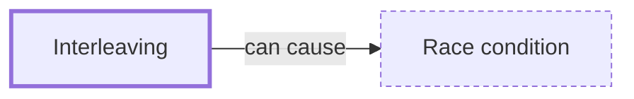

# Interleaving

**Category:** [Foundations](../README.md) · **Status:** stub · **Lessons:** chapter 02, Shared state *(planned)*

**One line:** One of the many orders in which the steps of concurrent tasks can actually run; a concurrent program is correct only if it is correct under every one of them.

## How it connects

- **Can lead to:** [Race condition](../../hazards/race_condition/README.md)
- **See also:** [Concurrency](../concurrency/README.md), [Nondeterminism](../nondeterminism/README.md), [Preemptive scheduling](../../scheduling/preemptive_scheduling/README.md)

## Where to read more

- **In a sibling library:** [Go: Fan-out, fan-in ↗](https://masiarek.github.io/go-learning-library/06_Patterns/fan_out_fan_in/index.html)
- **Notes:** [interleaving actions across threads ↗](https://docs.google.com/document/d/1JqRl9gJCA_tmJQPkipzg0sG5p773x-PuPIel-Nx5HdM/edit?tab=t.0)

<!-- Generated above this line by tools/build_concepts.py from TOML data — edit the data, not the page. Hand-written notes go below it and are kept. -->
