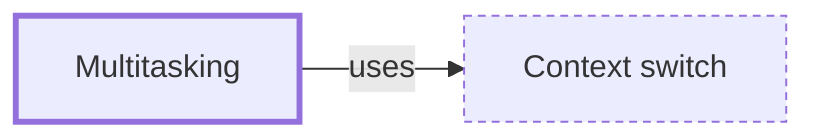

# Multitasking

**Category:** [Foundations](../README.md) · **Status:** stub

**One line:** An operating system or runtime running several tasks over the same period by switching between them — by force (preemptive) or when a task gives way (cooperative).

## How it connects

- **Is built on:** [Context switch](../../units_of_execution/context_switch/README.md)
- **See also:** [Concurrency](../concurrency/README.md), [Cooperative scheduling](../../scheduling/cooperative_scheduling/README.md), [Preemptive scheduling](../../scheduling/preemptive_scheduling/README.md)

## In each language

| | |
|---|---|
| The operating system | [`sched(7)` ↗](https://man7.org/linux/man-pages/man7/sched.7.html): Linux decides which thread runs next by scheduling policy and priority, and preempts the one running |

## Where to read more

- **In the books:** [*Grokking Concurrency*](../../../10_Resources/books_general/README.md#bobrov_grokking_concurrency), Kirill Bobrov — ch. 6, 'Multitasking'
- **In the books:** [*Asynchronous Programming in Rust*](../../../10_Resources/books_rust/README.md#samson_asynchronous_programming_in_rust), Carl Fredrik Samson — ch. 1, 'Concurrency and Asynchronous Programming: a Detailed Overview' → 'An evolutionary journey of multitasking'
- **In the books:** [*Python Concurrency with asyncio*](../../../10_Resources/books_python/README.md#fowler_python_concurrency_with_asyncio), Matthew Fowler — ch. 1, 'Getting to know asyncio' → 'Understanding concurrency, parallelism, and multitasking'
- **In the books:** [*Systems Programming in Unix/Linux*](../../../10_Resources/books_c/README.md#wang_systems_programming_unix_linux), K. C. Wang — ch. 3, 'Process Management in Unix/Linux' → 'Multitasking'
- **Notes:** [Multitasking - general ↗](https://docs.google.com/document/d/1tTucxIGt2tzt_Xdsg_zZ1di3oHlKi5SCHa6XLZVEgEE/edit?tab=t.0)
- **Reference:** [Wikipedia: Computer multitasking ↗](https://en.wikipedia.org/wiki/Computer_multitasking)

<!-- Generated above this line by tools/build_concepts.py from TOML data — edit the data, not the page. Hand-written notes go below it and are kept. -->
