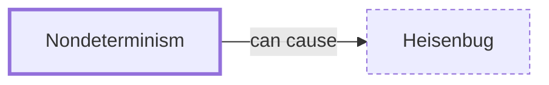

# Nondeterminism

**Category:** [Foundations](../README.md) · **Status:** stub

**One line:** The same program with the same input gives different results on different runs, because the scheduler chose a different interleaving.

Also called: non-deterministic behaviour.

## How it connects

- **Can lead to:** [Heisenbug](../../hazards/heisenbug/README.md)
- **See also:** [Interleaving](../interleaving/README.md), [Stress testing](../../testing_and_tools/stress_testing/README.md)

## In each language

| | |
|---|---|
| Go | The spec makes [`select` ↗](https://go.dev/ref/spec#Select_statements) choose among ready cases by uniform pseudo-random selection, and leaves [map iteration order ↗](https://go.dev/ref/spec#For_range) unspecified |

## Where to read more

- **In this library:** [Who waits when main returns?](../../../01_Threads/who_waits_when_main_returns/README.md)
- **In a sibling library:** [Go: `select` chooses at random ↗](https://masiarek.github.io/go-learning-library/03_Select/select_chooses_at_random/index.html)
- **In a sibling library:** [Go: Fan-out, fan-in ↗](https://masiarek.github.io/go-learning-library/06_Patterns/fan_out_fan_in/index.html)
- **In the books:** [*Multithreaded JavaScript*](../../../10_Resources/books_javascript/README.md#hunter_english_multithreaded_javascript), Thomas Hunter II, Bryan English — ch. 5, 'Advanced Shared Memory' → 'Timing and Nondeterminism'
- **In the books:** [*The Little Book of Semaphores*](../../../10_Resources/books_general/README.md#downey_little_book_of_semaphores), Allen B. Downey — ch. 1, 'Introduction' → 'Non-determinism'
- **In the books:** [*Functional and Concurrent Programming*](../../../10_Resources/books_scala_jvm_functional/README.md#charpentier_functional_and_concurrent_programming), Michel Charpentier — ch. 17, 'Threads and Nondeterminism'
- **Notes:** [non-deterministic behavior - concurrency ↗](https://docs.google.com/document/d/17sZ1SSHzqKmpS_GIAg2UyMqqvIU4lTs-hvsYeGnwcWM/edit?tab=t.0)
- **Notes:** [deterministic and nondeterministic - concurrency ↗](https://docs.google.com/document/d/1ospUDi71_hJRcJaEcvj9f5L5uXuaKyrynUwO3QR7TOA/edit?tab=t.0)

<!-- Generated above this line by tools/build_concepts.py from TOML data — edit the data, not the page. Hand-written notes go below it and are kept. -->
