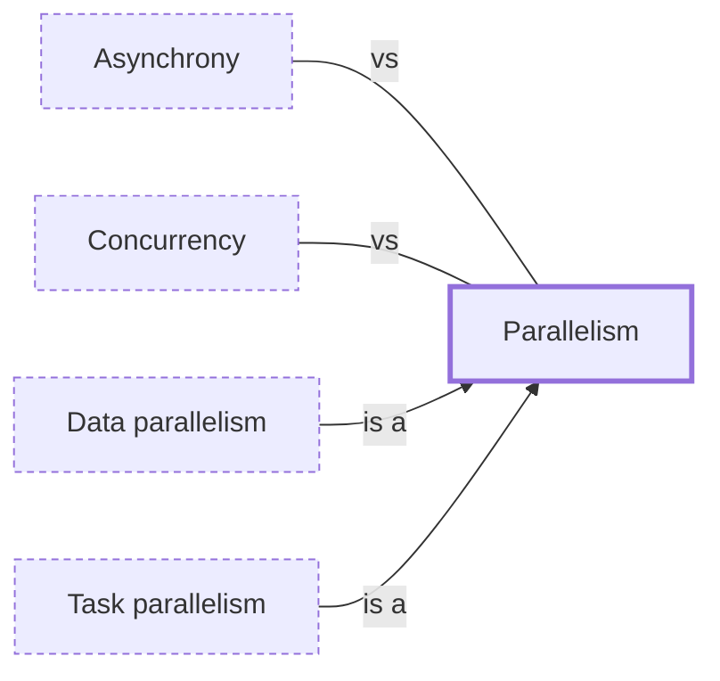

# Parallelism

**Category:** [Foundations](../README.md) · **Status:** stub · **Lessons:** [chapter 07, Parallelism](../../../07_Parallelism/README.md)

**One line:** Running several computations at the same instant on separate processing units so the whole finishes sooner; it needs more than one core, and concurrency does not.

Also called: parallel computing, parallel execution.

## How it connects

- **Kinds:** [Data parallelism](../../parallelism/data_parallelism/README.md), [Task parallelism](../../parallelism/task_parallelism/README.md)
- **Often confused with:** [Asynchrony](../asynchrony/README.md), [Concurrency](../concurrency/README.md)
- **See also:** [I/O-bound and CPU-bound work](../io_bound_and_cpu_bound/README.md), [Speedup and Amdahl's law](../speedup_and_amdahls_law/README.md)

## In each language

| | |
|---|---|
| Rust | [`std::thread::scope` ↗](https://doc.rust-lang.org/std/thread/fn.scope.html) runs threads that borrow local data; parallel iterators come from the [Rayon ↗](https://docs.rs/rayon/latest/rayon/) crate, not the standard library |
| Go | Goroutines run in parallel on as many CPUs as [`runtime.GOMAXPROCS` ↗](https://pkg.go.dev/runtime#GOMAXPROCS) allows |
| C++ | [Execution policies ↗](https://en.cppreference.com/w/cpp/algorithm/execution_policy_tag_t) (C++17) let standard algorithms such as `std::sort` and `std::reduce` run in parallel |
| Java | [Parallel streams ↗](https://docs.oracle.com/en/java/javase/25/docs/api/java.base/java/util/stream/package-summary.html#Parallelism), and [`ForkJoinPool` ↗](https://docs.oracle.com/en/java/javase/25/docs/api/java.base/java/util/concurrent/ForkJoinPool.html) for tasks that spawn subtasks |
| Python | Threads do not run Python code in parallel under the [GIL ↗](https://docs.python.org/3/glossary.html#term-global-interpreter-lock); use [`multiprocessing` ↗](https://docs.python.org/3/library/multiprocessing.html) or the free-threaded build |
| C# | [Parallel programming in .NET ↗](https://learn.microsoft.com/en-us/dotnet/standard/parallel-programming/): the Task Parallel Library and PLINQ |
| JavaScript | Each [worker ↗](https://developer.mozilla.org/en-US/docs/Web/API/Web_Workers_API) runs in a background thread; memory is shared between them with a [`SharedArrayBuffer` ↗](https://developer.mozilla.org/en-US/docs/Web/JavaScript/Reference/Global_Objects/SharedArrayBuffer) |
| Erlang and Elixir | The VM starts one [scheduler thread ↗](https://www.erlang.org/doc/apps/erts/erl_cmd.html) per logical processor by default, so processes run in parallel without any change to the code |
| Haskell | [`par` and `pseq` ↗](https://hackage.haskell.org/package/parallel/docs/Control-Parallel.html) in the `parallel` package mark pure expressions that may be worth evaluating in parallel |

## Where to read more

- **In the books:** [*Hands-On Concurrency with Rust*](../../../10_Resources/books_rust/README.md#troutwine_hands_on_concurrency_with_rust), Brian L. Troutwine — ch. 8, 'High-Level Parallelism – Threadpools, Parallel Iterators and Processes'
- **In the books:** [*Parallel Programming with Intel Parallel Studio XE*](../../../10_Resources/books_cpp/README.md#blair_chappell_intel_parallel_studio_xe), Stephen Blair-Chappell, Andrew Stokes — ch. 1, 'Parallelism Today'
- **In the books:** [*Parallel and Concurrent Programming in Haskell*](../../../10_Resources/books_haskell/README.md#marlow_parallel_and_concurrent_programming_in_haskell), Simon Marlow — ch. 2, 'Basic Parallelism: The Eval Monad'
- **In the books:** [*Pro Asynchronous Programming with .NET*](../../../10_Resources/books_csharp_dotnet/README.md#blewett_clymer_pro_asynchronous_programming_dotnet), Richard Blewett, Andrew Clymer — ch. 11, 'Parallel Programming'
- **In the books:** [*Python Parallel Programming Cookbook*](../../../10_Resources/books_python/README.md#zaccone_python_parallel_programming_cookbook), Giancarlo Zaccone — ch. 1, 'Getting Started with Parallel Computing and Python'
- **In the books:** [*Grokking Concurrency*](../../../10_Resources/books_general/README.md#bobrov_grokking_concurrency), Kirill Bobrov — ch. 2, 'Serial and parallel execution' → 'Parallel computing requirements'
- **Notes:** [parallelism - general ↗](https://docs.google.com/document/d/1VvV-E2KRjEpYtHoTCS1bRh89V1XSUJmzU6wpCpClU6M/edit?tab=t.0)
- **Notes:** [parallelism - rust ↗](https://docs.google.com/document/u/0/d/1l4c6dy7ZB7PUp83hxH7Vnsr5_qX5JkrRES5aUhvuXXs/edit)
- **Reference:** [Wikipedia: Parallel computing ↗](https://en.wikipedia.org/wiki/Parallel_computing)

<!-- Generated above this line by tools/build_concepts.py from TOML data — edit the data, not the page. Hand-written notes go below it and are kept. -->
