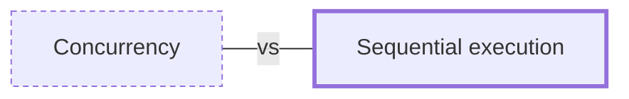

# Sequential execution

**Category:** [Foundations](../README.md) · **Status:** stub

**One line:** Steps run one after another in a fixed order, each finishing before the next starts: a single total order of events, and the baseline every concurrent program is measured against.

Also called: serial execution, sequential programming.

## How it connects

- **Often confused with:** [Concurrency](../concurrency/README.md)

## Where to read more

- **In this library:** [Why does the ninth core help less than the second?](../../../07_Parallelism/amdahls_law/README.md)
- **In the books:** [*Hands-On Concurrency with Rust*](../../../10_Resources/books_rust/README.md#troutwine_hands_on_concurrency_with_rust), Brian L. Troutwine — ch. 2, 'Sequential Rust Performance and Testing'
- **In the books:** [*Grokking Concurrency*](../../../10_Resources/books_general/README.md#bobrov_grokking_concurrency), Kirill Bobrov — ch. 2, 'Serial and parallel execution'
- **In the books:** [*Multi-Threaded Programming in C++*](../../../10_Resources/books_cpp/README.md#walmsley_multithreaded_programming_in_cpp), Mark Walmsley — ch. 1, 'Introduction' → 'Single Threaded Programming'
- **In the books:** [*Java Concurrency in Practice*](../../../10_Resources/books_java/README.md#goetz_java_concurrency_in_practice), Brian Goetz, Tim Peierls, Joshua Bloch, Joseph Bowbeer, David Holmes, Doug Lea — ch. 9, 'GUI Applications' → 'Why are GUIs Single-threaded?'
- **In the books:** [*Python Concurrency with asyncio*](../../../10_Resources/books_python/README.md#fowler_python_concurrency_with_asyncio), Matthew Fowler — ch. 1, 'Getting to know asyncio' → 'How single-threaded concurrency works'
- **In the books:** [*Multithreaded JavaScript*](../../../10_Resources/books_javascript/README.md#hunter_english_multithreaded_javascript), Thomas Hunter II, Bryan English — ch. 1, 'Introduction' → 'Single-Threaded JavaScript'
- **Notes:** [sequential programming - sequential functions - sequential platform ↗](https://docs.google.com/document/d/1Ru7dKMOBWpFx36MzGhzMOWZhZ4WYb7Kb0Tkqv9VAMfE/edit?tab=t.0)
- **Notes:** [Sequential Steps ↗](https://docs.google.com/document/d/1jXqqDFIZQAiQ_0s1hUHe8_X7HiZ2UQeySHO8bVuK8Xs/edit?tab=t.0)
- **Reference:** [Dominik Tornow: Distributed Async Await (NDC talk) ↗](https://www.youtube.com/watch?v=lfSIunYUsSg)

<!-- Generated above this line by tools/build_concepts.py from TOML data — edit the data, not the page. Hand-written notes go below it and are kept. -->
