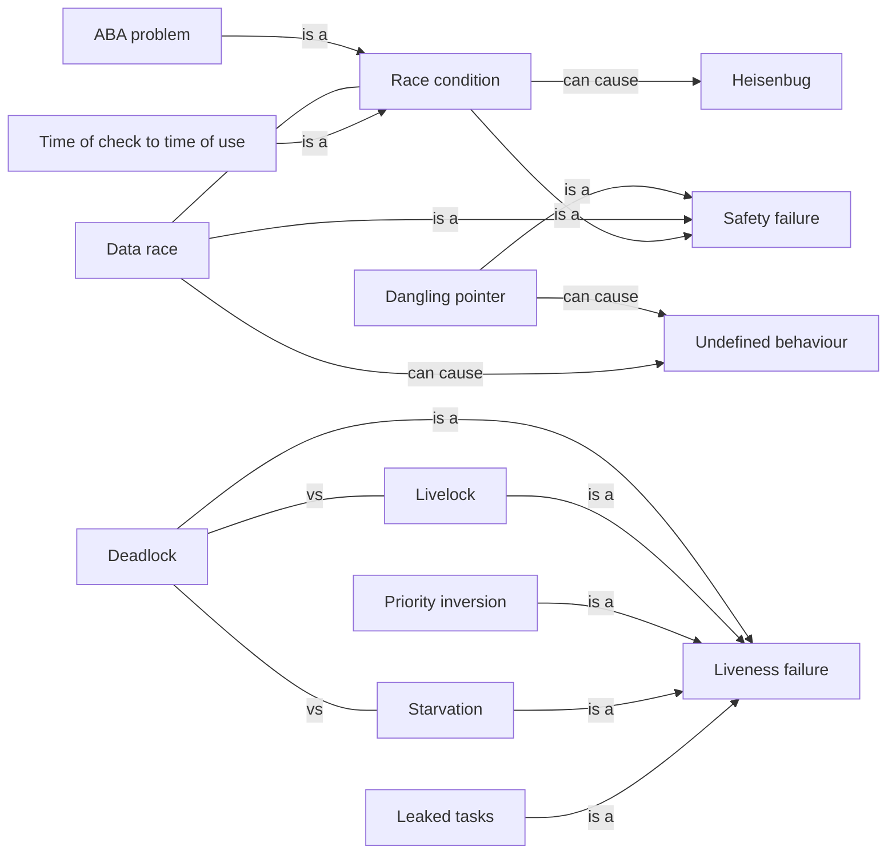

# Hazards

What goes wrong: the failures that exist only because more than one thing runs at once, and why they are so hard to reproduce.

[All categories](../README.md) · [How they connect](../schema/README.md)

- [Safety and liveness](safety_and_liveness/README.md) — The two kinds of correctness for a concurrent program: safety means nothing bad ever happens, liveness means something good eventually does.
- [Safety failure](safety_failure/README.md) — The program reaches a state it must never reach — a lost update, a torn read, a broken invariant — usually because two tasks interleaved badly.
    - [Race condition](race_condition/README.md) — The result depends on the relative timing of tasks, and some timings give a wrong result — whether or not there is also a data race.
        - [Time of check to time of use](toctou/README.md) — Checking a condition and then acting on it as two separate steps, so that the condition can change in between — the classic check-then-act race.
        - [ABA problem](aba_problem/README.md) — A compare-and-swap succeeds because a value changed from A to B and back to A, although what it stands for is no longer the same.
    - [Data race](data_race/README.md) — Two threads access the same memory at the same time, at least one of them writing, with nothing synchronizing them — undefined behaviour in C and C++, a compile error in safe Rust.
    - [Dangling pointer](dangling_pointer/README.md) — A pointer or reference to storage whose lifetime has ended — the classic way for a thread to outlive the stack frame it was reading.
- [Weak memory models and reordering](weak_memory_model/README.md) — CPUs and compilers may perform memory reads and writes in a different order from the source code, and without synchronization another thread can see that order.
- [Liveness failure](liveness_failure/README.md) — A task that should make progress never does, though nothing has crashed: it waits for ever, spins for ever, or never gets its turn.
    - [Deadlock](deadlock/README.md) — Tasks each hold something another of them needs and wait for it, so none of them can ever continue.
    - [Livelock](livelock/README.md) — Tasks keep changing state in response to each other — backing off, retrying, stepping aside — without any of them getting work done.
    - [Starvation](starvation/README.md) — A task that is ready never gets to run, or never gets the lock, because others keep being chosen ahead of it.
    - [Priority inversion](priority_inversion/README.md) — A high-priority task waits for a lock held by a low-priority task, which is itself preempted by medium-priority work, so the most important task effectively runs last.
    - [Leaked tasks](task_leak/README.md) — A thread, goroutine or task blocked for ever on something nobody will provide, holding its memory until the process ends.
- [Heisenbug](heisenbug/README.md) — A bug that disappears or changes when you look for it — adding a print, attaching a debugger or changing the optimizer shifts the timing it depends on.
- [Contention](contention/README.md) — Tasks competing for the same lock or resource, so their time goes to waiting instead of working — the reason adding threads can make a program slower.
- [False sharing](false_sharing/README.md) — Threads writing unrelated variables that happen to sit on the same CPU cache line keep invalidating each other's cache, slowing down with no logical sharing at all.
- [Undefined behaviour](undefined_behaviour/README.md) — A program the language standard stops describing: once it has one, no requirement is placed on what it does, so a right answer on this build is not evidence of anything.

## Inside this category

<!-- Generated above this line by tools/build_concepts.py from TOML data — edit the data, not the page. Hand-written notes go below it and are kept. -->
