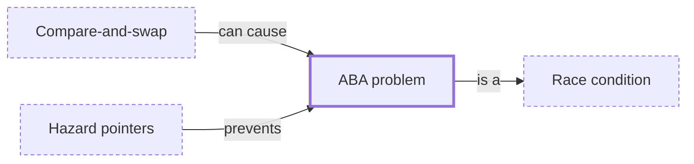

# ABA problem

**Category:** [Hazards](../README.md) · **Status:** stub · **Lessons:** [chapter 02, Shared state](../../../02_Shared_State/README.md)

**One line:** A compare-and-swap succeeds because a value changed from A to B and back to A, although what it stands for is no longer the same.

## How it connects

- **Is a kind of:** [Race condition](../race_condition/README.md)
- **Is prevented by:** [Hazard pointers](../../lock_free/hazard_pointers/README.md)
- **Can be caused by:** [Compare-and-swap](../../lock_free/compare_and_swap/README.md)

## In each language

| | |
|---|---|
| Java | [`AtomicStampedReference` ↗](https://docs.oracle.com/en/java/javase/25/docs/api/java.base/java/util/concurrent/atomic/AtomicStampedReference.html) keeps an integer stamp beside the reference, and its `compareAndSet` compares and sets both together |

## Where to read more

- **In this library:** [Can a compare-and-swap succeed when it should have failed?](../../../02_Shared_State/the_aba_problem/README.md)
- **In the books:** [*The Art of Multiprocessor Programming*](../../../10_Resources/books_general/README.md#herlihy_shavit_art_of_multiprocessor_programming), Maurice Herlihy, Nir Shavit — ch. 10, 'Concurrent Queues and the ABA Problem'
- **In the books:** [*Concurrency with Modern C++*](../../../10_Resources/books_cpp/README.md#grimm_concurrency_with_modern_cpp), Rainer Grimm — ch. 13, 'Challenges' → 'ABA Problem'
- **Reference:** [Wikipedia: ABA problem ↗](https://en.wikipedia.org/wiki/ABA_problem)

<!-- Generated above this line by tools/build_concepts.py from TOML data — edit the data, not the page. Hand-written notes go below it and are kept. -->
