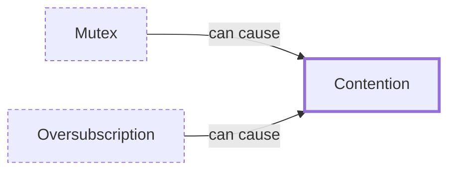

# Contention

**Category:** [Hazards](../README.md) · **Status:** stub · **Lessons:** chapter 02, Shared state *(planned)*

**One line:** Tasks competing for the same lock or resource, so their time goes to waiting instead of working — the reason adding threads can make a program slower.

Also called: lock contention.

## How it connects

- **Can be caused by:** [Mutex](../../synchronization/mutex/README.md), [Oversubscription](../../foundations/oversubscription/README.md)
- **See also:** [False sharing](../false_sharing/README.md), [Profiling concurrent programs](../../testing_and_tools/profiling_concurrency/README.md), [Starvation](../starvation/README.md)

## In each language

| | |
|---|---|
| Go | [`runtime.SetMutexProfileFraction` ↗](https://pkg.go.dev/runtime#SetMutexProfileFraction) turns on the [`mutex` profile ↗](https://pkg.go.dev/runtime/pprof) of contended mutexes; the `block` profile shows where goroutines wait |
| Java | [`ThreadMXBean` ↗](https://docs.oracle.com/en/java/javase/25/docs/api/java.management/java/lang/management/ThreadMXBean.html) thread contention monitoring accumulates the time each thread has blocked for synchronization |
| Python | [`functools.cached_property` ↗](https://docs.python.org/3/library/functools.html#functools.cached_property) dropped its lock in 3.12 because the lock was per property, not per instance, and caused high lock contention |
| C# | [`Monitor.LockContentionCount` ↗](https://learn.microsoft.com/en-us/dotnet/api/system.threading.monitor.lockcontentioncount) counts the times taking a monitor's lock met contention |

## Where to read more

- **In the books:** [*The Art of Multiprocessor Programming*](../../../10_Resources/books_general/README.md#herlihy_shavit_art_of_multiprocessor_programming), Maurice Herlihy, Nir Shavit — ch. 7, 'Spin Locks and Contention'
- **In the books:** [*Java Concurrency in Practice*](../../../10_Resources/books_java/README.md#goetz_java_concurrency_in_practice), Brian Goetz, Tim Peierls, Joshua Bloch, Joseph Bowbeer, David Holmes, Doug Lea — ch. 11, 'Performance and Scalability' → 'Reducing Lock Contention'
- **In the books:** [*Concurrent Programming: Algorithms, Principles, and Foundations*](../../../10_Resources/books_general/README.md#raynal_concurrent_programming_algorithms), Michel Raynal — ch. 6, 'Hybrid Concurrent Objects' → 'Contention-Sensitive Implementations'
- **Reference:** [Wikipedia: Lock (computer science) — granularity ↗](https://en.wikipedia.org/wiki/Lock_(computer_science)#Granularity)

<!-- Generated above this line by tools/build_concepts.py from TOML data — edit the data, not the page. Hand-written notes go below it and are kept. -->
