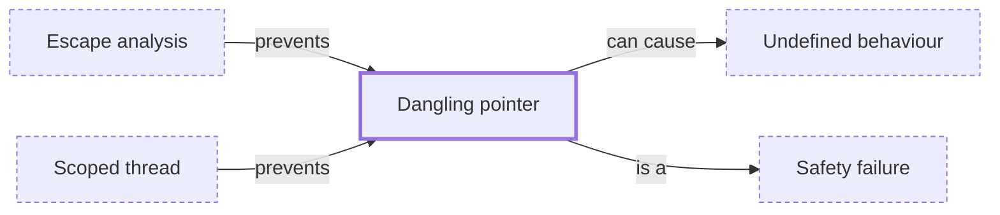

# Dangling pointer

**Category:** [Hazards](../README.md) · **Status:** stub · **Lessons:** [chapter 01, Threads](../../../01_Threads/README.md)

**One line:** A pointer or reference to storage whose lifetime has ended — the classic way for a thread to outlive the stack frame it was reading.

Also called: use after free, use after return, use after scope.

## How it connects

- **Is a kind of:** [Safety failure](../safety_failure/README.md)
- **Is prevented by:** [Escape analysis](../../safety_in_languages/escape_analysis/README.md), [Scoped thread](../../units_of_execution/scoped_thread/README.md)
- **Can lead to:** [Undefined behaviour](../undefined_behaviour/README.md)
- **See also:** [Memory error detector](../../testing_and_tools/memory_error_detector/README.md), [Object lifetime](../../safety_in_languages/object_lifetime/README.md)

## In each language

| | |
|---|---|
| Rust | Rejected in safe code: the borrow checker requires a reference to be outlived by what it points at |
| C | [Lifetime ↗](https://en.cppreference.com/w/c/language/lifetime): using a pointer to an object whose lifetime has ended is undefined |
| C++ | [Lifetime ↗](https://en.cppreference.com/w/cpp/language/lifetime); a dangling [`std::string_view` ↗](https://en.cppreference.com/w/cpp/string/basic_string_view) or captured reference is the common form |

## Where to read more

- **In this library:** [Can a thread borrow a local variable?](../../../01_Threads/lending_a_local_to_a_thread/README.md)
- **Reference:** [Wikipedia: Dangling pointer ↗](https://en.wikipedia.org/wiki/Dangling_pointer)

<!-- Generated above this line by tools/build_concepts.py from TOML data — edit the data, not the page. Hand-written notes go below it and are kept. -->
