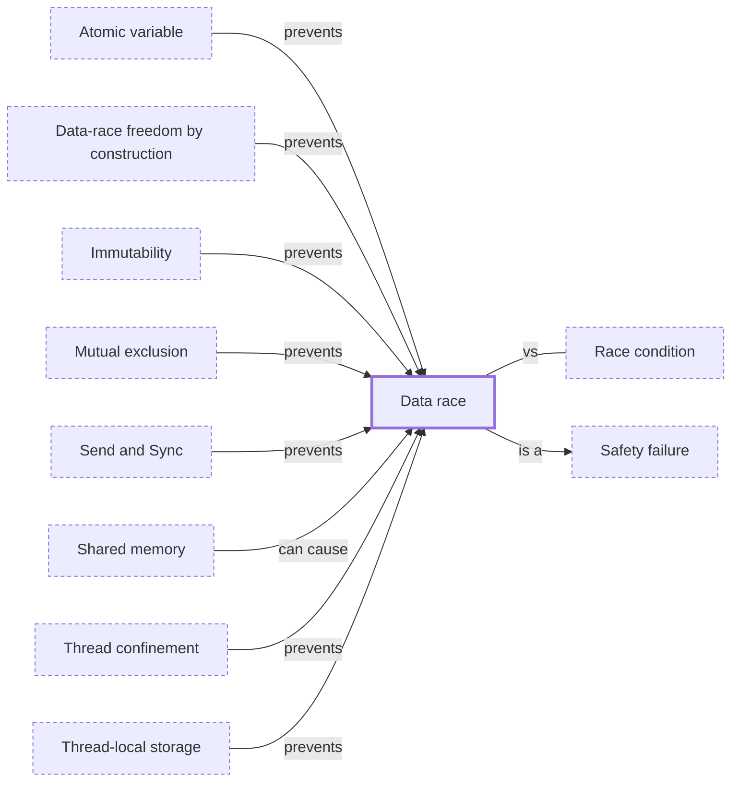

# Data race

**Category:** [Hazards](../README.md) · **Status:** stub · **Lessons:** [chapter 02, Shared state](../../../02_Shared_State/README.md)

**One line:** Two threads access the same memory at the same time, at least one of them writing, with nothing synchronizing them — undefined behaviour in C and C++, a compile error in safe Rust.

Also called: unsynchronized access.

## How it connects

- **Is a kind of:** [Safety failure](../safety_failure/README.md)
- **Is prevented by:** [Atomic variable](../../lock_free/atomic_variable/README.md), [Data-race freedom by construction](../../safety_in_languages/data_race_freedom/README.md), [Immutability](../../safety_in_languages/immutability/README.md), [Mutual exclusion](../../synchronization/mutual_exclusion/README.md), [Send and Sync](../../safety_in_languages/send_and_sync/README.md), [Thread confinement](../../safety_in_languages/thread_confinement/README.md), [Thread-local storage](../../units_of_execution/thread_local_storage/README.md)
- **Can be caused by:** [Shared memory](../../communication/shared_memory/README.md)
- **Often confused with:** [Race condition](../race_condition/README.md)
- **See also:** [Happens-before](../../lock_free/happens_before/README.md), [Race detector](../../testing_and_tools/race_detector/README.md), [Weak memory models and reordering](../weak_memory_model/README.md)

## In each language

| | |
|---|---|
| Rust | [The Rustonomicon ↗](https://doc.rust-lang.org/nomicon/races.html): safe Rust guarantees there are none; in `unsafe` code a data race is [undefined behaviour ↗](https://doc.rust-lang.org/reference/behavior-considered-undefined.html) |
| Go | Compiles and runs: the [memory model ↗](https://go.dev/ref/mem) requires such access to be serialized and warns that races can corrupt memory; the [race detector ↗](https://go.dev/doc/articles/race_detector) (`-race`) reports them at run time |
| C | [Memory model and data races ↗](https://en.cppreference.com/w/c/language/memory_model): if a data race occurs, the behaviour of the program is undefined |
| C++ | [Multi-threaded executions and data races ↗](https://en.cppreference.com/w/cpp/language/multithread): a data race is undefined behaviour; `std::atomic` or a mutex avoids it |
| Java | Not undefined behaviour, but [JLS §17.4 ↗](https://docs.oracle.com/javase/specs/jls/se25/html/jls-17.html#jls-17.4) specifies a memory model with few guarantees for unsynchronized reads, and [§17.7 ↗](https://docs.oracle.com/javase/specs/jls/se25/html/jls-17.html#jls-17.7) warns that writes to `long` and `double` are not atomic |
| Python | In the [free-threaded build ↗](https://docs.python.org/3/howto/free-threading-python.html) built-in types like `dict`, `list` and `set` use internal locks, much as the GIL protected them; the program's own invariants still need `threading.Lock` |
| JavaScript | Only memory shared through a [`SharedArrayBuffer` ↗](https://developer.mozilla.org/en-US/docs/Web/JavaScript/Reference/Global_Objects/SharedArrayBuffer) can race; [`Atomics` ↗](https://developer.mozilla.org/en-US/docs/Web/JavaScript/Reference/Global_Objects/Atomics) operations make its reads and writes predictable |
| Swift | [The Swift Programming Language: Concurrency ↗](https://docs.swift.org/swift-book/documentation/the-swift-programming-language/concurrency/): most data races are compile-time errors, and those found only at run time terminate the program |

## Where to read more

- **In this library:** [Is total += n safe on two threads?](../../../02_Shared_State/the_lost_update/README.md)
- **In this library:** [Data race or race condition?](../../../02_Shared_State/data_race_or_race_condition/README.md)
- **In a sibling library:** [Rust: Data races (for C and C++ programmers) ↗](https://masiarek.github.io/rust-learning-library/31_C_and_Cpp/data_races/index.html)
- **In a sibling library:** [Go: A mutex guards a counter ↗](https://masiarek.github.io/go-learning-library/04_Sync/a_mutex_guards_a_counter/index.html)
- **In a sibling library:** [Go: The race detector ↗](https://masiarek.github.io/go-learning-library/07_Testing_Concurrent_Code/the_race_detector/index.html)
- **In the books:** [*Rust Atomics and Locks*](../../../10_Resources/books_rust/README.md#bos_rust_atomics_and_locks), Mara Bos — ch. 1, 'Basics of Rust Concurrency' → 'Borrowing and Data Races'
- **In the books:** [*Concurrency with Modern C++*](../../../10_Resources/books_cpp/README.md#grimm_concurrency_with_modern_cpp), Rainer Grimm — ch. 13, 'Challenges' → 'Data Races'
- **In the books:** [*Mastering C++ Multithreading*](../../../10_Resources/books_cpp/README.md#posch_mastering_cpp_multithreading), Maya Posch — ch. 7, 'Best Practices' → 'Being careless - data races'
- **In the books:** [*Parallel Programming with Intel Parallel Studio XE*](../../../10_Resources/books_cpp/README.md#blair_chappell_intel_parallel_studio_xe), Stephen Blair-Chappell, Andrew Stokes — ch. 8, 'Checking for Errors' → 'Detecting Data Races'
- **In the books:** [*Effective Python*](../../../10_Resources/books_python/README.md#slatkin_effective_python), Brett Slatkin — ch. 7, 'Concurrency and Parallelism' → 'Item 54: Use Lock to Prevent Data Races in Threads'
- **Reference:** [Wikipedia: Race condition (data race) ↗](https://en.wikipedia.org/wiki/Race_condition#Data_race)

<!-- Generated above this line by tools/build_concepts.py from TOML data — edit the data, not the page. Hand-written notes go below it and are kept. -->
