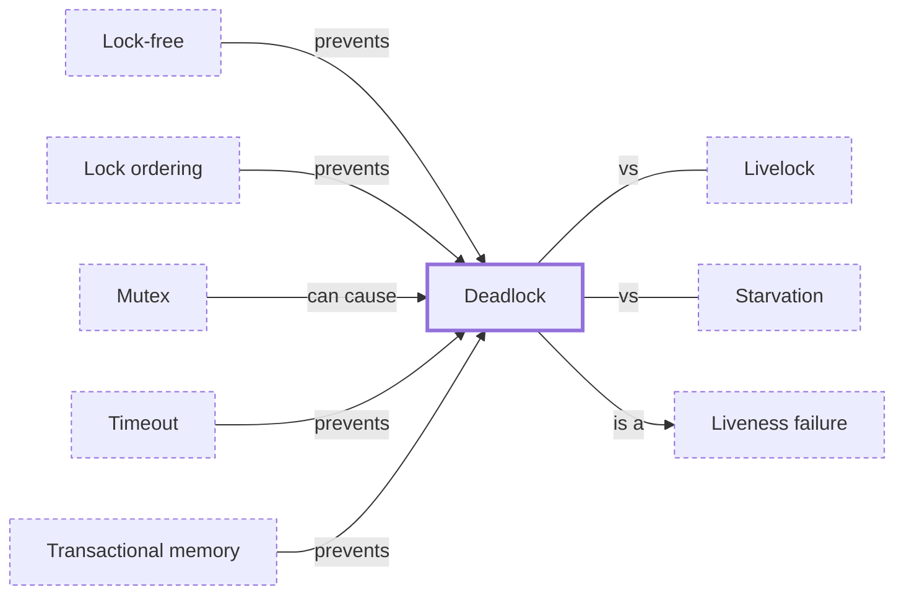

# Deadlock

**Category:** [Hazards](../README.md) · **Status:** stub · **Lessons:** [chapter 03, When locks go wrong](../../../03_When_Locks_Go_Wrong/README.md)

**One line:** Tasks each hold something another of them needs and wait for it, so none of them can ever continue.

Also called: deadly embrace.

## How it connects

- **Is a kind of:** [Liveness failure](../liveness_failure/README.md)
- **Is prevented by:** [Lock ordering](../../synchronization/lock_ordering/README.md), [Lock-free](../../lock_free/lock_free/README.md), [Timeout](../../async/timeout/README.md), [Transactional memory](../../lock_free/transactional_memory/README.md)
- **Can be caused by:** [Mutex](../../synchronization/mutex/README.md)
- **Often confused with:** [Livelock](../livelock/README.md), [Starvation](../starvation/README.md)
- **See also:** [Classic synchronization problems](../../synchronization/classic_synchronization_problems/README.md), [Debugging concurrent programs](../../testing_and_tools/concurrency_debugging/README.md)

## In each language

| | |
|---|---|
| Rust | Not prevented: [`Mutex::lock` ↗](https://doc.rust-lang.org/std/sync/struct.Mutex.html#method.lock) on the thread that already holds the lock may deadlock or panic, and [the Book ↗](https://doc.rust-lang.org/book/ch16-03-shared-state.html) warns that `Mutex<T>` comes with the risk of deadlocks |
| Go | The runtime's `checkdead` in [`runtime/proc.go` ↗](https://go.dev/src/runtime/proc.go) stops the program with `all goroutines are asleep - deadlock!`; in a [`testing/synctest` ↗](https://pkg.go.dev/testing/synctest) bubble a deadlock makes `Test` panic |
| C | [`mtx_lock` ↗](https://en.cppreference.com/w/c/thread/mtx_lock): locking a non-recursive mutex the thread already holds is undefined behaviour |
| C++ | [`std::lock` ↗](https://en.cppreference.com/w/cpp/thread/lock) and [`std::scoped_lock` ↗](https://en.cppreference.com/w/cpp/thread/scoped_lock) (C++17) take several mutexes with a deadlock avoidance algorithm; [relocking a `std::mutex` ↗](https://en.cppreference.com/w/cpp/thread/mutex/lock) is undefined and may deadlock |
| Java | [JLS §17.1 ↗](https://docs.oracle.com/javase/specs/jls/se25/html/jls-17.html#jls-17.1): not prevented or detected by the language; [`ThreadMXBean.findDeadlockedThreads` ↗](https://docs.oracle.com/en/java/javase/25/docs/api/java.management/java/lang/management/ThreadMXBean.html) finds deadlocked threads at run time |
| Python | [`Lock.acquire` ↗](https://docs.python.org/3/library/threading.html#threading.Lock.acquire) takes a `timeout`, so a thread can give up instead of waiting for ever |
| Erlang and Elixir | [`gen_server:call/2` ↗](https://www.erlang.org/doc/apps/stdlib/gen_server.html) waits at most 5000 ms for a reply unless given `infinity` |
| Haskell | [`BlockedIndefinitelyOnMVar` ↗](https://hackage.haskell.org/package/base/docs/Control-Exception.html): a thread blocked on an `MVar` that nothing else references gets this exception instead of hanging |
| The operating system | POSIX [`pthread_mutex_lock` ↗](https://pubs.opengroup.org/onlinepubs/9799919799/functions/pthread_mutex_lock.html): a `PTHREAD_MUTEX_ERRORCHECK` mutex returns `EDEADLK` when its owner locks it again; Linux [lockdep ↗](https://docs.kernel.org/locking/lockdep-design.html) checks the kernel's lock order for cycles |

## Where to read more

- **In this library:** [Why do two locks taken in different orders hang?](../../../03_When_Locks_Go_Wrong/two_locks_in_different_orders/README.md)
- **In this library:** [What happens when a thread takes a lock it already holds?](../../../03_When_Locks_Go_Wrong/a_lock_taken_twice/README.md)
- **In this library:** [Who unlocks when the function returns early?](../../../03_When_Locks_Go_Wrong/the_forgotten_unlock/README.md)
- **In this library:** [Can two threads be busy forever and get nothing done?](../../../03_When_Locks_Go_Wrong/livelock/README.md)
- **In this library:** [How do you find out where a deadlocked program is stuck?](../../../03_When_Locks_Go_Wrong/detecting_a_deadlock/README.md)
- **In this library:** [Why do five philosophers with five forks starve?](../../../04_Waiting_For_Each_Other/the_dining_philosophers/README.md)
- **In this library:** [What does the child get when a process forks?](../../../08_Processes/fork_copies_the_process/README.md)
- **In this library:** [How do you read a thread dump?](../../../09_Testing_and_Tools/reading_a_thread_dump/README.md)
- **In a sibling library:** [Go: All goroutines are asleep ↗](https://masiarek.github.io/go-learning-library/02_Channels/all_goroutines_are_asleep/index.html)
- **In the books:** [*Learn Concurrent Programming with Go*](../../../10_Resources/books_go/README.md#cutajar_learn_concurrent_programming_with_go), James Cutajar — ch. 11, 'Avoiding deadlocks'
- **In the books:** [*Grokking Concurrency*](../../../10_Resources/books_general/README.md#bobrov_grokking_concurrency), Kirill Bobrov — ch. 9, 'Solving concurrency problems: Deadlocks and starvation'
- **In the books:** [*Async Rust*](../../../10_Resources/books_rust/README.md#flitton_morton_async_rust), Maxwell Flitton, Caroline Morton — ch. 11, 'Testing' → 'Testing For Deadlocks'
- **In the books:** [*Concurrency with Modern C++*](../../../10_Resources/books_cpp/README.md#grimm_concurrency_with_modern_cpp), Rainer Grimm — ch. 13, 'Challenges' → 'Deadlocks'
- **In the books:** [*Java Concurrency in Practice*](../../../10_Resources/books_java/README.md#goetz_java_concurrency_in_practice), Brian Goetz, Tim Peierls, Joshua Bloch, Joseph Bowbeer, David Holmes, Doug Lea — ch. 10, 'Avoiding Liveness Hazards' → 'Deadlock'
- **In the books:** [*Parallel Programming and Concurrency with C# 10 and .NET 6*](../../../10_Resources/books_csharp_dotnet/README.md#ashcraft_parallel_programming_concurrency_csharp10), Alvin Ashcraft — ch. 3, 'Best Practices for Managed Threading' → 'Managing deadlocks and race conditions'
- **Notes:** [Deadlock in general (concurrent async processing) ↗](https://docs.google.com/document/d/1tALJk7JPUA5gRrQKAkWiwxlnWO0LXJs90CsxfgC7Bgo/edit)
- **Reference:** [Wikipedia: Deadlock (computer science) ↗](https://en.wikipedia.org/wiki/Deadlock_(computer_science))

<!-- Generated above this line by tools/build_concepts.py from TOML data — edit the data, not the page. Hand-written notes go below it and are kept. -->
