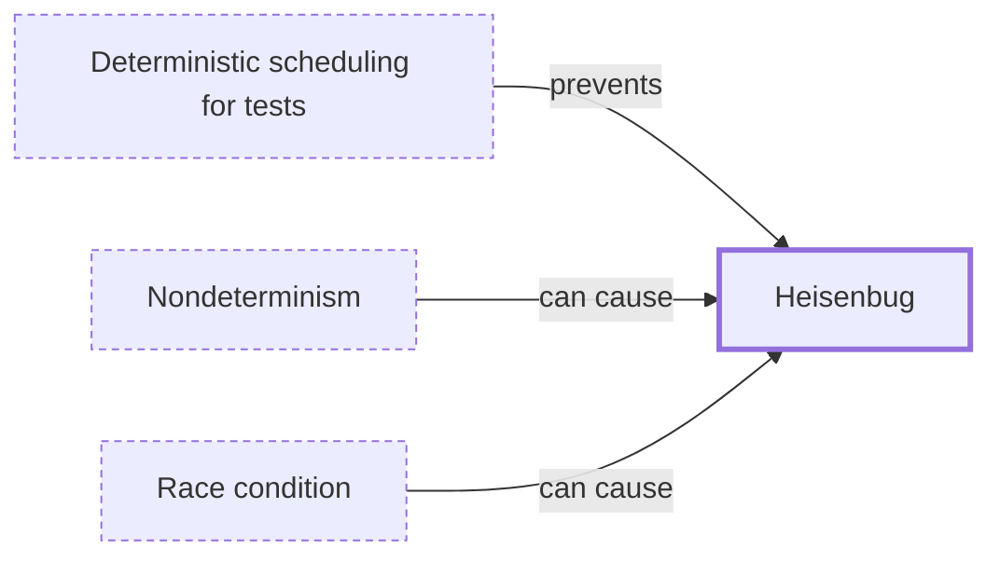

# Heisenbug

**Category:** [Hazards](../README.md) · **Status:** stub

**One line:** A bug that disappears or changes when you look for it — adding a print, attaching a debugger or changing the optimizer shifts the timing it depends on.

Also called: flaky concurrency bug.

## How it connects

- **Is prevented by:** [Deterministic scheduling for tests](../../testing_and_tools/deterministic_testing/README.md)
- **Can be caused by:** [Nondeterminism](../../foundations/nondeterminism/README.md), [Race condition](../race_condition/README.md)
- **See also:** [Deterministic scheduling for tests](../../testing_and_tools/deterministic_testing/README.md), [Race detector](../../testing_and_tools/race_detector/README.md)

## In each language

| | |
|---|---|
| Rust | [loom ↗](https://docs.rs/loom/latest/loom/) deterministically explores the possible execution permutations instead of relying on random runs |
| Go | [`testing/synctest` ↗](https://pkg.go.dev/testing/synctest), new in [Go 1.25 ↗](https://go.dev/doc/go1.25), runs a test in a bubble whose fake clock advances only when every goroutine in it is durably blocked |
| Elsewhere | [rr ↗](https://rr-project.org/) records a failing run once and replays it deterministically; its chaos mode makes intermittent bugs more reproducible |

## Where to read more

- **In a sibling library:** [Go: `synctest` makes time virtual ↗](https://masiarek.github.io/go-learning-library/07_Testing_Concurrent_Code/synctest_makes_time_virtual/index.html)
- **In a sibling library:** [Go: `synctest.Wait` instead of a sleep ↗](https://masiarek.github.io/go-learning-library/07_Testing_Concurrent_Code/synctest_wait/index.html)
- **Notes:** [heisenbug ↗](https://docs.google.com/document/d/1U0NuN9NO02_e_oNutiNPs-TcWk6Ar11xNreOBCCJU7Q/edit)
- **Reference:** [Wikipedia: Heisenbug ↗](https://en.wikipedia.org/wiki/Heisenbug)

<!-- Generated above this line by tools/build_concepts.py from TOML data — edit the data, not the page. Hand-written notes go below it and are kept. -->
