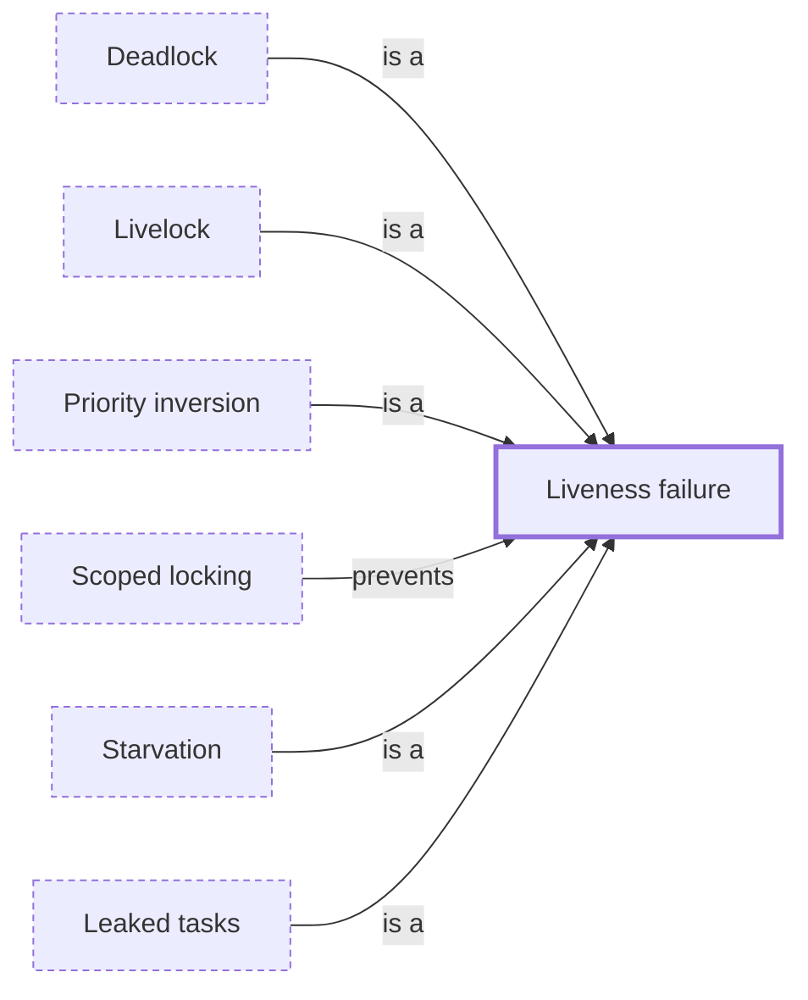

# Liveness failure

**Category:** [Hazards](../README.md) · **Status:** stub · **Lessons:** chapter 03, When locks go wrong *(planned)*

**One line:** A task that should make progress never does, though nothing has crashed: it waits for ever, spins for ever, or never gets its turn.

## How it connects

- **Kinds:** [Deadlock](../deadlock/README.md), [Leaked tasks](../task_leak/README.md), [Livelock](../livelock/README.md), [Priority inversion](../priority_inversion/README.md), [Starvation](../starvation/README.md)
- **Is prevented by:** [Scoped locking](../../synchronization/scoped_lock/README.md)
- **See also:** [Safety and liveness](../safety_and_liveness/README.md)

## In each language

| | |
|---|---|
| Rust | [The Rustonomicon ↗](https://doc.rust-lang.org/nomicon/races.html) counts getting deadlocked as safe: the compiler checks memory safety, not progress |
| Java | [JLS §17.1 ↗](https://docs.oracle.com/javase/specs/jls/se25/html/jls-17.html#jls-17.1): the language neither prevents nor requires detection of deadlock |
| Haskell | [`BlockedIndefinitelyOnMVar` ↗](https://hackage.haskell.org/package/base/docs/Control-Exception.html) is the exception for a thread blocked on an `MVar` that nothing else references, so it can never continue |

<!-- Generated above this line by tools/build_concepts.py from TOML data — edit the data, not the page. Hand-written notes go below it and are kept. -->
