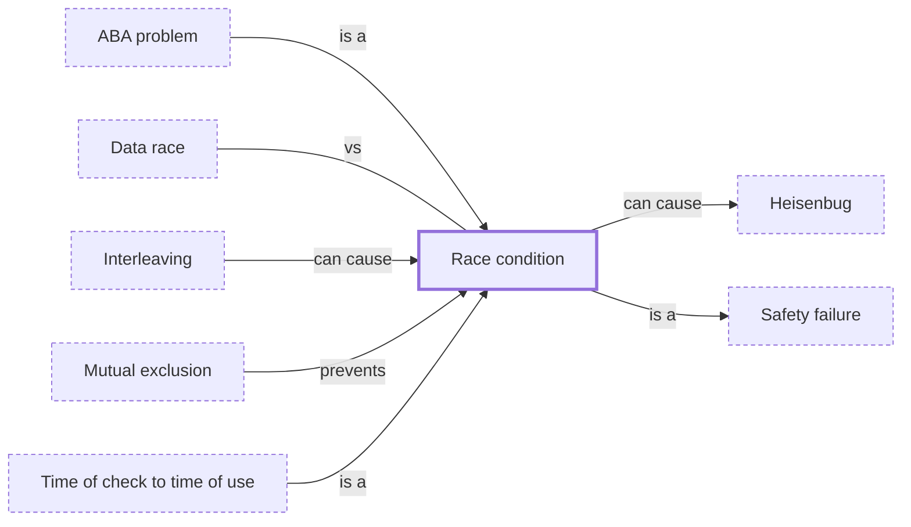

# Race condition

**Category:** [Hazards](../README.md) · **Status:** stub · **Lessons:** [chapter 02, Shared state](../../../02_Shared_State/README.md)

**One line:** The result depends on the relative timing of tasks, and some timings give a wrong result — whether or not there is also a data race.

Also called: race, interference, general race, resource race.

## How it connects

- **Is a kind of:** [Safety failure](../safety_failure/README.md)
- **Kinds:** [ABA problem](../aba_problem/README.md), [Time of check to time of use](../toctou/README.md)
- **Is prevented by:** [Mutual exclusion](../../synchronization/mutual_exclusion/README.md)
- **Can lead to:** [Heisenbug](../heisenbug/README.md)
- **Can be caused by:** [Interleaving](../../foundations/interleaving/README.md)
- **Often confused with:** [Data race](../data_race/README.md)

## In each language

| | |
|---|---|
| Rust | [The Rustonomicon ↗](https://doc.rust-lang.org/nomicon/races.html): Rust prevents data races but not general race conditions, which it calls impossible to prevent when you do not control the scheduler |
| Java | [`ConcurrentHashMap` ↗](https://docs.oracle.com/en/java/javase/25/docs/api/java.base/java/util/concurrent/ConcurrentHashMap.html): `putIfAbsent`, `replace` and `computeIfAbsent` do a check and an update as one atomic action |

## Where to read more

- **In this library:** [Is total += n safe on two threads?](../../../02_Shared_State/the_lost_update/README.md)
- **In this library:** [The lost update in a database](../../../02_Shared_State/the_lost_update_in_a_database/README.md)
- **In this library:** [Data race or race condition?](../../../02_Shared_State/data_race_or_race_condition/README.md)
- **In the books:** [*Grokking Concurrency*](../../../10_Resources/books_general/README.md#bobrov_grokking_concurrency), Kirill Bobrov — ch. 8, 'Solving concurrency problems: Race conditions and synchronization'
- **In the books:** [*Learn Concurrent Programming with Go*](../../../10_Resources/books_go/README.md#cutajar_learn_concurrent_programming_with_go), James Cutajar — ch. 3, 'Thread communication using memory sharing' → 'Race conditions'
- **In the books:** [*Async Rust*](../../../10_Resources/books_rust/README.md#flitton_morton_async_rust), Maxwell Flitton, Caroline Morton — ch. 11, 'Testing' → 'Testing for Race Conditions'
- **In the books:** [*Concurrency with Modern C++*](../../../10_Resources/books_cpp/README.md#grimm_concurrency_with_modern_cpp), Rainer Grimm — ch. 13, 'Challenges' → 'Race Conditions'
- **In the books:** [*Parallel Programming and Concurrency with C# 10 and .NET 6*](../../../10_Resources/books_csharp_dotnet/README.md#ashcraft_parallel_programming_concurrency_csharp10), Alvin Ashcraft — ch. 3, 'Best Practices for Managed Threading' → 'Managing deadlocks and race conditions'
- **In the books:** [*asyncio Recipes*](../../../10_Resources/books_python/README.md#tahrioui_asyncio_recipes), Mohamed Mustapha Tahrioui — ch. 7, 'Synchronization Between Asyncio Components' → 'Detecting Asyncio Code That Might Have Race Conditions'
- **Reference:** [Wikipedia: Race condition (in software) ↗](https://en.wikipedia.org/wiki/Race_condition#In_software)

<!-- Generated above this line by tools/build_concepts.py from TOML data — edit the data, not the page. Hand-written notes go below it and are kept. -->
