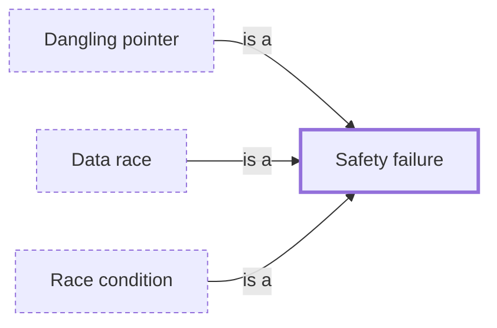

# Safety failure

**Category:** [Hazards](../README.md) · **Status:** stub · **Lessons:** [chapter 02, Shared state](../../../02_Shared_State/README.md)

**One line:** The program reaches a state it must never reach — a lost update, a torn read, a broken invariant — usually because two tasks interleaved badly.

Also called: data inconsistency, lost update, torn read.

## How it connects

- **Kinds:** [Dangling pointer](../dangling_pointer/README.md), [Data race](../data_race/README.md), [Race condition](../race_condition/README.md)
- **See also:** [Safety and liveness](../safety_and_liveness/README.md)

## In each language

| | |
|---|---|
| Go | The [Go memory model ↗](https://go.dev/ref/mem) warns that races on multiword values can lead to arbitrary memory corruption; since [Go 1.6 ↗](https://go.dev/doc/go1.6#runtime) the runtime has best-effort detection of concurrent misuse of maps |
| Java | [`ArrayList` ↗](https://docs.oracle.com/en/java/javase/25/docs/api/java.base/java/util/ArrayList.html) is not synchronized, and its fail-fast iterators throw `ConcurrentModificationException` only on a best-effort basis |
| Python | [Library FAQ ↗](https://docs.python.org/3/faq/library.html#what-kinds-of-global-value-mutation-are-thread-safe): some operations on built-in types are atomic, but a read-modify-write such as `i = i+1` is not |

## Where to read more

- **In this library:** [Is total += n safe on two threads?](../../../02_Shared_State/the_lost_update/README.md)
- **In this library:** [The lost update in a database](../../../02_Shared_State/the_lost_update_in_a_database/README.md)
- **In this library:** [What does a failure on a thread do when nobody is waiting for it?](../../../01_Threads/a_failure_nobody_is_waiting_for/README.md)
- **In this library:** [Can two atomics keep two values consistent?](../../../02_Shared_State/two_values_that_must_change_together/README.md)
- **In this library:** [Can a read see half of a write?](../../../02_Shared_State/a_torn_read/README.md)
- **In this library:** [What state is the data in after a thread died holding the lock?](../../../03_When_Locks_Go_Wrong/a_panic_while_holding_the_lock/README.md)
- **In this library:** [What happens to a task that is started and never awaited?](../../../06_Async/a_task_nobody_awaits/README.md)
- **In a sibling library:** [Go: A mutex guards a counter ↗](https://masiarek.github.io/go-learning-library/04_Sync/a_mutex_guards_a_counter/index.html)
- **Notes:** [data inconsistencies - async - concurrency - general ↗](https://docs.google.com/document/d/137RrmeoW8FsI52Lqn5uZOZB_i3fai6RqbppI3h6cOuc/edit?tab=t.0)

<!-- Generated above this line by tools/build_concepts.py from TOML data — edit the data, not the page. Hand-written notes go below it and are kept. -->
