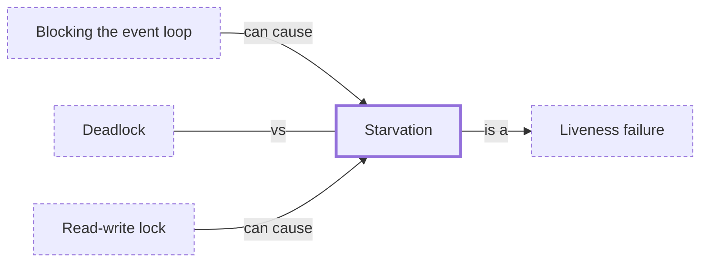

# Starvation

**Category:** [Hazards](../README.md) · **Status:** stub · **Lessons:** chapter 03, When locks go wrong *(planned)*

**One line:** A task that is ready never gets to run, or never gets the lock, because others keep being chosen ahead of it.

Also called: resource starvation, thread starvation, fairness.

## How it connects

- **Is a kind of:** [Liveness failure](../liveness_failure/README.md)
- **Can be caused by:** [Blocking the event loop](../../async/blocking_the_event_loop/README.md), [Read-write lock](../../synchronization/read_write_lock/README.md)
- **Often confused with:** [Deadlock](../deadlock/README.md)
- **See also:** [Classic synchronization problems](../../synchronization/classic_synchronization_problems/README.md), [Contention](../contention/README.md)

## In each language

| | |
|---|---|
| Rust | [`RwLock` ↗](https://doc.rust-lang.org/std/sync/struct.RwLock.html): the priority policy depends on the operating system, so a waiting writer may or may not block new readers |
| Go | [`RWMutex` ↗](https://pkg.go.dev/sync#RWMutex): once a writer waits, new `RLock` calls block so the writer eventually gets in; [`select` ↗](https://go.dev/ref/spec#Select_statements) picks among ready cases uniformly at random |
| Java | [`ReentrantLock` ↗](https://docs.oracle.com/en/java/javase/25/docs/api/java.base/java/util/concurrent/locks/ReentrantLock.html) takes a fairness flag: when true the longest-waiting thread is favoured, otherwise no access order is guaranteed |
| Python | [`threading.Lock` ↗](https://docs.python.org/3/library/threading.html#lock-objects): which waiting thread proceeds on release is not defined |
| C# | [`SemaphoreSlim` ↗](https://learn.microsoft.com/en-us/dotnet/api/system.threading.semaphoreslim): blocked threads enter in no guaranteed order, neither FIFO nor LIFO |
| Kotlin | [`Semaphore` ↗](https://kotlinlang.org/api/kotlinx.coroutines/kotlinx-coroutines-core/kotlinx.coroutines.sync/-semaphore/) in kotlinx.coroutines is fair, keeping acquirers in FIFO order |
| Haskell | [`MVar` ↗](https://hackage.haskell.org/package/base/docs/Control-Concurrent-MVar.html) promises fairness: threads blocked on it are woken in FIFO order |
| The operating system | [sched(7) ↗](https://man7.org/linux/man-pages/man7/sched.7.html): a runnable `SCHED_FIFO` thread always preempts a running normal thread, which can then wait indefinitely |

## Where to read more

- **In a sibling library:** [Go: `select` chooses at random ↗](https://masiarek.github.io/go-learning-library/03_Select/select_chooses_at_random/index.html)
- **In the books:** [*Grokking Concurrency*](../../../10_Resources/books_general/README.md#bobrov_grokking_concurrency), Kirill Bobrov — ch. 9, 'Solving concurrency problems: Deadlocks and starvation'
- **In the books:** [*Effective Concurrency in Go*](../../../10_Resources/books_go/README.md#serdar_effective_concurrency_in_go), Burak Serdar — ch. 1, 'Concurrency – A High-Level Overview' → 'Atomicity, race, deadlocks, and starvation'
- **In the books:** [*Modern Multithreading*](../../../10_Resources/books_general/README.md#carver_tai_modern_multithreading), Richard H. Carver, Kuo-Chung Tai — ch. 2, 'The Critical Section Problem' → 'Deadlock, Livelock, and Starvation'
- **In the books:** [*Advanced Python Programming*](../../../10_Resources/books_python/README.md#nguyen_advanced_python_programming), Quan Nguyen — ch. 13, 'Starvation'
- **In the books:** [*Erlang Programming*](../../../10_Resources/books_elixir_erlang/README.md#cesarini_thompson_erlang_programming), Francesco Cesarini, Simon Thompson — ch. 4, 'Concurrent Programming' → 'Race Conditions, Deadlocks, and Process Starvation'
- **Notes:** [thread starvation ↗](https://docs.google.com/document/d/1xhvuuHOPz71PD3e_aCuhrnoQjG3Cyt0LQkY-g3qgSsQ/edit?tab=t.0)
- **Notes:** [resource starvation - general ↗](https://docs.google.com/document/d/1pAEvG7JsjREZTUPqTGs9JKvQiZQ4weXZ-pktsBqoF0I/edit?tab=t.0)
- **Reference:** [Wikipedia: Starvation (computer science) ↗](https://en.wikipedia.org/wiki/Starvation_(computer_science))

<!-- Generated above this line by tools/build_concepts.py from TOML data — edit the data, not the page. Hand-written notes go below it and are kept. -->
