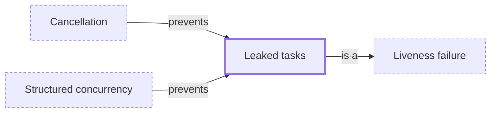

# Leaked tasks

**Category:** [Hazards](../README.md) · **Status:** stub · **Lessons:** chapter 06, Async *(planned)*

**One line:** A thread, goroutine or task blocked for ever on something nobody will provide, holding its memory until the process ends.

Also called: goroutine leak, thread leak, memory leak, zombie thread.

## How it connects

- **Is a kind of:** [Liveness failure](../liveness_failure/README.md)
- **Is prevented by:** [Cancellation](../../async/cancellation/README.md), [Structured concurrency](../../async/structured_concurrency/README.md)

## In each language

| | |
|---|---|
| Rust | [`JoinHandle` ↗](https://doc.rust-lang.org/std/thread/struct.JoinHandle.html) detaches its thread when dropped, and [`mem::forget` ↗](https://doc.rust-lang.org/std/mem/fn.forget.html) is safe: Rust does not guarantee that destructors run |
| Go | [`context` ↗](https://pkg.go.dev/context): failing to call a `CancelFunc` leaks the child context, and `go vet` checks for it; [`runtime/pprof` ↗](https://pkg.go.dev/runtime/pprof) lists a `goroutineleak` profile |
| C++ | Destroying a joinable [`std::thread` ↗](https://en.cppreference.com/w/cpp/thread/thread/~thread) calls `std::terminate`; [`std::jthread` ↗](https://en.cppreference.com/w/cpp/thread/jthread) joins on destruction |
| Java | [`ExecutorService` ↗](https://docs.oracle.com/en/java/javase/25/docs/api/java.base/java/util/concurrent/ExecutorService.html): an unused executor should be shut down to allow reclamation of its resources |
| Python | [`asyncio.create_task` ↗](https://docs.python.org/3/library/asyncio-task.html#asyncio.create_task) needs a strong reference kept to the task; [`asyncio.TaskGroup` ↗](https://docs.python.org/3/library/asyncio-task.html#asyncio.TaskGroup) keeps one and awaits every task |
| Kotlin | [`GlobalScope` ↗](https://kotlinlang.org/api/kotlinx.coroutines/kotlinx-coroutines-core/kotlinx.coroutines/-global-scope/): a coroutine that is never cancelled or resumed can be a resource leak, so tie coroutines to a lifecycle |
| The operating system | [pthread_join(3) ↗](https://man7.org/linux/man-pages/man3/pthread_join.3.html): a joinable thread that nobody joins becomes a zombie thread holding system resources |

## Where to read more

- **In a sibling library:** [Go: A leaked goroutine never ends ↗](https://masiarek.github.io/go-learning-library/05_Context/a_leaked_goroutine_never_ends/index.html)
- **In the books:** [*Concurrency in Go*](../../../10_Resources/books_go/README.md#cox_buday_concurrency_in_go), Katherine Cox-Buday — ch. 4, 'Concurrency Patterns in Go' → 'Preventing Goroutine Leaks'
- **In the books:** [*Parallel and Concurrent Programming in Haskell*](../../../10_Resources/books_haskell/README.md#marlow_parallel_and_concurrent_programming_in_haskell), Simon Marlow — ch. 11, 'Higher-Level Concurrency Abstractions' → 'Avoiding Thread Leakage'
- **Notes:** [memory leaks - general ↗](https://docs.google.com/document/d/1QA4Pr0tOLQEMcL6iqdx2lg9-H9NBynluyo6_uGxQQ2s/edit?tab=t.0)
- **Notes:** [memory leak - rust ↗](https://docs.google.com/document/u/0/d/1-24Bz0vaLCHV7SPBF-IZUor1-co5YdX_DKAF58_W354/edit)

<!-- Generated above this line by tools/build_concepts.py from TOML data — edit the data, not the page. Hand-written notes go below it and are kept. -->
